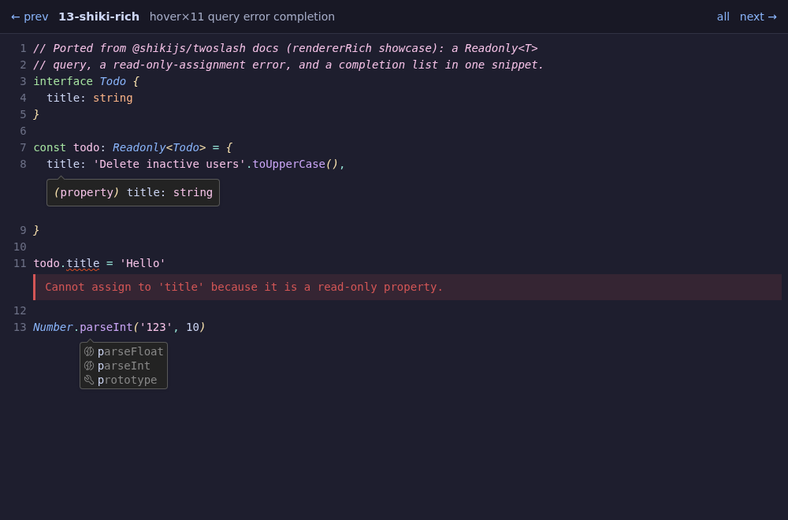

# hue

`hue` is an interactive syntax-highlighting file viewer, live theme previewer,
grammar-aware diff engine, and pull request inspector powered by
[`sparkles:syntax`](../../libs/syntax/) and tree-sitter.

It renders source code and documents across four distinct backends:
non-interactive **ANSI** color streams, an interactive terminal **TUI**,
standalone **HTML** (with pure CSS hover overlays), and a hardware-accelerated
[**GUI**](../../specs/hue/gui) window featuring rich Markdown previews
(rendered in the style of `render-markdown.nvim`).

---

## Ways to Run `hue`

| Method                     | Command                                            | Description                                                                                  |
| -------------------------- | -------------------------------------------------- | -------------------------------------------------------------------------------------------- |
| **Install with Nix**       | `nix profile add github:PetarKirov/sparkles#hue`   | Installs `hue` into `$PATH` (Linux & macOS). Manage with `nix profile {upgrade,remove} hue`. |
| **Run without installing** | `nix run github:PetarKirov/sparkles#hue -- <args>` | Runs `hue` directly without installing (or `nix run .#hue -- <args>` inside repository).     |
| **Ad-hoc shell**           | `nix shell github:PetarKirov/sparkles#hue`         | Starts an ephemeral subshell with `hue` available in `$PATH`.                                |
| **Nix dev shell**          | `dub run :hue -- <args>`                           | Standard development workflow inside `nix develop`.                                          |

---

## Quick Start

```bash
# View source code or markdown (view is the default subcommand)
hue path/to/file.d                       # opens GUI window on desktop; falls back to TUI in SSH/headless
hue view file.d --tui                    # force interactive terminal viewer (alias: --no-gui)
hue view file.d --html > output.html     # self-contained static HTML
hue view file.d | cat                    # piping automatically emits ANSI color stream

# Compare files, git revisions, or staged changes
hue diff file1.d file2.d                 # side-by-side or unified diff
hue diff --staged                        # git staged changes
hue diff HEAD~1..HEAD --diff-layout split

# Inspect pull requests with review comments
hue pr 123                               # by PR number
hue pr owner/repo#123                    # by repo and number

# Build static HTML syntax galleries
hue gallery ./fixtures --out ./html

# Inspect themes and configuration
hue theme --list                         # list 36+ built-in color themes
hue config show                          # display resolved settings and origins
```

---

## Subcommands & Features

`hue` provides dedicated subcommands for distinct viewing, diffing, and
inspection workflows:

### `hue view` (Default)

Syntax-highlights and inspects files, directories, stdin (`-`), URLs, or
twoslash annotations. When no subcommand is given, `hue` defaults to `view`.

```bash
hue view src/app.d                       # open file
hue view src/ --tree-depth 3             # open directory tree explorer
cat file.d | hue view - --lang d         # read from standard input with explicit syntax
hue view file.d --line 42 --column 10    # jump directly to line/column
hue view file.d --find "struct Foo"      # jump to search match
```

**Key options:**

- **Language / Syntax**: `--language <lang>` / `--lang <lang>` to specify syntax language (e.g. `d`, `rust`, `python`, `json`, `c`), essential when reading from stdin (`-`).
- **Navigation**: `--line <n>`, `--column <c>`, `--find <pattern>`, `--search <pattern>`.
- **Display**: `--line-numbers` / `--no-line-numbers`, `--tab-width <n>`, `--code-overflow <scroll|wrap|wrap-at:N>`, `--code-max-lines <n>`.
- **Markdown**: `--markdown` (force markdown rendering) or `--raw` (force raw source view).
- **Directory Explorer**: `--tree-width <cols>`, `--tree-depth <n>`, `--tree-hidden`, `--tree-exclude <glob>`.

---

### `hue diff`

Grammar-aware text and structural diff engine across file pairs, working
directory changes, or git revisions.

```bash
hue diff old.d new.d                                    # diff two files
hue diff --staged                                       # diff git staged changes
hue diff HEAD~3..HEAD                                   # diff git commit range
hue diff old.d new.d --diff-layout split                # side-by-side 2-column view
hue diff old.d new.d --diff-structural auto             # grammar-aware structural diff
hue diff old.md new.md --diff-preview                   # diff rendered Markdown
hue diff old.d new.d --diff-ignore-whitespace change    # ignore whitespace changes
```

**Diff controls:**

- `--diff-layout <unified|split>`: Choose unified single-column or side-by-side 2-column layout.
- `--diff-structural <auto|on|off>`: Grammar-aware CST diffing that isolates semantic changes from formatting noise.
- `--diff-commutative <mode>`: Suppresses non-breaking reorder noise in unordered containers (e.g. sorted D imports).
- `--diff-preview`: Diffs rendered Markdown documents instead of raw markdown text.
- `--diff-ignore-whitespace <exact|trailing|change|all>`: Whitespace sensitivity mode.

---

### `hue pr`

Inspect GitHub and GitLab pull requests read-only directly from your terminal
or GUI window, complete with file trees, diff hunks, and inline reviewer
discussion threads.

```bash
hue pr 123                               # current repository PR #123
hue pr PetarKirov/sparkles#309           # specific repository PR
hue pr https://github.com/owner/repo/pull/123
hue pr 123 --gui                         # open PR in GUI window
```

---

### `hue gallery`

Batch-renders entire source trees or fixture directories into a browsable static
HTML syntax gallery.

```bash
hue gallery ./examples --out ./dist/gallery
hue gallery ./docs --markdown --theme catppuccin-mocha
```

---

### `hue theme`

Inspect and list built-in color themes. `hue` ships with over 36 high-contrast,
dark, and light themes (including `tokyo-night`, `catppuccin-mocha`, `nord`,
`gruvbox-dark`, `github-light`, and `dracula`).

```bash
hue theme --list                         # list all available themes
hue theme tokyo-night                    # inspect palette colors of a theme
hue view file.d --theme catppuccin-latte # apply theme to view
```

---

### `hue overlay`

Inspect registered document overlay engines (such as TypeScript/D twoslash type
queries, code coverage overlays, and execution traces).

```bash
hue overlay --list                       # list registered overlay kinds
hue overlay twoslash                     # inspect twoslash overlay capabilities
```

---

### `hue config`

Display and diagnose effective application configuration, font fallbacks, and
theme settings.

```bash
hue config show                          # show effective configuration
```

---

## Output Rendering Sinks & Automatic Detection

When no explicit backend flag is provided, `hue` automatically picks the best
sink for your current environment:

1. **GUI Window (`--gui`)**: Opened automatically when a graphical display is
   present and stdout is a terminal (standard interactive desktop session).
   Features hardware acceleration, rich Markdown previews, customizable fonts,
   and mouse-hover inspection cards.
2. **Interactive Terminal TUI (`--tui` / `--no-gui`)**: Chosen automatically in
   headless or remote SSH sessions where stdin and stdout are terminals but no
   graphical display is available. Includes pane splitting, tree navigation,
   mouse support, and interactive key guides.
3. **Non-interactive ANSI (`--ansi`)**: Emitted automatically whenever stdout is
   piped or redirected (e.g. `hue file.d | cat` or `hue file.d | less -R`), or
   when reading non-interactive stdin.
4. **Standalone HTML (`--html`)**: Emits a self-contained, zero-JavaScript HTML
   document with CSS token styling and interactive CSS-only hover popups.

---

## Global & Appearance Options

Universal options can be passed to any `hue` command:

- `--theme <name>`: Select active color theme (default: `tokyo-night`).
- `--background <full|soft|none>`: Background fill mode.
- `--log-level <trace|info|warning|error|critical|off>`: Logging verbosity (default: `warning`).
- `--overlay <kind>[=<artifact>]`: Attach one or more overlay payloads (e.g. `--overlay twoslash=nodes.json`).
- `--font <family-list>`: Font family fallback chain for GUI mode.
- `--font-size <pt>`: GUI font size in points.
- `--window-width <px>`, `--window-height <px>`: GUI initial window dimensions.

---

## Twoslash Overlays

`hue` can render TypeScript and D
[Twoslash](https://twoslash.netlify.app/) type-annotation models as rich
overlays — including type hovers (`^?`), completion lists (`^|`), compile
errors, and custom `@tag`s — across **HTML**, **ANSI**, and **GUI** modes:

```bash
# View twoslash payload with type overlays in terminal or GUI
hue view sample.twoslash.json --twoslash
hue view sample.d --overlay twoslash=sample.twoslash.json --gui
hue view sample.twoslash.json --html > snippet.html
```

### Interactive Showcase

Hover over dotted-underline tokens to inspect type popups:

<a href="/apps/hue/twoslash/" target="_blank" rel="noreferrer"></a>

<div style="text-align:center">

<a href="/apps/hue/twoslash/" target="_blank" rel="noreferrer"><strong>→ Open the interactive twoslash showcase ↗</strong></a>

</div>

---

## Further Documentation & Specs

- [Hue Architecture & Feature Spec](../../specs/hue/)
- [Diff View & Structural Diffing Spec](../../specs/hue/diff-view.md)
- [GUI & Markdown Preview Spec](../../specs/hue/gui.md)
- [Configuration Layering Spec](../../specs/hue/config.md)
- [Twoslash Overlay Spec](../../specs/hue/twoslash.md)
- [Open Issues & Known Limitations](../../specs/hue/open-issues.md)
