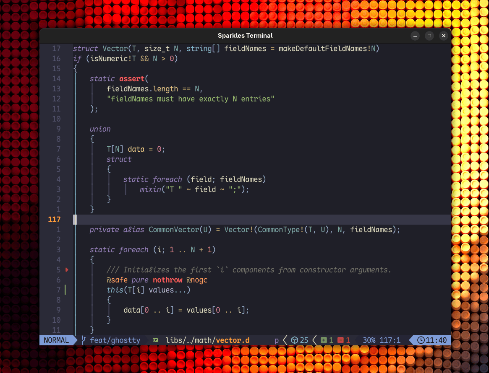

# Sparkles Terminal

A minimal, fast terminal emulator for Linux, written in D. It pairs
[libghostty-vt](https://ghostty.org/docs/about) — the terminal core that
powers [Ghostty](https://ghostty.org) — with a [raylib](https://www.raylib.com)
renderer, in roughly two thousand lines of code.

::: code-group

```bash [Nix]
nix profile add github:PetarKirov/sparkles#terminal
```

:::



It exists for two reasons: as a usable, no-frills terminal, and as the
real-world integration test for the `sparkles:ghostty` bindings (D bindings
for libghostty-vt, in `libs/ghostty`). It is deliberately small — no tabs, no splits, no config file — but
the terminal itself is not a toy: the VT engine is the same one Ghostty ships.

```bash
dub run :terminal                       # interactive login shell
dub run :terminal -- --font "Fira Code" --font-size 14
dub run :terminal -- -- htop            # run a command instead of a shell
```

## Highlights

### Correct

All escape-sequence parsing, terminal modes, and state live in libghostty-vt,
so full-screen applications behave the way they do in Ghostty:

- **VT220-class emulation** with `TERM=xterm-256color`, true color, and
  accurate responses to the capability queries (device attributes, size
  reports, XTVERSION) that programs like vim, tmux, and htop probe at startup.
- **Kitty Graphics Protocol** — PNG images render inline, with the file,
  temp-file, and shared-memory transmission mediums enabled and correct
  z-layering around text.
- **Grapheme clusters** — combining marks, ZWJ sequences, and variation
  selectors draw as single units instead of dropped accents.
- **OSC 8 hyperlinks** and plain `http(s)://` URLs: hover underlines them,
  click opens them in your browser.

### Fast where it matters

The steady-state frame loop is `nothrow @nogc` — a long-running session has no
GC pauses. When nothing on screen changes, the renderer skips the redraw
entirely, dropping idle CPU to near zero. Backgrounds, glyphs, cursor, and
decorations all batch through a single font-atlas texture, so a full-screen
redraw is a handful of draw calls.

### Practical text rendering

- Use any font by file path or fontconfig name (`--font "Fira Code"`).
- Bold, italic, and bold-italic faces of the same family are discovered
  automatically, so styled text uses real glyphs (e.g. cursive italics), with a
  synthetic fallback when a face is missing.
- Nerd Font and regular monospace fallbacks cover glyphs the primary font
  lacks; anything the primary _face_ does cover is rasterized on demand, so
  icon planes like Material Design Icons work without preloading ~109k glyphs.
- [`--font-codepoint-map`](./reference/cli.md#font-codepoint-map) routes
  specific codepoint ranges to a dedicated font, mirroring Ghostty's option of
  the same name.

### Everyday terminal ergonomics

Selection with rectangular (Alt) mode, clipboard copy/paste, mouse reporting
for TUI apps, a hover-activated scrollbar over 1000 lines of scrollback,
focus reporting, a visual bell, window-title updates, live window resizing,
and Ctrl +/- font zoom. See [key and mouse bindings](./reference/bindings.md).

## Documentation

- [Getting started](./getting-started.md) — build it, run it, run a command
  in it.
- [CLI reference](./reference/cli.md) — every flag, with defaults.
- [Key and mouse bindings](./reference/bindings.md) — shortcuts, selection,
  scrollback, links.

## Limitations

Linux/POSIX only (it spawns the shell with `forkpty`). One window, one
terminal: no tabs, splits, or configuration file — configuration is the
command line. Font discovery shells out to fontconfig (`fc-match`,
`fc-query`), which the Nix dev shell provides.
