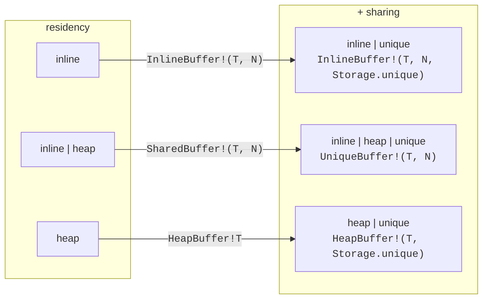
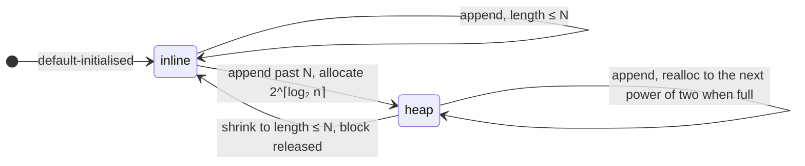
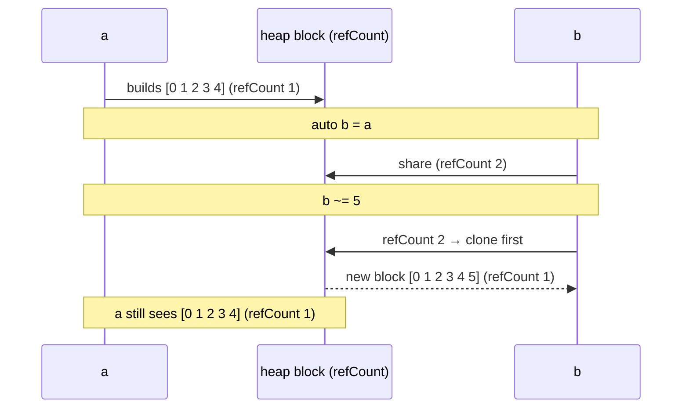
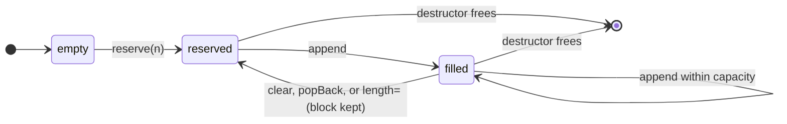
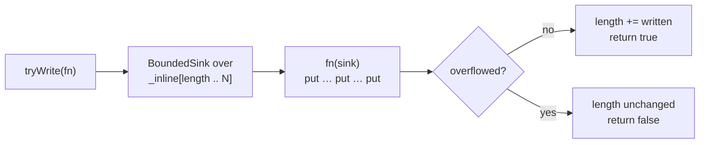
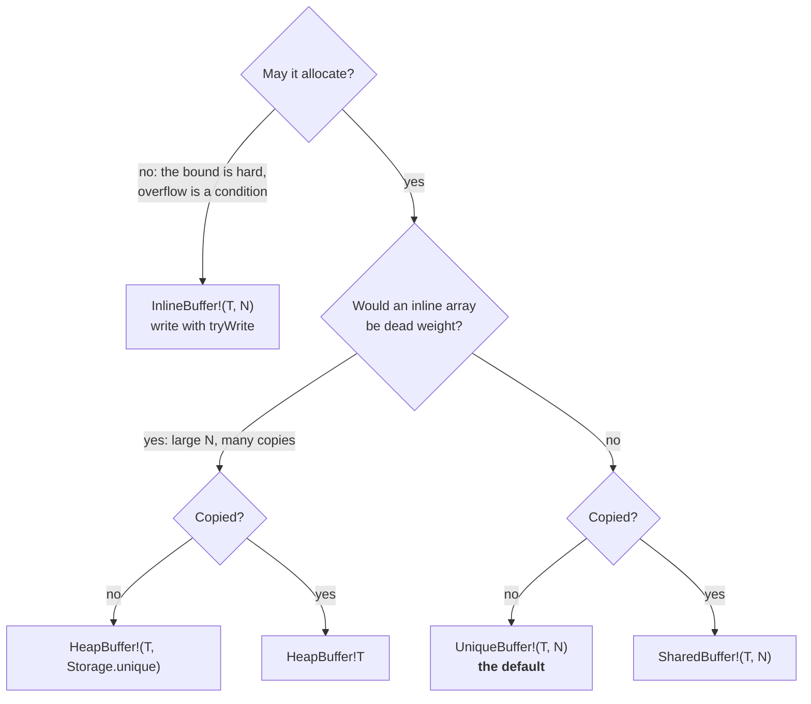

# Buffers: storage as capabilities

Elegant and expressive APIs should not require sacrificing control over memory
layout. D ranges provide an ideal backbone for fast pipelines, yet the absence
of a robust, general-purpose `@nogc` output range in Phobos remains an everyday
hurdle. Because no single dynamic-array policy fits every performance envelope,
`sparkles.base.buffer` acts as the foundational container for the Sparkles
ecosystem — offering callers fine-grained control over storage, lifetimes, and
allocation trade-offs without hiding what the hardware is doing. This page
explains what those choices are, what each one costs, and why the pieces built
on top follow from them.

> [!TIP]
> Every example on this page is a runnable dub single-file program, and its
> output block is checked by CI (`ci --verify`), so what the page shows is
> what the code does.

| See also                                                        |                                                    |
| --------------------------------------------------------------- | -------------------------------------------------- |
| [Buffer spec](../../../specs/base/buffer.md)                    | the normative contract, requirement by requirement |
| [API index](../reference/api.md#sparklesbasebuffer)             | the surface: every alias and member                |
| [Write `@nogc` text](../how-to/write-nogc-text.md)              | the recipe: a buffer plus the text writers         |
| [Test with check helpers](../how-to/test-with-check-helpers.md) | `checkWriter` / `checkToString` over a buffer      |

## 1. One container, two questions

A buffer is an append-only sequence of `T` that stays off the collected heap.
Most libraries offer one of these and pick its trade-offs for you: a
"small vector" that starts inline and spills to the heap, or a fixed array with
a length. `sparkles.base.buffer` instead asks the two questions those designs
answer implicitly, and lets each be answered on its own:

- **Residency** — where may the elements live? In an inline `T[N]` inside the
  struct, in a heap block, or in either (inline until they no longer fit)?
- **Sharing** — what is a copy? A second handle on the same storage, an
  independent copy of the bytes, or simply forbidden?

The answers are bits of one flag set, `Storage`:

```d
enum Storage : ubyte
{
    none   = 0,      // the empty set — not a policy on its own
    inline = 1 << 0, // may hold elements in the inline T[N]
    heap   = 1 << 1, // may allocate
    unique = 1 << 2, // move-only: copying is disabled
}
```

The bits are _capabilities_: each one permits something. That is why the
combination is the policy rather than a label for one — a buffer with
`Storage.inline` alone can never allocate, one with `Storage.heap` alone carries
no inline array, and `Storage.unique` on top of either removes copying. A
policy with neither storage bit has nowhere to put anything, and the template
constraint rejects it.



Six policies, four aliases. The aliases name the combinations you will reach
for; the raw `Buffer!(T, N, storage)` spelling is for generic code and for the
two policies without a name of their own.

| Policy                     | Alias                                 | Elements live     | A copy is                        | Output range |
| -------------------------- | ------------------------------------- | ----------------- | -------------------------------- | ------------ |
| `inline`                   | `InlineBuffer!(T, N)`                 | inline only       | an independent copy of the bytes | no           |
| `inline \| unique`         | `InlineBuffer!(T, N, Storage.unique)` | inline only       | disabled                         | no           |
| `inline \| heap`           | `SharedBuffer!(T, N)`                 | inline, then heap | a second handle, cloned on write | yes          |
| `inline \| heap \| unique` | `UniqueBuffer!(T, N)`                 | inline, then heap | disabled                         | yes          |
| `heap`                     | `HeapBuffer!T`                        | heap only         | a second handle, cloned on write | yes          |
| `heap \| unique`           | `HeapBuffer!(T, Storage.unique)`      | heap only         | disabled                         | yes          |

`N` means exactly one thing in every row: the inline capacity. It is not a
limit for a policy that may allocate, and it is `0` — enforced at compile time
— for a policy that has no inline array. `HeapBuffer` supplies that zero, which
is why it takes no `N` at all.

> [!NOTE]
> The alias parameter `extra` is the _ownership_ axis only. Passing a residency
> bit there — `InlineBuffer!(T, N, Storage.heap)` — is a compile error rather
> than a quiet `SharedBuffer`, because it is always a misunderstanding of what
> the alias is for.

## 2. What the struct costs

Residency decides the struct's size. A policy with inline storage carries
`T[N]`; a policy that may allocate carries a slice for the heap block; the
small-buffer policies overlay the two in a union, since at most one is live at
a time. With $w = \texttt{size\_t.sizeof}$:

$$
\text{sizeof}\bigl(\texttt{Buffer!(T, N, storage)}\bigr) =
w + \begin{cases}
N \cdot \text{sizeof}(T) & \text{inline only} \\
\max\bigl(N \cdot \text{sizeof}(T),\; 2w\bigr) & \text{inline | heap} \\
2w & \text{heap only}
\end{cases}
$$

The default `N` for the small-buffer policies is chosen to make the union
exactly slice-sized, so the struct is three words regardless of `T`:

$$
N_{\text{default}} = \max\!\left(1,\; \left\lfloor \frac{2w}{\text{sizeof}(T)} \right\rfloor\right)
\quad\Longrightarrow\quad 16\ \texttt{char},\ 4\ \texttt{int},\ 2\ \texttt{long}\ \text{on a 64-bit target.}
$$

```d
#!/usr/bin/env dub
/+ dub.sdl:
    name "buffer_policy_sizes"
    dependency "sparkles:base" version="*"
+/
import std.stdio : writefln;
import sparkles.base.buffer;

void main()
{
    writefln("word                       %2s bytes", size_t.sizeof);
    writefln("InlineBuffer!(char, 8)     %2s bytes  (word + 8)", InlineBuffer!(char, 8).sizeof);
    writefln("SharedBuffer!(char, 8)     %2s bytes  (word + max(8, 2 words))", SharedBuffer!(char, 8).sizeof);
    writefln("SharedBuffer!char          %2s bytes  (default N = %s: three words)",
        SharedBuffer!char.sizeof, SharedBuffer!char.init.capacity);
    writefln("UniqueBuffer!long          %2s bytes  (default N = %s)",
        UniqueBuffer!long.sizeof, UniqueBuffer!long.init.capacity);
    writefln("HeapBuffer!char            %2s bytes  (word + one slice, whatever it holds)", HeapBuffer!char.sizeof);
    writefln("SharedBuffer!(char, 4096)  %2s bytes  (the array is inside the struct)", SharedBuffer!(char, 4096).sizeof);
}
```

```ansi
word                        8 bytes
InlineBuffer!(char, 8)     16 bytes  (word + 8)
SharedBuffer!(char, 8)     24 bytes  (word + max(8, 2 words))
SharedBuffer!char          24 bytes  (default N = 16: three words)
UniqueBuffer!long          24 bytes  (default N = 2)
HeapBuffer!char            24 bytes  (word + one slice, whatever it holds)
SharedBuffer!(char, 4096)  4104 bytes  (the array is inside the struct)
```

The last line is the case `HeapBuffer` exists for. A 4 KB inline array is a
fine scratch buffer on the stack, but it is 4 KB in every struct that holds one
and in every copy — a per-connection state, a per-frame row builder — where the
typical payload is a few hundred bytes. A heap-only buffer costs one slice and
is sized once, up front, with `reserve` ([§7](#_7-heap-only-reserve-once-reuse-forever)).

## 3. What `inline` alone buys: a guarantee about lifetime

The obvious reading of `InlineBuffer` is "a buffer that never allocates". That
is true, and it is the lesser property. The greater one is that its elements
are provably a reference into the enclosing frame.

A small-buffer policy keeps its inline array in a union with the heap slice. To
hand out `this[]`, it has to choose at runtime which member is live, and the
result comes back through a pointer either way. The compiler cannot tell where
that pointer leads, so `-dip1000` has to allow returning it — the caller might
be holding a heap block. Drop the union and there is nothing to choose: a slice
of a plain `T[N]` field is a slice of the struct itself, and escaping it from a
`@safe` function is a compile error.

```d
#!/usr/bin/env dub
/+ dub.sdl:
    name "buffer_escape_rejection"
    dependency "sparkles:base" version="*"
    dflags "-preview=in" "-preview=dip1000"
+/
import std.stdio : writefln;
import sparkles.base.buffer;

// Does `-dip1000` reject returning the elements of a local buffer of this type?
enum rejects(alias Buf) = !__traits(compiles, {
    const(char)[] leak() @safe { Buf b; return b[]; }
});

void main()
{
    writefln("InlineBuffer!(char, 8)  escape rejected: %s", rejects!(InlineBuffer!(char, 8)));
    writefln("SharedBuffer!(char, 8)  escape rejected: %s", rejects!(SharedBuffer!(char, 8)));
    writefln("HeapBuffer!char         escape rejected: %s", rejects!(HeapBuffer!char));
}
```

```ansi
InlineBuffer!(char, 8)  escape rejected: true
SharedBuffer!(char, 8)  escape rejected: false
HeapBuffer!char         escape rejected: false
```

This is a property of the _layout_, not of any annotation, which is what makes
it dependable: there is no `@trusted` to get wrong. `CString!N` is built on
`InlineBuffer!(char, N)` precisely to inherit it — a C string built in a local
cannot be returned by accident. The same policy has no destructor, so it is
plain data: copyable, comparable, and usable as a field in a struct that must
itself stay POD.

## 4. What `heap` buys: growth, and its price

With `Storage.heap`, appending past the inline capacity moves the elements to
a malloc'd block and keeps going. Growth is by doubling to the next power of
two, so a buffer that reaches $n$ elements one append at a time has been
reallocated

$$
\left\lceil \log_2 \frac{n}{N} \right\rceil \text{ times, copying at most } 2n \text{ elements in total}
$$

which is what makes each append amortised $O(1)$. Location is tied to length:
the elements are inline exactly when `length <= N`, so shrinking back across
`N` moves them home again and releases the block.



```d
#!/usr/bin/env dub
/+ dub.sdl:
    name "buffer_growth"
    dependency "sparkles:base" version="*"
+/
import std.stdio : writefln;
import sparkles.base.buffer : SharedBuffer;

void main()
{
    SharedBuffer!(int, 2) buf;
    foreach (i; 0 .. 9)
    {
        buf ~= i;
        writefln("length %s  capacity %2s  %s", buf.length, buf.capacity,
            buf.onHeap ? "heap" : "inline");
    }
    buf.length = 2;
    writefln("length %s  capacity %2s  %s  (shrunk to N: the block is released)",
        buf.length, buf.capacity, buf.onHeap ? "heap" : "inline");
}
```

```ansi
length 1  capacity  2  inline
length 2  capacity  2  inline
length 3  capacity  4  heap
length 4  capacity  4  heap
length 5  capacity  8  heap
length 6  capacity  8  heap
length 7  capacity  8  heap
length 8  capacity  8  heap
length 9  capacity 16  heap
length 2  capacity  2  inline  (shrunk to N: the block is released)
```

The block comes from `malloc`, not the collector, through an
`AffixAllocator` that keeps a reference count in a prefix ahead of the
elements. Two consequences follow. The container works under `-betterC`,
because every allocator piece it touches is a template instantiated into the
caller and the one leaf that is not — Phobos' `Mallocator` — is restated over
`pureMalloc`. And a `T` that holds references needs help: the collector does
not scan malloc'd memory, so the block is registered as a GC root for as long
as it lives, and the inline slots are default-initialised rather than `= void`
so a conservative scan of the struct never follows garbage.


_A heap block: the reference count lives just before `_block.ptr`, so copying
a buffer copies one slice and bumps one integer._

## 5. What sharing means: storage, not value

Without `Storage.unique`, a buffer is copyable — and the two residencies copy
differently. An inline buffer copies its elements, yielding an independent
value. A heap buffer copies the slice and bumps the reference count: the block
is shared. What is _not_ shared is the value. The first write through any
handle clones the block first, so no copy can observe a mutation made through
another. Copies behave as independent values that happen to share bytes until
one of them writes.



```d
#!/usr/bin/env dub
/+ dub.sdl:
    name "buffer_copy_on_write"
    dependency "sparkles:base" version="*"
+/
import std.stdio : writefln;
import std.range : iota;
import sparkles.base.buffer : SharedBuffer;

void main()
{
    SharedBuffer!(int, 2) a;
    a ~= iota(5);                 // on the heap: [0, 1, 2, 3, 4]

    auto b = a;                   // shares the block
    b ~= 5;                       // clones before writing
    writefln("a = %s", a[]);
    writefln("b = %s", b[]);

    // `borrow` names the read side: a const handle that shares and never clones.
    const reader = a.borrow;
    a ~= 99;                      // the producer moves on; the reader keeps the old value
    writefln("reader = %s", reader[]);
    writefln("a      = %s", a[]);

    // `toOwned` is the eager inverse: an independent copy that shares with nobody.
    auto own = reader.toOwned();
    own[0] = -1;
    writefln("own    = %s   reader = %s", own[], reader[]);
}
```

```ansi
a = [0, 1, 2, 3, 4]
b = [0, 1, 2, 3, 4, 5]
reader = [0, 1, 2, 3, 4]
a      = [0, 1, 2, 3, 4, 99]
own    = [-1, 1, 2, 3, 4]   reader = [0, 1, 2, 3, 4]
```

This is the shape of the common hand-off: one producer builds a buffer
mutably, then hands out many `const` readers. It is unlike `shared_ptr`, where
a write through one holder is visible to all — and it has one consequence
worth knowing. Overload resolution cannot tell a read from a write, so the
_mutable_ `opSlice`/`opIndex` clone a shared block even when you only read
through them. Read through `const` (or `borrow`) to share without cloning.

## 6. What `unique` buys: nothing to consult

If copying is disabled, there is never a second owner, so the grow path has
nothing to consult: no reference count to read, no clone to consider. That is
the whole of what `Storage.unique` does, and it is why `UniqueBuffer` is the
default recommendation — a buffer with one owner should not pay for sharing it
never does. The cost is the usual one for a move-only type: it transfers with
`move`, not `=`.

A buffer built under `unique` can still be handed to the shared world when it
is finished. `toShared` consumes it and returns the corresponding copyable
policy; a heap block transfers without reallocation, since both
instantiations share the same layout, and inline elements are copied.

```d
#!/usr/bin/env dub
/+ dub.sdl:
    name "buffer_unique_handoff"
    dependency "sparkles:base" version="*"
+/
import std.stdio : writefln;
import std.range : iota;
import sparkles.base.buffer : SharedBuffer, UniqueBuffer;

// Build phase: one owner, no reference count on the hot path.
UniqueBuffer!(int, 2) build() @safe pure nothrow @nogc
{
    UniqueBuffer!(int, 2) buf;
    foreach (i; iota(6))
        buf ~= i * i;
    return buf;                   // moves out
}

void main()
{
    static assert(!__traits(isCopyable, UniqueBuffer!(int, 2)));
    static assert( __traits(isCopyable, SharedBuffer!(int, 2)));

    auto u = build();
    const cap = u.capacity;

    auto sh = u.toShared();       // the block moves across; `u` is left empty
    writefln("shared  = %s   capacity %s (same block: %s)", sh[], sh.capacity, sh.capacity == cap);
    writefln("unique  = %s   length %s", u[], u.length);

    const reader = sh.borrow;     // now it can be shared
    writefln("reader  = %s", reader[]);
}
```

```ansi
shared  = [0, 1, 4, 9, 16, 25]   capacity 8 (same block: true)
unique  = []   length 0
reader  = [0, 1, 4, 9, 16, 25]
```

## 7. Heap-only: reserve once, reuse forever

The small-buffer policies tie location to length, which is what lets them
revert to inline storage when they shrink. A heap-only buffer has nothing to
revert to, so it makes the opposite promise: once it has a block, it keeps it.
`popBack`, a shrinking `length`, and `clear` reset the length and nothing else;
the block is released by the destructor, or handed on by `toShared`. One
`reserve` therefore serves every reuse — which is exactly what a buffer that is
cleared and refilled each frame needs.



```d
#!/usr/bin/env dub
/+ dub.sdl:
    name "buffer_heap_only"
    dependency "sparkles:base" version="*"
+/
import std.stdio : writefln;
import sparkles.base.buffer : HeapBuffer, Storage;

void main()
{
    HeapBuffer!(char, Storage.unique) row;   // one slice in the struct, whatever it holds
    row.reserve(256);
    const capacity = row.capacity;

    foreach (frame; 0 .. 3)
    {
        row.clear();                          // length 0; the block stays
        row ~= "frame ";
        row ~= cast(char)('0' + frame);
        writefln("%s  (length %s, capacity %s, still the reserved block: %s)",
            row[], row.length, row.capacity, row.capacity == capacity);
    }
}
```

```ansi
frame 0  (length 7, capacity 256, still the reserved block: true)
frame 1  (length 7, capacity 256, still the reserved block: true)
frame 2  (length 7, capacity 256, still the reserved block: true)
```

Contrast `reserve` on a small-buffer policy that is still inline: it is a no-op
there, because an empty buffer's elements live inline by definition and a heap
block cannot be held at the same time. `reserve` pre-grows a buffer that is
already on the heap, or sizes a `HeapBuffer` before use; those are its two jobs.

## 8. Writing into something that cannot grow

`put` is a promise: an output range accepts what it is given. A buffer that may
not allocate cannot make that promise, so `InlineBuffer` deliberately is not an
output range — it has no `put` and no `~=`, and `isOutputRange` says so. The
alternative would be to accept and truncate, or to accept and assert, and both
turn a condition the caller should handle into one they cannot see.

Instead the write is bracketed. `tryWrite` runs a callback against a
`BoundedSink` over the free slots; the sink records overflow rather than
throwing, and only when the callback returns does the buffer decide. Either
everything fit and `length` advances over all of it, or nothing did and the
buffer is byte-for-byte what it was. A partially written sink is never
observable, because the sink never outlives the call.



Because `BoundedSink` _is_ an output range, the whole
`sparkles.base.text.writers` family composes inside one attempt: integers,
floats, durations, escapes — anything that writes through `put`.

```d
#!/usr/bin/env dub
/+ dub.sdl:
    name "buffer_try_write"
    dependency "sparkles:base" version="*"
    dflags "-preview=in" "-preview=dip1000"
+/
import std.range.primitives : isOutputRange;
import std.stdio : writefln;
import sparkles.base.buffer : BoundedSink, InlineBuffer;
import sparkles.base.text.writers : writeInteger;

void main()
{
    static assert(!isOutputRange!(InlineBuffer!(char, 12), char));

    InlineBuffer!(char, 12) path;
    const pid = 4242;

    // Fits: the writers family works unchanged through the sink.
    const ok = path.tryWrite((scope ref BoundedSink!char w) {
        w.put("/proc/");
        w.writeInteger(pid);
    });
    writefln("%-5s %-14s length %2s", ok, path[], path.length);

    // Does not fit: nothing is kept, not even the part that would have.
    const over = path.tryWrite((scope ref BoundedSink!char w) { w.put("/status"); });
    writefln("%-5s %-14s length %2s", over, path[], path.length);

    // Fits exactly.
    const exact = path.tryWrite((scope ref BoundedSink!char w) { w.put("/s"); });
    writefln("%-5s %-14s length %2s", exact, path[], path.length);

    // A write of nothing is not an overflow.
    const none = path.tryWrite((scope ref BoundedSink!char w) {});
    writefln("%-5s %-14s length %2s", none, path[], path.length);
}
```

```ansi
true  /proc/4242     length 10
false /proc/4242     length 10
true  /proc/4242/s   length 12
true  /proc/4242/s   length 12
```

The free-function form, `dest[].tryWrite(fn)`, works over any slice — a static
array, a region of a bigger buffer — and returns the written slice, or `null`
on overflow. Two details matter there. A successful write of _nothing_ returns
`dest[0 .. 0]`, a non-`null` empty slice, so `is null` is the test and
`.length == 0` is not. And `dest` is declared `return`, so `-dip1000` refuses
to let the result outlive the array it points into.

## 9. Choosing



| Reach for                | When                                                                                                                      |
| ------------------------ | ------------------------------------------------------------------------------------------------------------------------- |
| `UniqueBuffer!(T, N)`    | **The default.** One owner — a local builder, a field nobody copies. Move-only, so growth carries no reference count.     |
| `SharedBuffer!(T, N)`    | Copies genuinely happen. Naming it is a claim that something copies the buffer; the block is shared and cloned on write.  |
| `InlineBuffer!(T, N)`    | The bound is hard and overflow is a condition to report. Never allocates, has no destructor, and cannot escape its frame. |
| `HeapBuffer!T`           | An inline array would be dead weight. Size it once with `reserve`; the block survives `clear`.                            |
| `Buffer!(T, N, storage)` | Generic code, or one of the two policies no alias names.                                                                  |

Naming the policy is the point. `SmallBuffer!(T, N, true)` — the previous
spelling — said nothing at its call sites; a reader had to know that the third
argument meant "move-only" and that the elements might be anywhere. Each alias
states what the buffer may do, so a reviewer can check the claim against the
code that follows: a `SharedBuffer` that is never copied is a question, and an
`InlineBuffer` handed to a function that appends is a compile error.

## 10. What sits on top

The layers above the buffer do not add storage; they add an invariant.

- **`CString!N`** (`sparkles.base.text.cstring`) is an `InlineBuffer!(char, N)`
  plus the promise of a terminator at `N - 1` or earlier, so `ptr` is never
  `null` and never unterminated — and it inherits §3's escape rejection, which
  is the property a C string in a local most needs.
- **`TempStringz`** owns a `UniqueBuffer!(char, N)` and a sentinel, built and
  consumed inside one expression: `SetWindowTitle(title.toTempStringz.ptr)`.
  The pointer is valid to the end of the full expression and no longer; naming
  the buffer instead of the pointer is how to keep it.
- **`checkWriter` / `checkToString`** render into a `Buffer` so a test of a
  writer stays `@safe pure nothrow @nogc`, and the failure path allocates
  nothing either.

## 11. Verification

```bash
dub test :base                   # the policies, copy-on-write, tryWrite, the static asserts
dub test :base -- --better-c     # the container without druntime
nix run .#ci -- --verify --files docs/libs/base/explanation/buffer.md
```

The spec's requirement tables — `BUF`, `WRT`, `TMP`, `CST` — name each
guarantee this page describes, and every compile-time rejection among them is
pinned by a `static assert(!__traits(compiles, …))` in the module, so relaxing
one fails the build rather than the review.
