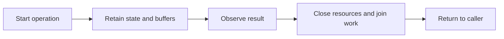

# Coming from EVE

EVE separates OS backends, its callback loop, asynchronous I/O, and optional
runtime facilities such as fibers and futures. The useful migration question is
where execution and resource ownership move—not whether one library has “real
async” and the other does not.

This guide uses the [EVE source baseline][eve] at
`c72f75135de636987e91bcd8ec5a22d32d34a197`. Its README lists Linux
`io_uring`/`epoll`/`poll` and Windows IOCP/WSAPoll; it marks macOS/BSD kqueue
support as planned. EVE is not a readiness-only library with working kqueue support.

<!-- verified-comparisons -->

> [!NOTE]
> Each source tab imports a complete single-file DUB program. Run it with
> `dub run --single <file> -b checked`; assertions stay enabled. Each labelled
> output belongs to the immediately preceding implementation and is independently
> checked by `ci --verify`. See [Running the examples](./running-examples.md)
> for prerequisites, dependency versions and the validation command.

## Map the execution model

| In EVE                                   | In Event Horizon                                 | Migration decision                                                      |
| ---------------------------------------- | ------------------------------------------------ | ----------------------------------------------------------------------- |
| Select a backend and runtime layer       | Start `LoopGroup`, receive `RootScope` and `Env` | Keep the owning loop explicit; the default topology is single-threaded. |
| Register timer callbacks                 | Call `env.clock.sleep` in a fiber                | Sequential code resumes after the wait; check its result.               |
| Launch runtime fibers or wait on futures | Fork scoped children and join `JoinHandle!T`     | A scope joins its children before returning.                            |
| Coordinate producers and consumers       | Use `Channel!(T, capacity)`                      | These channels are scheduler-local, not cross-thread queues.            |
| Cancel an operation or task              | Use a deadline or cancel the owning scope        | Cancellation is cooperative; protect only cleanup that must finish.     |

The baseline's [future implementation][future] supports several callback-delivery
policies. Do not replace a future wait with a thread-blocking wait inside an
Event Horizon fiber: that would stall the loop's other fibers too.



The lifecycle is common; the mechanism is not. Callback registrations need an
explicit owner and terminal path. Fibers make sequential control flow possible,
but still need cancellation and lifetime rules. A lexical scope is useful when
it actually owns the work being started.

## Timers and cadence

The contract is three timer deliveries in order, followed by termination of the
loop or task. The assertions check the count; they do not claim exact timing.
The event-horizon program uses relative sleeps, not `Ticker`: work between
sleeps shifts the next deadline. For absolute cadence, maintain an absolute
next deadline and define how missed ticks are skipped. Cancelling a timer
registration and interrupting the fiber waiting on it are different operations.

::: code-group

<<< @/libs/event-horizon/tutorial/snippets/eve_timers.d [eve]

```ansi [eve output]
tick 1
tick 2
tick 3
```

<<< @/libs/event-horizon/tutorial/snippets/eh_timers.d [event-horizon]

```ansi [event-horizon output]
tick 1
tick 2
tick 3
```

:::

## Concurrency and joined lifetime

Start independent work, combine the two results as `1 * 10 + 2`, and do not
return until the work is complete. Event Horizon's ready/release handshake
proves both children have started before either can finish. This is concurrency,
not proof of CPU parallelism.

On the foreign side, keep callback state or task handles alive through completion.
A lexical D block alone does not join asynchronous work. On the event-horizon
side, the nested scope owns that lifetime and the join handles carry outcomes.
Decide separately what failure of one child should do to its siblings; successful
joining alone does not establish fail-fast cancellation semantics.

::: code-group

<<< @/libs/event-horizon/tutorial/snippets/eve_concurrency.d [eve]

```ansi [eve output]
joined: 12
```

<<< @/libs/event-horizon/tutorial/snippets/eh_concurrency.d [event-horizon]

```ansi [event-horizon output]
joined: 12
```

:::

## Cancellation, deadlines and cleanup

The examples distinguish timeout detection from successful completion and
assert that cleanup ran. Read the foreign operation's interruption mechanism
carefully: cancelling a registration, signalling a flag and interrupting a
fiber are not interchangeable. A timeout on a wait does not necessarily stop
the operation being waited for.

Event Horizon's deadline latches cooperative cancellation. The parked sleep
returns `ECANCELED`; `protect` lets cleanup cross checkpoints even with that
latch set. Keep cleanup bounded. The foreign tab documents its own status
representation rather than pretending its errors are event-horizon values.

::: code-group

<<< @/libs/event-horizon/tutorial/snippets/eve_deadline.d [eve]

```ansi [eve output]
sleep returned: stopped by adapter
timed out: true
cleaned up: true
```

<<< @/libs/event-horizon/tutorial/snippets/eh_deadline.d [event-horizon]

```ansi [event-horizon output]
sleep returned: ECANCELED
timed out: true
cleaned up: true
```

:::

## TCP and buffer ownership

The fixture sends the five-byte message `hello` and asserts the echoed bytes.
TCP is a byte stream: neither one write nor one readiness/completion notification
is a message boundary. Accumulate partial receives and retain unsent suffixes,
or use an API's documented all-bytes operation. Binding loopback port zero lets
the OS reserve a port for this run without a port-selection race.

The foreign callbacks borrow buffers according to their library's contract. Copy
data that must outlive a callback, or retain the documented owner. Event Horizon
moves an owned buffer into the operation and returns ownership on completion.
That lifetime discipline is not a promise of kernel or network zero-copy. A real
protocol also needs framing, maximum message sizes and per-connection deadlines.

::: code-group

<<< @/libs/event-horizon/tutorial/snippets/eve_tcp_echo.d [eve]

```ansi [eve output]
echoed: hello
```

<<< @/libs/event-horizon/tutorial/snippets/eh_tcp_echo.d [event-horizon]

```ansi [event-horizon output]
echoed: hello
```

:::

## Queues, channels and backpressure

The shared payload contract is the ordered sequence 1 through 5, with sum 15.
The flow-control contracts can differ. The event-horizon program fills capacity
two, proves the third put is pending, frees one slot, and proves exactly one
additional put progresses before draining the remaining values and checking
the closed-channel result. No short sleep is used as the backpressure proof.

Read the foreign implementation before translating `put`: an unbounded queue
does not acquire a capacity bound merely because the consumer is slow. A
callback adapter must stop producing and arrange a wakeup when space returns;
blocking an event-loop thread on an OS semaphore can stop unrelated connections.
Event Horizon's `Channel!(T, capacity)` belongs to one scheduler and is not a
drop-in cross-thread notification or broadcast mechanism.

::: code-group

<<< @/libs/event-horizon/tutorial/snippets/eve_channel.d [eve]

```ansi [eve output]
consumed: 15
```

<<< @/libs/event-horizon/tutorial/snippets/eh_channel.d [event-horizon]

```ansi [event-horizon output]
consumed: 15
```

:::

## Files and operation lifetime

The fixture owns a fresh temporary directory and a file containing exactly
`hello from a file\n`. Assertions check the byte count and contents. Keep file
and buffer ownership until all pending operations finish; then close the file
before removing the fixture. Never classify an arbitrary read failure as EOF.

The event-horizon example reads until EOF using offsets and an owned buffer.
Its Linux io_uring implementation submits file operations to the kernel. This
does not establish the same behavior for every backend: kqueue synthesizes
completions over readiness and its regular-file worker-pool refinement is
separate. Where the foreign example uses a worker adapter, it is explicitly
application code, not evidence of a native filesystem capability.

::: code-group

<<< @/libs/event-horizon/tutorial/snippets/eve_file_read.d [eve]

```ansi [eve output]
read 18 bytes: hello from a file
```

<<< @/libs/event-horizon/tutorial/snippets/eh_file_read.d [event-horizon]

```ansi [event-horizon output]
read 18 bytes: hello from a file
```

:::

## Capturing a child process

The child writes different text to stdout and stderr, then exits with code 3.
Both streams and the nonzero status are asserted: a child command failing is
not necessarily failure to launch or observe it. Root reaping is part of the
operation's lifetime.

A general capture implementation must drain both pipes concurrently, even when
one is quiet. Reading all stdout before stderr can deadlock when the stderr
pipe fills. Tiny fixed fixtures do not prove a hand-written adapter safe for
unbounded output. `capture` supplies the drain/reap coordination; adapters need
their own output limits, cancellation and error handling.

::: code-group

<<< @/libs/event-horizon/tutorial/snippets/eve_exec.d [eve]

```ansi [eve output]
stdout: out

stderr: err

exit code: 3
```

<<< @/libs/event-horizon/tutorial/snippets/eh_exec.d [event-horizon]

```ansi [event-horizon output]
stdout: out

stderr: err

exit code: 3
```

:::

## POSIX signals and loop notifications

Install the signal receiver before sending `SIGUSR1` to this process and assert
that the expected signal was observed. Linux signal masks and handler installation
are process/thread integration decisions; they are not interchangeable with an
ordinary callback queue. Keep signal-handler work async-signal-safe.

`SignalFd` receives masked POSIX signals through the event-horizon loop. A foreign
notification primitive may only wake an owner loop from another thread. In
particular, libasync's `AsyncSignal` is not a POSIX signal subscription; an OS
signal bridge must supply that integration explicitly. These programs are Linux
fixtures, not Windows signal portability examples.

::: code-group

<<< @/libs/event-horizon/tutorial/snippets/eve_signal.d [eve]

```ansi [eve output]
got signal SIGUSR1
```

<<< @/libs/event-horizon/tutorial/snippets/eh_signal.d [event-horizon]

```ansi [event-horizon output]
got signal SIGUSR1
```

:::

## Streaming and root termination: an explicit adapter

This foreign program is an application-side process adapter, not a native
supervision API. It owns an OS worker, reads complete lines with Phobos, sends
TERM only after the second line establishes readiness, and asserts the root's
reaped status. `exec sleep` avoids leaving a shell child holding the output pipe.
The library-specific `runWorker` code makes completion delivery and joining
visible. EVE's adapter polls an atomic completion flag; Collie posts a task;
libasync triggers an owner-loop notifier; Hunt uses an explicitly joined Task.

The event-horizon program requests scope cancellation after the same readiness
point. It asserts the final `cancelled` result, root reap status and natural EOF.
Neither fixture demonstrates unescapable descendants. Timeouts and hard-kill
escalation are separate policies; see the deadline pair and containment notes.

::: code-group

<<< @/libs/event-horizon/tutorial/snippets/eve_spawn.d [eve]

```ansi [eve output]
line: one
line: two
exited: SIGTERM
end: reaped
```

<<< @/libs/event-horizon/tutorial/snippets/eh_spawn.d [event-horizon]

```ansi [event-horizon output]
line: one
line: two
exited: cancelled, signaled by 15
end: cancelled, reap: reaped
```

:::

## Retries and finite policy

The first two attempts represent transient failure; the third succeeds. The
foreign timer adapter uses a fixed interval (Photon uses explicit exponential
delays), whereas event-horizon composes `exponential` with `recurs`. Assert the
attempt budget and final value rather than exact elapsed time. In production,
retry only selected transient errors, propagate cancellation and permanent
failures, and ensure repeated side effects are safe. A timer callback becoming
ready is not itself permission to retry a non-idempotent operation.

::: code-group

<<< @/libs/event-horizon/tutorial/snippets/eve_retry.d [eve]

```ansi [eve output]
succeeded on attempt 3
```

<<< @/libs/event-horizon/tutorial/snippets/eh_retry.d [event-horizon]

```ansi [event-horizon output]
succeeded on attempt 3
```

:::

## Errors and migration decisions

| Boundary                   | Migration decision                                                                                                            |
| -------------------------- | ----------------------------------------------------------------------------------------------------------------------------- |
| Ordinary operation failure | Check the foreign status/exception and the event-horizon `IoResult`; do not silently treat failure as success or EOF.         |
| Task failure               | Decide who observes the error and who joins remaining work. Scope outcomes and defects are distinct from ordinary I/O errors. |
| Buffer lifetime            | Retain borrowed data until the foreign operation finishes; recover moved buffers from event-horizon completions.              |
| Cross-thread work          | Use a documented cross-thread bridge. Scheduler-local channels do not replace it.                                             |
| Missing native primitive   | Treat a Phobos/POSIX adapter as application integration, not as a feature supplied by the networking library.                 |

## Next steps

Start with one independently owned connection or operation. Preserve its framing,
error handling and shutdown behavior before changing scheduler topology. The
[Node.js comparison](./coming-from-nodejs.md) provides another fully executable
view of the same concerns, including explicit retries. The
[execution guide](./running-examples.md) records platform and containment limits.

<!-- References -->

[eve]: https://codeberg.org/ddn/eve/src/commit/c72f75135de636987e91bcd8ec5a22d32d34a197/README.md
[future]: https://codeberg.org/ddn/eve/src/commit/c72f75135de636987e91bcd8ec5a22d32d34a197/src/eve/rt/future.d
