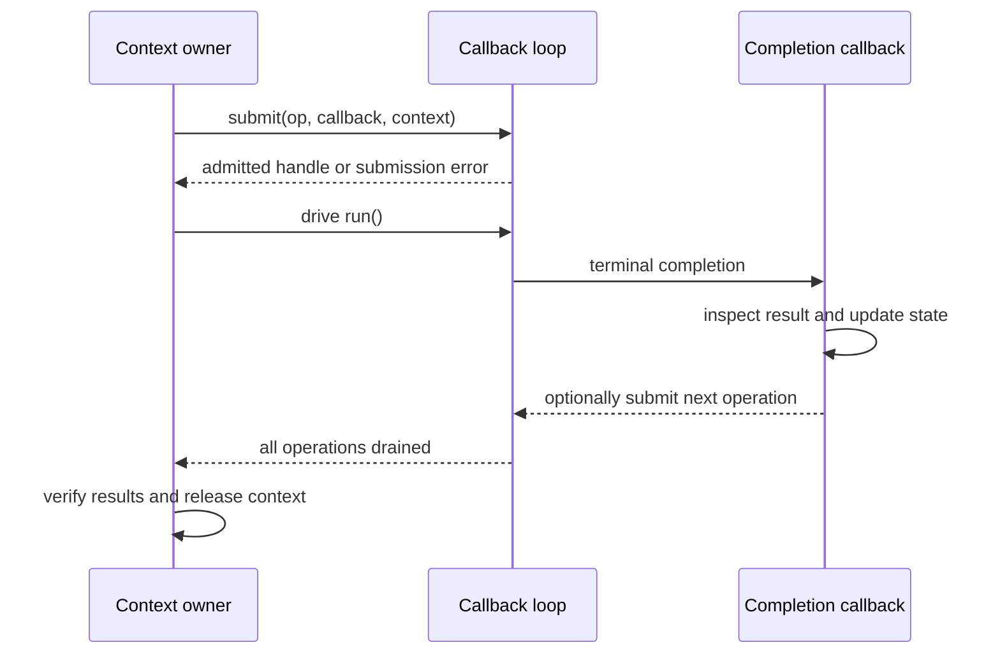
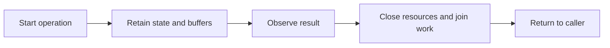

# Coming from eventcore

If you use `eventDriver`, typed descriptor handles, and completion callbacks,
you already know the lower-level responsibilities of an event loop. Event Horizon
offers both callback and fiber layers. These examples compare explicit callback
state with continuations carried by suspended fibers.

The [eventcore baseline][eventcore] is
`ced22593f38dd9b4514aff58a390ce313e62d283`. Its driver matrix includes epoll,
kqueue, WinAPI, and an experimental io_uring driver. It is a callback-based
abstraction, not simply “readiness pretending to be completion.” Supported
operations vary by backend in both libraries.

<!-- verified-comparisons -->

> [!NOTE]
> Each source tab imports a complete single-file DUB program. Run it with
> `dub run --single <file> -b checked`; assertions stay enabled. Each labelled
> output belongs to the immediately preceding implementation and is independently
> checked by `ci --verify`. See [Running the examples](./running-examples.md)
> for prerequisites, dependency versions and the validation command.

## Choose the continuation style, not a different I/O engine

The six three-way groups below show the foreign library, **event-horizon
fibers**, and **event-horizon callbacks**, each with its own asserted output.
Both event-horizon styles submit completion operations; callbacks are Tier A,
and the scheduler builds the fiber style above that core. Callback programs
here create `DefaultLoop` directly: they do not hide a fiber behind a delegate.

| Responsibility     | Tier A: callbacks                                              | Fiber style                                        |
| ------------------ | -------------------------------------------------------------- | -------------------------------------------------- |
| Continue after I/O | `void function(void*, ref Completion) nothrow @nogc`           | Resume after a verb returns an `IoResult`          |
| Keep state alive   | Explicit context until terminal completion                     | Locals in a suspended fiber, owned by its scope    |
| Start an operation | Check `submit`/`submitAfter` for admission failure             | Check the operation's returned result              |
| Observe completion | `Completion.res` is a value or negative errno                  | Typed `IoResult!T`; scope outcomes are separate    |
| Own a buffer       | Move into the op; recover/move `Completion.buf`                | Move through a sequential I/O verb                 |
| Cancel             | Request cancellation, then keep driving to terminal completion | Cancel the owning scope and join protected cleanup |
| Combine operations | Explicit pending count/state machine                           | `fork`/`join` within `withScope`                   |



A submission failure produces **no callback**. An accepted cancellation request
is **not** permission to free the context: the target's terminal callback still
runs, and a real completion may win the race. Do not call `run`/`runOnce` from a
callback. The examples keep contexts and pools alive until `inFlight == 0` and
print after dispatch, outside the `nothrow @nogc` callback boundary.

### Where a callback comparison stops being equivalent

The channel, signal, capture and supervision sections retain their fiber
programs. Tier A has raw read/wait/process-related operations, but no drop-in
callback version of scheduler-local `Channel`, scoped `SignalFd` consumption,
`execCapture`, or `supervise`. Rebuilding their buffering, cancellation, drain,
and reaping policies would be an application adapter, not a second spelling of
the same high-level API. No such equivalence is implied by the six native
operation comparisons.

## Map ownership before syntax

For an eventcore port, Tier A is the closer control-flow translation: explicit
registrations become explicit submissions, and callback state remains callback
state. Moving to fibers is a separate choice about where to store continuations
and how to own related work.

| eventcore entry point              | Event Horizon callbacks                  | Event Horizon fibers                 |
| ---------------------------------- | ---------------------------------------- | ------------------------------------ |
| `eventDriver.core.processEvents`   | `DefaultLoop.run` / `runOnce`            | `LoopGroup.run` drives the scheduler |
| Timer `set` plus one-shot `wait`   | `submitAfter` followed by explicit rearm | A loop around `env.clock.sleep`      |
| Socket read/write callbacks        | `submit(OpRecv/OpSend, callback, ctx)`   | Sequential receive/send verbs        |
| File open/read/close callbacks     | `OpOpenAt`, `OpRead`, `OpClose`          | `openFile`, `read`, `closeFile`      |
| Application-owned completion count | Context with a pending count             | Scoped child handles and `join`      |

The table below describes the higher-level, fiber-oriented migration specifically.

| eventcore concept                | Event Horizon counterpart                     | What changes                                                     |
| -------------------------------- | --------------------------------------------- | ---------------------------------------------------------------- |
| `eventDriver.core.processEvents` | `LoopGroup.run`                               | The group owns dispatch while the root scope runs.               |
| Typed handles and callbacks      | `Stream`, `FileHandle`, direct-style verbs    | A waiting fiber carries the continuation and local state.        |
| `eventDriver.timers`             | `env.clock.sleep`, `Ticker`                   | Check a returned result instead of updating state in a callback. |
| Handle reference management      | Explicit handle cleanup and owned I/O buffers | Moving a buffer does not make TCP message-oriented.              |
| Operation-specific result enums  | `IoResult!T`                                  | Failure includes errno, operation, and stage.                    |
| A higher-level task abstraction  | `withScope`, `fork`, `join`                   | Child lifetime and cancellation belong to an explicit scope.     |

Do not mix a handle created by one driver with another runtime's I/O verbs.
Move ownership of a complete connection or subsystem, including its shutdown path.



The lifecycle is common; the mechanism is not. Callback registrations need an
explicit owner and terminal path. Fibers make sequential control flow possible,
but still need cancellation and lifetime rules. A lexical scope is useful when
it actually owns the work being started.

## Timers and cadence

The contract is three timer deliveries in order, followed by termination of the
loop or task. The assertions check the count; they do not claim exact timing.
The event-horizon program uses relative sleeps, not `Ticker`: work between
sleeps shifts the next deadline. For absolute cadence, maintain an absolute
next deadline and define how missed ticks are skipped. Cancelling a timer
registration and interrupting the fiber waiting on it are different operations.

The callback program explicitly rearms a relative timer after each delivery; the fiber program loops over relative sleeps. Neither proves exact timing or an absolute cadence.

::: code-group

<<< @/libs/event-horizon/tutorial/snippets/ec_timers.d [eventcore]

```ansi [eventcore output]
tick 1
tick 2
tick 3
```

<<< @/libs/event-horizon/tutorial/snippets/eh_timers.d [event-horizon fibers]

```ansi [event-horizon fibers output]
tick 1
tick 2
tick 3
```

<<< @/libs/event-horizon/tutorial/snippets/eh_callback_timers.d [event-horizon callbacks]

```ansi [event-horizon callbacks output]
tick 1
tick 2
tick 3
```

:::

## Concurrency and joined lifetime

Start independent work, combine the two results as `1 * 10 + 2`, and do not
return until the work is complete. Event Horizon's ready/release handshake
proves both children have started before either can finish. This is concurrency,
not proof of CPU parallelism.

On the foreign side, keep callback state or task handles alive through completion.
A lexical D block alone does not join asynchronous work. On the event-horizon
fiber side, the nested scope owns that lifetime and the join handles carry outcomes.
Decide separately what failure of one child should do to its siblings; successful
joining alone does not establish fail-fast cancellation semantics.

The callback program admits two operations before driving the loop, then asserts both results and a drained loop. Its counter is explicit fan-in, not a lexical child scope. The fiber program additionally proves both children have started with a ready/release handshake.

::: code-group

<<< @/libs/event-horizon/tutorial/snippets/ec_concurrency.d [eventcore]

```ansi [eventcore output]
joined: 12
```

<<< @/libs/event-horizon/tutorial/snippets/eh_concurrency.d [event-horizon fibers]

```ansi [event-horizon fibers output]
joined: 12
```

<<< @/libs/event-horizon/tutorial/snippets/eh_callback_concurrency.d [event-horizon callbacks]

```ansi [event-horizon callbacks output]
joined: 12
```

:::

## Cancellation, deadlines and cleanup

The examples distinguish timeout detection from successful completion and
assert that cleanup ran. Read the foreign operation's interruption mechanism
carefully: cancelling a registration, signalling a flag and interrupting a
fiber are not interchangeable. A timeout on a wait does not necessarily stop
the operation being waited for.

Event Horizon's deadline latches cooperative cancellation. The parked sleep
returns `ECANCELED`; `protect` lets cleanup cross checkpoints even with that
latch set. Keep cleanup bounded. The foreign tab documents its own status
representation rather than pretending its errors are event-horizon values.

The callback deadline requests cancellation of an already-admitted long timer, observes its terminal `-ECANCELED`, and only then submits asynchronous cleanup. `run()` drains that cleanup before the context dies. This is a manually owned deadline state machine, not `withDeadline` or a callback-level protected scope. The fixture's long delay makes the intended cancellation path testable; real code must also handle completion winning the race.

::: code-group

<<< @/libs/event-horizon/tutorial/snippets/ec_deadline.d [eventcore]

```ansi [eventcore output]
sleep returned: stopped by adapter
timed out: true
cleaned up: true
```

<<< @/libs/event-horizon/tutorial/snippets/eh_deadline.d [event-horizon fibers]

```ansi [event-horizon fibers output]
sleep returned: ECANCELED
timed out: true
cleaned up: true
```

<<< @/libs/event-horizon/tutorial/snippets/eh_callback_deadline.d [event-horizon callbacks]

```ansi [event-horizon callbacks output]
sleep returned: ECANCELED
timed out: true
cleaned up: true
```

:::

## TCP and buffer ownership

The fixture sends the five-byte message `hello` and asserts the echoed bytes.
TCP is a byte stream: neither one write nor one readiness/completion notification
is a message boundary. Accumulate partial receives and retain unsent suffixes,
or use an API's documented all-bytes operation. Binding loopback port zero lets
the OS reserve a port for this run without a port-selection race.

The foreign callbacks borrow buffers according to their library's contract. Copy
data that must outlive a callback, or retain the documented owner. Event Horizon
moves an owned buffer into the operation and returns ownership on completion.
That lifetime discipline is not a promise of kernel or network zero-copy. A real
protocol also needs framing, maximum message sizes and per-connection deadlines.

The callback implementation drives **both** peers through `OpAccept`, `OpConnect`, `OpSend` and `OpRecv`. Two-byte pool buffers force the five-byte frame through multiple completions. It retains unsent suffixes, accumulates receives, and asserts all four buffers returned before releasing the pool. Socket creation/bind/listen and final descriptor closure are synchronous setup/teardown.

::: code-group

<<< @/libs/event-horizon/tutorial/snippets/ec_tcp_echo.d [eventcore]

```ansi [eventcore output]
echoed: hello
```

<<< @/libs/event-horizon/tutorial/snippets/eh_tcp_echo.d [event-horizon fibers]

```ansi [event-horizon fibers output]
echoed: hello
```

<<< @/libs/event-horizon/tutorial/snippets/eh_callback_tcp_echo.d [event-horizon callbacks]

```ansi [event-horizon callbacks output]
echoed: hello
```

:::

## Queues, channels and backpressure

The shared payload contract is the ordered sequence 1 through 5, with sum 15.
The flow-control contracts can differ. The event-horizon program fills capacity
two, proves the third put is pending, frees one slot, and proves exactly one
additional put progresses before draining the remaining values and checking
the closed-channel result. No short sleep is used as the backpressure proof.

Read the foreign implementation before translating `put`: an unbounded queue
does not acquire a capacity bound merely because the consumer is slow. A
callback adapter must stop producing and arrange a wakeup when space returns;
blocking an event-loop thread on an OS semaphore can stop unrelated connections.
Event Horizon's `Channel!(T, capacity)` belongs to one scheduler and is not a
drop-in cross-thread notification or broadcast mechanism.

::: code-group

<<< @/libs/event-horizon/tutorial/snippets/ec_channel.d [eventcore]

```ansi [eventcore output]
consumed: 15
```

<<< @/libs/event-horizon/tutorial/snippets/eh_channel.d [event-horizon fibers]

```ansi [event-horizon fibers output]
consumed: 15
```

:::

## Files and operation lifetime

The fixture owns a fresh temporary directory and a file containing exactly
`hello from a file\n`. Assertions check the byte count and contents. Keep file
and buffer ownership until all pending operations finish; then close the file
before removing the fixture. Never classify an arbitrary read failure as EOF.

The event-horizon example reads until EOF using offsets and an owned buffer.
Its Linux io_uring implementation submits file operations to the kernel. This
does not establish the same behavior for every backend: kqueue synthesizes
completions over readiness and its regular-file worker-pool refinement is
separate. Where the foreign example uses a worker adapter, it is explicitly
application code, not evidence of a native filesystem capability.

The callback state machine checks a missing-file `-ENOENT`, then opens the fixture, reads through an eight-byte buffer until zero-byte EOF, and closes through `OpClose`. The NUL-terminated paths stay alive until their open completions. Moving the returned buffer into the next read avoids retaining a borrowed completion slice.

::: code-group

<<< @/libs/event-horizon/tutorial/snippets/ec_file_read.d [eventcore]

```ansi [eventcore output]
read 18 bytes: hello from a file
```

<<< @/libs/event-horizon/tutorial/snippets/eh_file_read.d [event-horizon fibers]

```ansi [event-horizon fibers output]
read 18 bytes: hello from a file
```

<<< @/libs/event-horizon/tutorial/snippets/eh_callback_file_read.d [event-horizon callbacks]

```ansi [event-horizon callbacks output]
read 18 bytes: hello from a file
```

:::

## Capturing a child process

The child writes different text to stdout and stderr, then exits with code 3.
Both streams and the nonzero status are asserted: a child command failing is
not necessarily failure to launch or observe it. Root reaping is part of the
operation's lifetime.

A general capture implementation must drain both pipes concurrently, even when
one is quiet. Reading all stdout before stderr can deadlock when the stderr
pipe fills. Tiny fixed fixtures do not prove a hand-written adapter safe for
unbounded output. `capture` supplies the drain/reap coordination; adapters need
their own output limits, cancellation and error handling.

::: code-group

<<< @/libs/event-horizon/tutorial/snippets/ec_exec.d [eventcore]

```ansi [eventcore output]
stdout: out

stderr: err

exit code: 3
```

<<< @/libs/event-horizon/tutorial/snippets/eh_exec.d [event-horizon fibers]

```ansi [event-horizon fibers output]
stdout: out

stderr: err

exit code: 3
```

:::

## Streaming and termination

Streaming adds a state machine: accumulate bytes into lines, observe the root,
request termination, finish drains, and reap. A pipe read can split a line or
contain several lines, so splitting each chunk independently is insufficient.
The two source tabs expose the cleanup machinery instead of hiding it behind
a printed success message.

The foreign program's manual root termination is not process-tree containment.
Event Horizon reports supervision outcome and reap provenance, but its process
group/cgroup tiers are not an inescapable sandbox either: descendants can race
the post-spawn cgroup migration. EOF may be forced at the drain limit. See
[the supervision caveats](./running-examples.md#capture-versus-streaming-supervision).

::: code-group

<<< @/libs/event-horizon/tutorial/snippets/ec_spawn.d [eventcore]

```ansi [eventcore output]
line: one
line: two
exited: timedOut, signaled by 15
end: timedOut, reap: reaped
```

<<< @/libs/event-horizon/tutorial/snippets/eh_spawn.d [event-horizon fibers]

```ansi [event-horizon fibers output]
line: one
line: two
exited: cancelled, signaled by 15
end: cancelled, reap: reaped
```

:::

## POSIX signals and loop notifications

Install the signal receiver before sending `SIGUSR1` to this process and assert
that the expected signal was observed. Linux signal masks and handler installation
are process/thread integration decisions; they are not interchangeable with an
ordinary callback queue. Keep signal-handler work async-signal-safe.

`SignalFd` receives masked POSIX signals through the event-horizon loop. A foreign
notification primitive may only wake an owner loop from another thread. In
particular, libasync's `AsyncSignal` is not a POSIX signal subscription; an OS
signal bridge must supply that integration explicitly. These programs are Linux
fixtures, not Windows signal portability examples.

::: code-group

<<< @/libs/event-horizon/tutorial/snippets/ec_signal.d [eventcore]

```ansi [eventcore output]
got signal SIGUSR1
```

<<< @/libs/event-horizon/tutorial/snippets/eh_signal.d [event-horizon fibers]

```ansi [event-horizon fibers output]
got signal SIGUSR1
```

:::

## Retries and finite policy

The first two attempts represent transient failure; the third succeeds. The
foreign timer adapter uses a fixed interval (Photon uses explicit exponential
delays), whereas event-horizon composes `exponential` with `recurs`. Assert the
attempt budget and final value rather than exact elapsed time. In production,
retry only selected transient errors, propagate cancellation and permanent
failures, and ensure repeated side effects are safe. A timer callback becoming
ready is not itself permission to retry a non-idempotent operation.

The callback implementation models an operation returning `EAGAIN` twice, schedules 5 ms then 10 ms backoff, and asserts the third attempt produced its value. Retry state and the attempt budget are explicit. This models an ordinary dependency failure, not an assertion failure and not automatic retry of failed `submit` calls.

::: code-group

<<< @/libs/event-horizon/tutorial/snippets/ec_retry.d [eventcore]

```ansi [eventcore output]
succeeded on attempt 3
```

<<< @/libs/event-horizon/tutorial/snippets/eh_retry.d [event-horizon fibers]

```ansi [event-horizon fibers output]
succeeded on attempt 3
```

<<< @/libs/event-horizon/tutorial/snippets/eh_callback_retry.d [event-horizon callbacks]

```ansi [event-horizon callbacks output]
succeeded on attempt 3
```

:::

## Errors and migration decisions

| Boundary                   | Migration decision                                                                                                            |
| -------------------------- | ----------------------------------------------------------------------------------------------------------------------------- |
| Ordinary operation failure | Check the foreign status/exception and the event-horizon `IoResult`; do not silently treat failure as success or EOF.         |
| Task failure               | Decide who observes the error and who joins remaining work. Scope outcomes and defects are distinct from ordinary I/O errors. |
| Buffer lifetime            | Retain borrowed data until the foreign operation finishes; recover moved buffers from event-horizon completions.              |
| Cross-thread work          | Use a documented cross-thread bridge. Scheduler-local channels do not replace it.                                             |
| Missing native primitive   | Treat a Phobos/POSIX adapter as application integration, not as a feature supplied by the networking library.                 |

## Next steps

Start with one independently owned connection or operation. Preserve its framing,
error handling and shutdown behavior before changing scheduler topology. The
[Node.js comparison](./coming-from-nodejs.md) provides another fully executable
view of the same concerns, including explicit retries. The
[execution guide](./running-examples.md) records platform and containment limits.

<!-- References -->

[eventcore]: https://github.com/vibe-d/eventcore/blob/ced22593f38dd9b4514aff58a390ce313e62d283/README.md
