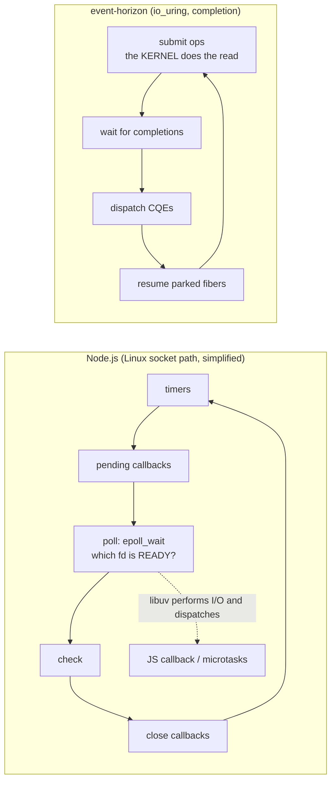
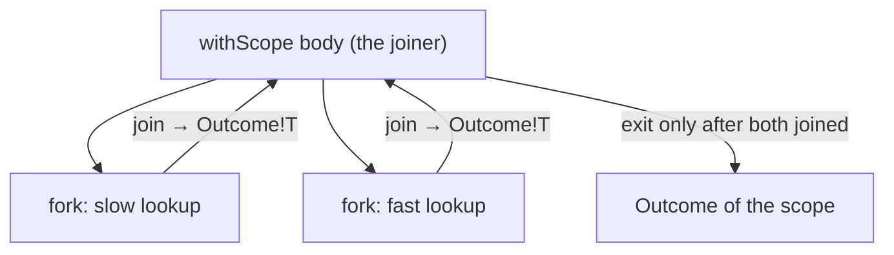
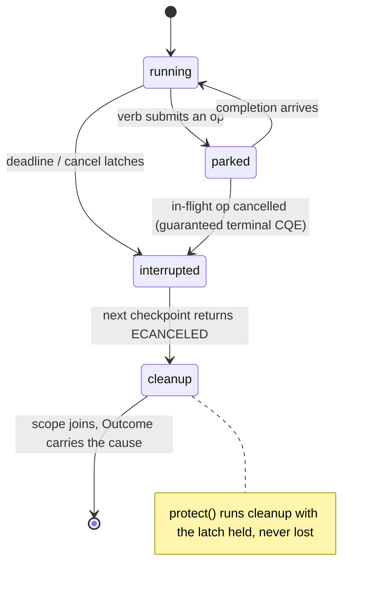
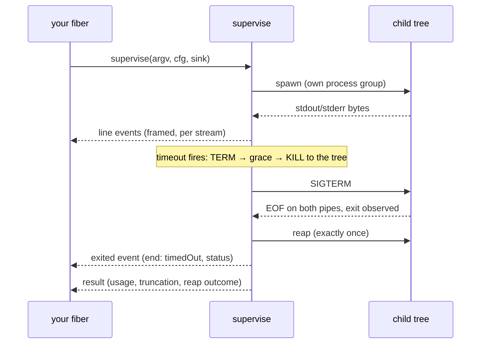

# Coming from Node.js

You know the Node.js event loop: one thread, callbacks and promises, `async`/`await`,
`EventEmitter`, `AbortController`, `child_process`, `worker_threads`. This page maps
each of those onto `sparkles:event-horizon`, explains where the two models deliberately
differ, and gives you a runnable D program for every mapping.

**Last reviewed:** September 7, 2026

> [!NOTE]
> Every implementation below is a complete executable tutorial, with error handling
> and cleanup. Assertion-heavy contract examples are linked after each comparison.
> D files run with `dub run --single <file> -b checked`; Node.js files run with
> `node <file>`. The labelled output tabs belong to the immediately preceding source.
> `ci --verify` checks both tutorial outputs and independently runs the contract
> counterparts with assertions enabled. Linux prerequisites
> and dependency versions are documented in [Running the examples](./running-examples.md).

<!-- verified-comparisons -->

## The one-paragraph difference

On Linux, libuv commonly reacts to socket readiness, performs I/O, and dispatches
JavaScript callbacks. Event Horizon's io_uring backend submits the operation itself
and receives a completion. This is a backend distinction, not a claim that Node's
Windows IOCP backend is readiness-based or that kqueue is a completion ring.
On top of its completion interface Event Horizon runs **fibers**: your code looks blocking
(`recv`, `sleep`, `accept` return values), but each call parks the fiber on a
submission and resumes it on the completion. There is no `await` keyword, no
function coloring, or JavaScript-style microtask ordering. Its kqueue backend
synthesizes completions over readiness; see the [platform notes](./running-examples.md).



## Concept map

| Node.js                                   | `event-horizon`                                              | Notes                                                                        |
| ----------------------------------------- | ------------------------------------------------------------ | ---------------------------------------------------------------------------- |
| the process-wide event loop               | `LoopGroup` + `RootScope` + `Env`                            | one loop per thread; you start it, it does not start itself                  |
| `Promise<T>` / rejection                  | `IoResult!T` (a value _or_ an `IoError`)                     | ordinary I/O errors are values; defects remain distinct                      |
| `async function` / `await`                | a fiber; every verb is a checkpoint                          | `recv`, `sleep`, `accept` park the fiber and return the result               |
| `setTimeout` / `setInterval`              | `env.clock.sleep` / `Ticker`                                 | `Ticker` avoids cumulative delay drift; individual wakeups can still be late |
| `Promise.all` / `Promise.allSettled`      | `withScope` + `fork`/`join`                                  | the scope cannot exit until every child is done                              |
| `Promise.race`                            | `race`                                                       | losers are cancelled and joined; this is not `Promise.any` semantics         |
| `AbortController` / `AbortSignal.timeout` | `Scope.cancel` / `withDeadline` / `protect`                  | cancellation is a tree, delivered at checkpoints, and cleanup runs shielded  |
| streams' backpressure                     | `Channel!(T, capacity)`                                      | bounded queue, not a broadcast emitter; scheduler-local                      |
| `net.createServer` / `net.connect`        | `env.net.listen` / `env.net.connect`, `accept`/`recv`/`send` | buffers move in and come back (the kernel owns them mid-flight)              |
| `fs.promises.readFile`                    | `openFile` + `read`                                          | Linux io_uring submits reads; backend implementations differ                 |
| `child_process.exec`                      | `capture`                                                    | concurrent drains and root reap ownership                                    |
| `child_process.spawn` + `'data'` events   | `supervise` + `ProcessEvent`s                                | framed lines, timeouts, tree kill, resource accounting                       |
| `process.on('SIGINT')`                    | `SignalFd`                                                   | signals are completions, not handlers                                        |
| `fs.watch`                                | `Watcher`                                                    | inotify events through the loop                                              |
| `p-retry` / hand-rolled backoff           | `retry` + schedules (`exponential & recurs`)                 | schedules are pure values; time comes in, decisions come out                 |
| `worker_threads`                          | `LoopGroup` topologies                                       | default is one loop; multi-worker ownership must be designed explicitly      |
| unhandled rejection event                 | explicit result checking                                     | dropping an `IoResult` does not automatically report an error                |

The EH programs use `runApplication`: it starts a single-scheduler runtime,
provides the root scope and capabilities, then joins and cleans up. The body
returns `IoResult`; the application receives an `Outcome` that distinguishes
ordinary failure from cancellation and defects. For reusable or multi-worker
runtimes, use `LoopGroup` explicitly instead.

## Timers: `setTimeout` is a parked fiber

Both examples print three ticks separated by relative delays. A delay
starts when requested: it is not an absolute ticker and does not prove drift-free
cadence. `env.clock.sleep` parks this fiber; Node's promise timer suspends this
async function. Neither promises exact wall-clock execution under load.

::: code-group

<<< @/libs/event-horizon/tutorial/snippets/tutorial/node_timers.mjs [Node.js]

```ansi [Node.js output]
tick 1
tick 2
tick 3
```

<<< @/libs/event-horizon/tutorial/snippets/tutorial/eh_timers.d [event-horizon]

```ansi [event-horizon output]
tick 1
tick 2
tick 3
```

:::

Contract examples: [Node.js](./snippets/node_timers.mjs) · [event-horizon](./snippets/eh_timers.d).

## Concurrency: joining promises versus owning children

Both examples start two delayed computations before joining their results.
`Promise.all` joins these successful promises, but does not itself own or cancel
underlying work on failure. A **scope** owns its children: `withScope` does not return until every fiber it
spawned has finished, and a child's typed result comes back through a `JoinHandle`.
That is the whole of structured concurrency — there is no way to leak a running fiber
past the block that created it.

The EH example joins both handles before reporting their outcomes. A `fork`'s
typed failure goes to its join handle; it does not itself invoke the scope's
sibling-cancellation policy. Here `root.fail` explicitly promotes a joined
failure into the root outcome. This is not JavaScript's fail-fast promise behavior.



::: code-group

<<< @/libs/event-horizon/tutorial/snippets/tutorial/node_concurrency.mjs [Node.js]

```ansi [Node.js output]
joined: 12
```

<<< @/libs/event-horizon/tutorial/snippets/tutorial/eh_concurrency.d [event-horizon]

```ansi [event-horizon output]
joined: 12
```

:::

Contract examples: [Node.js](./snippets/node_concurrency.mjs) · [event-horizon](./snippets/eh_concurrency.d).

## Cancellation and timeouts: `AbortController` is a cancel scope

In Node, honouring a signal is the callee's job — every layer must thread `signal`
through and check it. Here a deadline **is** a cancel scope: `withDeadline` interrupts
every checkpoint inside it, the operation that was parked returns `ECANCELED`, and the
scope's outcome says it was a timeout. Cleanup that must not be interrupted runs under
`protect`.



::: code-group

<<< @/libs/event-horizon/tutorial/snippets/tutorial/node_deadline.mjs [Node.js]

```ansi [Node.js output]
sleep returned: AbortError
timed out: true
cleaned up: true
```

<<< @/libs/event-horizon/tutorial/snippets/tutorial/eh_deadline.d [event-horizon]

```ansi [event-horizon output]
sleep returned: ECANCELED
timed out: true
cleaned up: true
```

:::

Contract examples: [Node.js](./snippets/node_deadline.mjs) · [event-horizon](./snippets/eh_deadline.d).

## Events and backpressure: choose a bounded channel

A `Channel!(T, capacity)` is a queue, not an `EventEmitter` broadcast substitute.
`put` parks the producer while the buffer is full, so
backpressure is what you get by default. `close` wakes every waiter: takers drain what
is buffered and then see `EPIPE`.

::: code-group

<<< @/libs/event-horizon/tutorial/snippets/tutorial/node_channel.mjs [Node.js]

```ansi [Node.js output]
consumed: 15
```

<<< @/libs/event-horizon/tutorial/snippets/tutorial/eh_channel.d [event-horizon]

```ansi [event-horizon output]
consumed: 15
```

:::

Contract examples: [Node.js](./snippets/node_channel.mjs) · [event-horizon](./snippets/eh_channel.d).

## Sockets: `net.createServer` is `listen` + `accept` in a fiber

The shape is the same — a listener, a connection per client — but each side is a fiber
running sequential code. One thing is genuinely different: the **buffer moves**. The
kernel owns it while the operation is in flight, so `recv(move(buf))` hands it over and
the result hands it back. This expresses ownership, not a zero-copy guarantee.
`sendAll` and `readExactly` handle partial transfers while returning the buffer
owner. The EH example uses a five-byte frame; Node ends the request stream and
reads the echo through EOF. TCP itself preserves neither write boundaries nor
application messages.

::: code-group

<<< @/libs/event-horizon/tutorial/snippets/tutorial/node_tcp_echo.mjs [Node.js]

```ansi [Node.js output]
echoed: hello
```

<<< @/libs/event-horizon/tutorial/snippets/tutorial/eh_tcp_echo.d [event-horizon]

```ansi [event-horizon output]
echoed: hello
```

:::

Contract examples: [Node.js](./snippets/node_tcp_echo.mjs) · [event-horizon](./snippets/eh_tcp_echo.d).

## Files: bounded whole-file reads

Node's async file I/O is a thread pool because `epoll` cannot express a file read.
`io_uring` can: `env.fs.readText` composes open, reads and protected close over
the ring-backed file operations. Its explicit byte limit prevents unbounded
accumulation, and the returned string is GC-allocated without Unicode validation.
The anonymous temporary fixture makes this Linux D program self-contained.

::: code-group

<<< @/libs/event-horizon/tutorial/snippets/tutorial/node_file_read.mjs [Node.js]

```ansi [Node.js output]
read 18 bytes: hello from a file

```

<<< @/libs/event-horizon/tutorial/snippets/tutorial/eh_file_read.d [event-horizon]

```ansi [event-horizon output]
read 18 bytes: hello from a file

```

:::

Contract examples: [Node.js](./snippets/node_file_read.mjs) · [event-horizon](./snippets/eh_file_read.d).

## Child processes: `exec` is `capture`, `spawn` is `supervise`

`capture` spawns, drains both pipes concurrently (so a chatty child can never deadlock
against an undrained pipe), and reaps exactly once. A non-zero exit is data, not an
error.

::: code-group

<<< @/libs/event-horizon/tutorial/snippets/tutorial/node_exec.mjs [Node.js]

```ansi [Node.js output]
stdout: out

stderr: err

exit code: 3
```

<<< @/libs/event-horizon/tutorial/snippets/tutorial/eh_exec.d [event-horizon]

```ansi [event-horizon output]
stdout: out

stderr: err

exit code: 3
```

:::

Contract examples: [Node.js](./snippets/node_exec.mjs) · [event-horizon](./snippets/eh_exec.d).

`supervise` owns the whole run: it frames each stream into lines, feeds stdin, applies
a timeout as TERM-then-grace-then-KILL to the child's **process tree** (a fresh process
group, plus a cgroup where the host delegates one), samples the tree's resource usage,
and delivers every event on your fiber in order. The `exited` event is published exactly
once after the terminal sequence. Streams can be forcibly closed at the drain
limit, and the result records reap provenance and termination degradation. Process
groups and post-spawn cgroup migration are not inescapable containment; see
[the supervision caveats](./running-examples.md#capture-versus-streaming-supervision).

The diagram shows the timeout path. The executable programs below instead wait
for the child's second line before requesting termination. EH deliberately
cancels its root, waits for supervision to drain and reap, then handles that
expected cancellation at the application boundary. Node sends SIGTERM to its
single child and waits for `close`; it does not acquire EH's tree policy.



::: code-group

<<< @/libs/event-horizon/tutorial/snippets/tutorial/node_spawn.mjs [Node.js]

```ansi [Node.js output]
line: one
line: two
exited: SIGTERM
end: closed
```

<<< @/libs/event-horizon/tutorial/snippets/tutorial/eh_spawn.d [event-horizon]

```ansi [event-horizon output]
line: one
line: two
exited: cancelled, signaled by 15
end: cancelled, reap: reaped
```

:::

Contract examples: [Node.js](./snippets/node_spawn.mjs) · [event-horizon](./snippets/eh_spawn.d).

## Signals: `process.on('SIGINT')` is a completion too

A `SignalFd` turns signals into completions the loop delivers to the fiber waiting on
them. Create it before other threads that must inherit the blocked signal mask;
this avoids running application logic in an asynchronous signal handler. It does
not by itself make all application state race-free.

::: code-group

<<< @/libs/event-horizon/tutorial/snippets/tutorial/node_signal.mjs [Node.js]

```ansi [Node.js output]
got signal SIGUSR1
```

<<< @/libs/event-horizon/tutorial/snippets/tutorial/eh_signal.d [event-horizon]

```ansi [event-horizon output]
got signal SIGUSR1
```

:::

Contract examples: [Node.js](./snippets/node_signal.mjs) · [event-horizon](./snippets/eh_signal.d).

## Retries: a schedule is a value, not a loop you write

Schedules compose as values (`exponential(5.msecs) & recurs(4)` reads "back off
exponentially, at most four times") and the `retry` driver sleeps through whatever
clock you pass it — so a test can virtualise time with a `TestClock`.

::: code-group

<<< @/libs/event-horizon/tutorial/snippets/tutorial/node_retry.mjs [Node.js]

```ansi [Node.js output]
attempts: 3
```

<<< @/libs/event-horizon/tutorial/snippets/tutorial/eh_retry.d [event-horizon]

```ansi [event-horizon output]
succeeded on attempt 3
```

:::

Contract examples: [Node.js](./snippets/node_retry.mjs) · [event-horizon](./snippets/eh_retry.d).

## Where the models deliberately differ

- **Explicit error checking.** A failing operation returns an `IoResult` you must
  inspect; dropping it does not create an unhandled-rejection event. `Throwable`s escaping a
  fiber) are _defects_ and fail the scope that owns the fiber.
- **No fire-and-forget.** Every fiber belongs to a scope, and a scope does not exit
  until its children have. Daemons (`spawnDaemon`) are the escape hatch: they are
  reaped when the scope ends, not orphaned.
- **Cancellation is cooperative and structural.** It latches on a fiber and is
  delivered at its next checkpoint — every I/O verb is one — and it descends a tree of
  scopes. `protect` shields cleanup. Nothing is "aborted" between two statements.
- **Buffers move.** A completion backend owns the buffer while an operation is in
  flight; `move(buf)` in, `move(result.buf)` out. The contract keeps storage alive
  through completion; it does not eliminate every application-level alias or race.
- **No microtasks, no `nextTick`.** A fiber runs until it parks; `yieldNow` is the
  explicit "let others run" point when you need one in a CPU-bound loop.
- **Explicit topology.** A `LoopGroup` defaults to one calling-thread loop.
  Multi-worker modes have thread-affine handles and scheduler-local state; changing
  topology is not a substitute for designing cross-thread communication.

## Errors as values, in one table

| Node.js                           | `event-horizon`                                                                                     |
| --------------------------------- | --------------------------------------------------------------------------------------------------- |
| `throw` / rejected promise        | `IoResult!T` = `Expected!(T, IoError)`: `hasValue`, `value`, `error`                                |
| `err.code === 'ECONNRESET'`       | `error.errnoValue == ECONNRESET`, plus `op` and `stage`                                             |
| `AbortError` / `TimeoutError`     | `Outcome` with a `Cause`: `isTimeout`, `Interrupt` kind                                             |
| uncaught exception                | a defect: the scope fails with `Cause.die`, the `Throwable` travels to the joiner                   |
| `process.exit(1)` on a hard fault | the loop's `FatalHook` — a backend that can no longer make progress ends the process, never returns |

## Next steps

- The normative surface: [SPEC.md](../../../specs/event-horizon/SPEC.md) — §7 fibers,
  §8 scopes and cancellation, §13 processes, §14 channels, §16 the public API.
- The research behind the design: [Async I/O & Event Loops](../../../research/async-io/index.md)
  and [Process Supervision](../../../research/async-io/process-supervision.md).
- Standalone examples in `libs/event-horizon/examples/`: `callback-echo.d` (tier A),
  `fiber-echo.d` (tier B), `agent-tooling.d` (processes, files and a watcher together).
