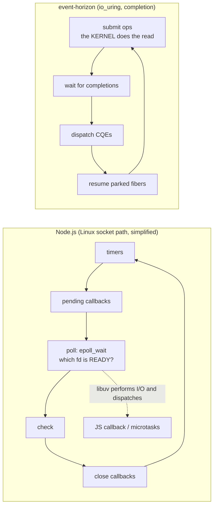
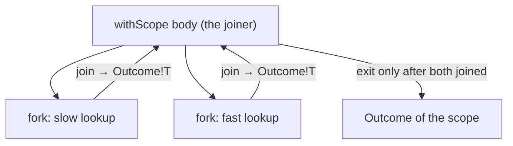
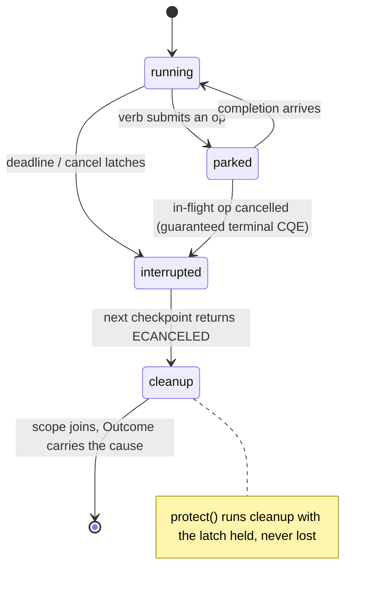
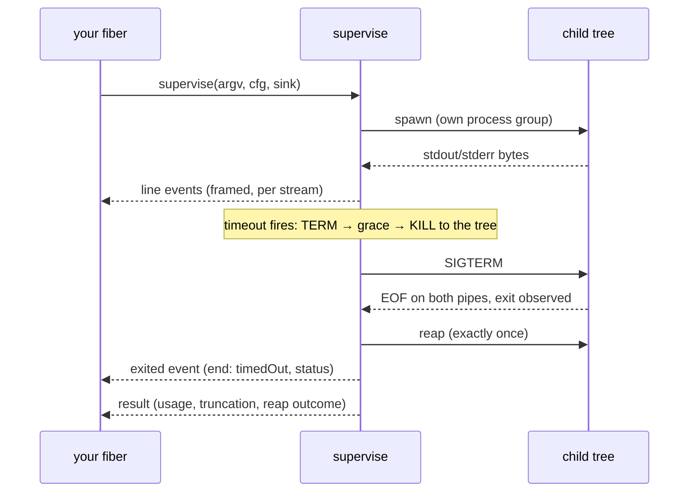

# Coming from Node.js

You know the Node.js event loop: one thread, callbacks and promises, `async`/`await`,
`EventEmitter`, `AbortController`, `child_process`, `worker_threads`. This page maps
each of those onto `sparkles:event-horizon`, explains where the two models deliberately
differ, and gives you a runnable D program for every mapping.

**Last reviewed:** September 6, 2026

> [!NOTE]
> Every D tab imports a shared single-file `dub` program run by the standalone-example
> CI gate. See [Running the examples](./running-examples.md) for Linux prerequisites
> and commands. Output blocks are illustrative; assertions check the programs' results.
> The Node.js blocks show the shape being translated and are not executed.

## The one-paragraph difference

On Linux, libuv commonly reacts to socket readiness, performs I/O, and dispatches
JavaScript callbacks. Event Horizon's io_uring backend submits the operation itself
and receives a completion. This is a backend distinction, not a claim that Node's
Windows IOCP backend is readiness-based or that kqueue is a completion ring.
On top of its completion interface Event Horizon runs **fibers**: your code looks blocking
(`recv`, `sleep`, `accept` return values), but each call parks the fiber on a
submission and resumes it on the completion. There is no `await` keyword, no
function coloring, or JavaScript-style microtask ordering. Its kqueue backend
synthesizes completions over readiness; see the [platform notes](./running-examples.md).



## Concept map

| Node.js                                   | `event-horizon`                                              | Notes                                                                       |
| ----------------------------------------- | ------------------------------------------------------------ | --------------------------------------------------------------------------- |
| the process-wide event loop               | `LoopGroup` + `RootScope` + `Env`                            | one loop per thread; you start it, it does not start itself                 |
| `Promise<T>` / rejection                  | `IoResult!T` (a value _or_ an `IoError`)                     | ordinary I/O errors are values; defects remain distinct                     |
| `async function` / `await`                | a fiber; every verb is a checkpoint                          | `recv`, `sleep`, `accept` park the fiber and return the result              |
| `setTimeout` / `setInterval`              | `env.clock.sleep` / `Ticker`                                 | `Ticker` is absolute-deadline paced: no drift, missed ticks are skipped     |
| `Promise.all` / `Promise.allSettled`      | `withScope` + `fork`/`join`                                  | the scope cannot exit until every child is done                             |
| `Promise.race`                            | `race`                                                       | losers are cancelled and joined; this is not `Promise.any` semantics        |
| `AbortController` / `AbortSignal.timeout` | `Scope.cancel` / `withDeadline` / `protect`                  | cancellation is a tree, delivered at checkpoints, and cleanup runs shielded |
| streams' backpressure                     | `Channel!(T, capacity)`                                      | bounded queue, not a broadcast emitter; scheduler-local                     |
| `net.createServer` / `net.connect`        | `env.net.listen` / `env.net.connect`, `accept`/`recv`/`send` | buffers move in and come back (the kernel owns them mid-flight)             |
| `fs.promises.readFile`                    | `openFile` + `read`                                          | Linux io_uring submits reads; backend implementations differ                |
| `child_process.exec`                      | `capture`                                                    | concurrent drains and root reap ownership                                   |
| `child_process.spawn` + `'data'` events   | `supervise` + `ProcessEvent`s                                | framed lines, timeouts, tree kill, resource accounting                      |
| `process.on('SIGINT')`                    | `SignalFd`                                                   | signals are completions, not handlers                                       |
| `fs.watch`                                | `Watcher`                                                    | inotify events through the loop                                             |
| `p-retry` / hand-rolled backoff           | `retry` + schedules (`exponential & recurs`)                 | schedules are pure values; time comes in, decisions come out                |
| `worker_threads`                          | `LoopGroup` topologies                                       | default is one loop; multi-worker ownership must be designed explicitly     |
| unhandled rejection event                 | explicit result checking                                     | dropping an `IoResult` does not automatically report an error               |

## Timers: `setTimeout` is a parked fiber

`env.clock.sleep` parks the current fiber on an in-ring timer. The thread is free to
run other fibers meanwhile; nothing spins.

::: code-group

<<< @/libs/event-horizon/tutorial/snippets/eh_timers.d [D]

```ansi
tick 1
tick 2
tick 3
```

```js [Node.js]
// Node.js
for (let i = 1; i <= 3; i++) {
  await new Promise(resolve => setTimeout(resolve, 10));
  console.log(`tick ${i}`);
}
```

:::

## Concurrency: `Promise.all` is a scope with children

A **scope** owns its children: `withScope` does not return until every fiber it
spawned has finished, and a child's typed result comes back through a `JoinHandle`.
That is the whole of structured concurrency — there is no way to leak a running fiber
past the block that created it.



::: code-group

<<< @/libs/event-horizon/tutorial/snippets/eh_concurrency.d [D]

```ansi
joined: 12
```

```js [Node.js]
// Node.js
const [a, b] = await Promise.all([fetchA(), fetchB()]);
```

:::

## Cancellation and timeouts: `AbortController` is a cancel scope

In Node, honouring a signal is the callee's job — every layer must thread `signal`
through and check it. Here a deadline **is** a cancel scope: `withDeadline` interrupts
every checkpoint inside it, the operation that was parked returns `ECANCELED`, and the
scope's outcome says it was a timeout. Cleanup that must not be interrupted runs under
`protect`.



::: code-group

<<< @/libs/event-horizon/tutorial/snippets/eh_deadline.d [D]

```ansi
sleep returned: ECANCELED
timed out: true
cleaned up: true
```

```js [Node.js]
// Node.js
const signal = AbortSignal.timeout(50);
try {
  await slowOperation({ signal });
} catch (e) {
  if (e.name === 'TimeoutError') console.log('timed out');
}
```

:::

## Events and backpressure: choose a bounded channel

A `Channel!(T, capacity)` is a queue, not an `EventEmitter` broadcast substitute.
`put` parks the producer while the buffer is full, so
backpressure is what you get by default. `close` wakes every waiter: takers drain what
is buffered and then see `EPIPE`.

::: code-group

<<< @/libs/event-horizon/tutorial/snippets/eh_channel.d [D]

```ansi
consumed: 15
```

```js [Node.js]
// Node.js — nothing stops a fast emitter from flooding a slow listener
emitter.on('item', x => slowConsume(x));
for (const x of items) emitter.emit('item', x);
```

:::

## Sockets: `net.createServer` is `listen` + `accept` in a fiber

The shape is the same — a listener, a connection per client — but each side is a fiber
running sequential code. One thing is genuinely different: the **buffer moves**. The
kernel owns it while the operation is in flight, so `recv(move(buf))` hands it over and
the result hands it back. This expresses ownership, not a zero-copy guarantee.
The example handles partial transfers; TCP does not preserve message boundaries.

::: code-group

<<< @/libs/event-horizon/tutorial/snippets/eh_tcp_echo.d [D]

```ansi
echoed: hello
```

```js [Node.js]
// Node.js
const server = net.createServer(sock => sock.pipe(sock)); // echo
server.listen(0, '127.0.0.1', () => {
  /* connect a client, write, read */
});
```

:::

## Files: `fs.promises.readFile` without the thread pool

Node's async file I/O is a thread pool because `epoll` cannot express a file read.
`io_uring` can: `openFile` and `read` are real completions on the loop.

::: code-group

<<< @/libs/event-horizon/tutorial/snippets/eh_file_read.d [D]

```ansi
read 18 bytes: hello from a file

```

```js [Node.js]
// Node.js — libuv runs this on its worker threadpool
const text = await fs.promises.readFile('/tmp/example.txt', 'utf8');
```

:::

## Child processes: `exec` is `capture`, `spawn` is `supervise`

`capture` spawns, drains both pipes concurrently (so a chatty child can never deadlock
against an undrained pipe), and reaps exactly once. A non-zero exit is data, not an
error.

::: code-group

<<< @/libs/event-horizon/tutorial/snippets/eh_exec.d [D]

```ansi
stdout: out

stderr: err

exit code: 3
```

```js [Node.js]
// Node.js
const { stdout } = await execFile('sh', [
  '-c',
  'echo out; echo err >&2; exit 3',
]);
```

:::

`supervise` owns the whole run: it frames each stream into lines, feeds stdin, applies
a timeout as TERM-then-grace-then-KILL to the child's **process tree** (a fresh process
group, plus a cgroup where the host delegates one), samples the tree's resource usage,
and delivers every event on your fiber in order. The `exited` event is published exactly
once after the terminal sequence. Streams can be forcibly closed at the drain
limit, and the result records reap provenance and termination degradation. Process
groups and post-spawn cgroup migration are not inescapable containment; see
[the supervision caveats](./running-examples.md#capture-versus-streaming-supervision).



::: code-group

<<< @/libs/event-horizon/tutorial/snippets/eh_spawn.d [D]

```ansi
line: one
line: two
exited: timedOut, signaled by 15
end: timedOut, reap: reaped
```

```js [Node.js]
// Node.js — streaming, with a kill after a deadline that you wire yourself
const child = spawn('sh', ['-c', 'echo one; echo two; sleep 30']);
child.stdout.on('data', chunk => process.stdout.write(chunk));
setTimeout(() => child.kill('SIGTERM'), 100);
child.on('exit', (code, signal) => console.log('exit', code, signal));
```

:::

## Signals: `process.on('SIGINT')` is a completion too

A `SignalFd` turns signals into completions the loop delivers to the fiber waiting on
them. Create it before other threads that must inherit the blocked signal mask;
this avoids running application logic in an asynchronous signal handler. It does
not by itself make all application state race-free.

::: code-group

<<< @/libs/event-horizon/tutorial/snippets/eh_signal.d [D]

```ansi
got signal SIGUSR1
```

```js [Node.js]
// Node.js
process.on('SIGUSR1', () => console.log('got SIGUSR1'));
process.kill(process.pid, 'SIGUSR1');
```

:::

## Retries: a schedule is a value, not a loop you write

Schedules compose as values (`exponential(5.msecs) & recurs(4)` reads "back off
exponentially, at most four times") and the `retry` driver sleeps through whatever
clock you pass it — so a test can virtualise time with a `TestClock`.

::: code-group

<<< @/libs/event-horizon/tutorial/snippets/eh_retry.d [D]

```ansi
succeeded on attempt 3
```

```js [Node.js]
// Node.js (p-retry)
await pRetry(op, { retries: 4, factor: 2, minTimeout: 5 });
```

:::

## Where the models deliberately differ

- **Explicit error checking.** A failing operation returns an `IoResult` you must
  inspect; dropping it does not create an unhandled-rejection event. `Throwable`s escaping a
  fiber) are _defects_ and fail the scope that owns the fiber.
- **No fire-and-forget.** Every fiber belongs to a scope, and a scope does not exit
  until its children have. Daemons (`spawnDaemon`) are the escape hatch: they are
  reaped when the scope ends, not orphaned.
- **Cancellation is cooperative and structural.** It latches on a fiber and is
  delivered at its next checkpoint — every I/O verb is one — and it descends a tree of
  scopes. `protect` shields cleanup. Nothing is "aborted" between two statements.
- **Buffers move.** A completion backend owns the buffer while an operation is in
  flight; `move(buf)` in, `move(result.buf)` out. The contract keeps storage alive
  through completion; it does not eliminate every application-level alias or race.
- **No microtasks, no `nextTick`.** A fiber runs until it parks; `yieldNow` is the
  explicit "let others run" point when you need one in a CPU-bound loop.
- **Explicit topology.** A `LoopGroup` defaults to one calling-thread loop.
  Multi-worker modes have thread-affine handles and scheduler-local state; changing
  topology is not a substitute for designing cross-thread communication.

## Errors as values, in one table

| Node.js                           | `event-horizon`                                                                                     |
| --------------------------------- | --------------------------------------------------------------------------------------------------- |
| `throw` / rejected promise        | `IoResult!T` = `Expected!(T, IoError)`: `hasValue`, `value`, `error`                                |
| `err.code === 'ECONNRESET'`       | `error.errnoValue == ECONNRESET`, plus `op` and `stage`                                             |
| `AbortError` / `TimeoutError`     | `Outcome` with a `Cause`: `isTimeout`, `Interrupt` kind                                             |
| uncaught exception                | a defect: the scope fails with `Cause.die`, the `Throwable` travels to the joiner                   |
| `process.exit(1)` on a hard fault | the loop's `FatalHook` — a backend that can no longer make progress ends the process, never returns |

## Next steps

- The normative surface: [SPEC.md](../../../specs/event-horizon/SPEC.md) — §7 fibers,
  §8 scopes and cancellation, §13 processes, §14 channels, §16 the public API.
- The research behind the design: [Async I/O & Event Loops](../../../research/async-io/index.md)
  and [Process Supervision](../../../research/async-io/process-supervision.md).
- Standalone examples in `libs/event-horizon/examples/`: `callback-echo.d` (tier A),
  `fiber-echo.d` (tier B), `agent-tooling.d` (processes, files and a watcher together).
