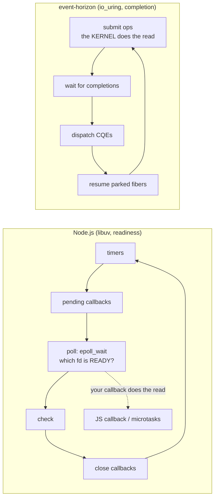
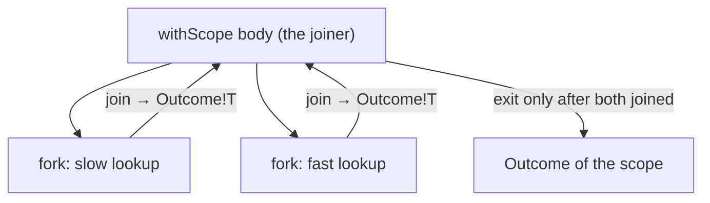
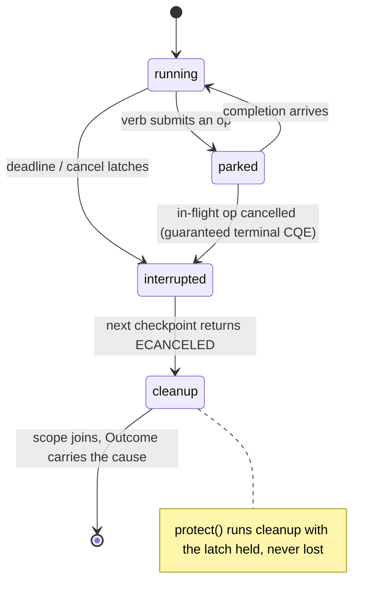
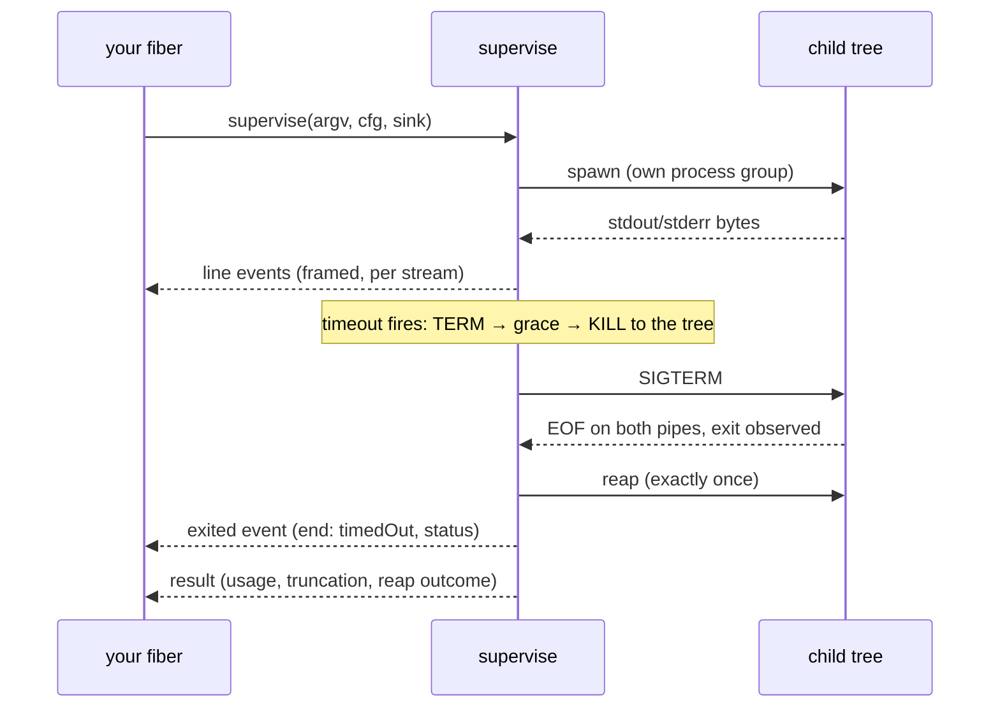

# Coming from Node.js

You know the Node.js event loop: one thread, callbacks and promises, `async`/`await`,
`EventEmitter`, `AbortController`, `child_process`, `worker_threads`. This page maps
each of those onto `sparkles:event-horizon`, explains where the two models deliberately
differ, and gives you a runnable D program for every mapping.

**Last reviewed:** September 5, 2026

> [!NOTE]
> Every D block on this page is a complete single-file `dub` program that CI compiles
> and runs; the block after it is the output it produced. The Node.js blocks are the
> shape being translated and are not executed.

## The one-paragraph difference

Node hands the kernel a list of descriptors and asks _"which of these is ready?"_; when
one is, your callback performs the read. `event-horizon` hands the kernel the read
itself and asks _"tell me when it is done"_ — a **completion** model (`io_uring`,
`kqueue`, IOCP). On top of that loop it runs **fibers**: your code looks blocking
(`recv`, `sleep`, `accept` return values), but each call parks the fiber on a
submission and resumes it on the completion. There is no `await` keyword, no
function coloring, and no callback pyramid — and no microtask queue either, because
nothing needs one.



## Concept map

| Node.js                                   | `event-horizon`                                              | Notes                                                                       |
| ----------------------------------------- | ------------------------------------------------------------ | --------------------------------------------------------------------------- |
| the process-wide event loop               | `LoopGroup` + `RootScope` + `Env`                            | one loop per thread; you start it, it does not start itself                 |
| `Promise<T>` / rejection                  | `IoResult!T` (a value _or_ an `IoError`)                     | errors are values; nothing is thrown across the loop                        |
| `async function` / `await`                | a fiber; every verb is a checkpoint                          | `recv`, `sleep`, `accept` park the fiber and return the result              |
| `setTimeout` / `setInterval`              | `env.clock.sleep` / `Ticker`                                 | `Ticker` is absolute-deadline paced: no drift, missed ticks are skipped     |
| `Promise.all` / `Promise.allSettled`      | `withScope` + `fork`/`join`                                  | the scope cannot exit until every child is done                             |
| `Promise.race` / `Promise.any`            | `race`                                                       | the losers are cancelled, not leaked                                        |
| `AbortController` / `AbortSignal.timeout` | `Scope.cancel` / `withDeadline` / `protect`                  | cancellation is a tree, delivered at checkpoints, and cleanup runs shielded |
| `EventEmitter` / streams' backpressure    | `Channel!T`                                                  | bounded; `put` parks when full — backpressure is the default, not an option |
| `net.createServer` / `net.connect`        | `env.net.listen` / `env.net.connect`, `accept`/`recv`/`send` | buffers move in and come back (the kernel owns them mid-flight)             |
| `fs.promises.readFile`                    | `openFile` + `read`                                          | file reads are real completions, not a thread pool                          |
| `child_process.exec`                      | `capture`                                                    | concurrent drains, exactly-one reap, no zombie on any path                  |
| `child_process.spawn` + `'data'` events   | `supervise` + `ProcessEvent`s                                | framed lines, timeouts, tree kill, resource accounting                      |
| `process.on('SIGINT')`                    | `SignalFd`                                                   | signals are completions, not handlers                                       |
| `fs.watch`                                | `Watcher`                                                    | inotify events through the loop                                             |
| `p-retry` / hand-rolled backoff           | `retry` + schedules (`exponential & recurs`)                 | schedules are pure values; time comes in, decisions come out                |
| `worker_threads`                          | `LoopGroup` topologies                                       | one loop per core, share-nothing; no serialisation boundary                 |
| unhandled rejection                       | does not exist                                               | an `IoResult` you drop is a compile-time-visible value, not a runtime event |

## Timers: `setTimeout` is a parked fiber

```js
// Node.js
for (let i = 1; i <= 3; i++) {
  await new Promise(resolve => setTimeout(resolve, 10));
  console.log(`tick ${i}`);
}
```

`env.clock.sleep` parks the current fiber on an in-ring timer. The thread is free to
run other fibers meanwhile; nothing spins.

```d
#!/usr/bin/env dub
/+ dub.sdl:
    name "eh_node_timers"
    dependency "sparkles:event-horizon" version="*"
+/
import core.time : msecs;
import std.stdio : writeln;
import sparkles.event_horizon;

void main()
{
    LoopGroup group;
    if (LoopGroup.start(group).hasError)
        assert(false, "no completion backend");
    scope (exit) group.shutdown();

    group.run((ref RootScope sc, ref Env env) {
        foreach (i; 1 .. 4)
        {
            cast(void) env.clock.sleep(10.msecs); // parks this fiber only
            writeln("tick ", i);
        }
        return 0;
    });
}
```

```ansi
tick 1
tick 2
tick 3
```

## Concurrency: `Promise.all` is a scope with children

```js
// Node.js
const [a, b] = await Promise.all([fetchA(), fetchB()]);
```

A **scope** owns its children: `withScope` does not return until every fiber it
spawned has finished, and a child's typed result comes back through a `JoinHandle`.
That is the whole of structured concurrency — there is no way to leak a running fiber
past the block that created it.



```d
#!/usr/bin/env dub
/+ dub.sdl:
    name "eh_node_promise_all"
    dependency "sparkles:event-horizon" version="*"
+/
import core.time : msecs;
import std.stdio : writeln;
import sparkles.event_horizon;

void main()
{
    LoopGroup group;
    if (LoopGroup.start(group).hasError)
        assert(false, "no completion backend");
    scope (exit) group.shutdown();

    group.run((ref RootScope root, ref Env env) {
        ref Sched s = currentScheduler();
        auto outcome = withScope!((ref sc) {
            JoinHandle!int slow, fast;
            sc.fork(slow, () {
                cast(void) env.clock.sleep(30.msecs);
                return ioOk(1); // an IoResult: the typed success or IoError
            });
            sc.fork(fast, () {
                cast(void) env.clock.sleep(5.msecs);
                return ioOk(2);
            });
            // Both run concurrently; join in any order.
            const a = slow.join(s).value;
            const b = fast.join(s).value;
            return a * 10 + b;
        })(s);
        writeln("joined: ", outcome.value);
        return 0;
    });
}
```

```ansi
joined: 12
```

## Cancellation and timeouts: `AbortController` is a cancel scope

```js
// Node.js
const signal = AbortSignal.timeout(50);
try {
  await slowOperation({ signal });
} catch (e) {
  if (e.name === 'TimeoutError') console.log('timed out');
}
```

In Node, honouring a signal is the callee's job — every layer must thread `signal`
through and check it. Here a deadline **is** a cancel scope: `withDeadline` interrupts
every checkpoint inside it, the operation that was parked returns `ECANCELED`, and the
scope's outcome says it was a timeout. Cleanup that must not be interrupted runs under
`protect`.



```d
#!/usr/bin/env dub
/+ dub.sdl:
    name "eh_node_deadline"
    dependency "sparkles:event-horizon" version="*"
+/
import core.time : msecs, seconds;
import std.stdio : writeln;
import sparkles.event_horizon;

void main()
{
    LoopGroup group;
    if (LoopGroup.start(group).hasError)
        assert(false, "no completion backend");
    scope (exit) group.shutdown();

    group.run((ref RootScope root, ref Env env) {
        ref Sched s = currentScheduler();
        bool cleanedUp;
        auto outcome = withDeadline!((ref sc) {
            auto slept = env.clock.sleep(10.seconds); // interrupted at 50 ms
            writeln("sleep returned: ", slept.hasError ? "ECANCELED" : "ok");
            // Cleanup runs to completion even though the fiber is cancelled.
            cast(void) protect!(() {
                cast(void) env.clock.sleep(5.msecs);
                cleanedUp = true;
                return 0;
            })(s);
            return 0;
        })(s, 50.msecs);
        writeln("timed out: ", outcome.hasError && outcome.error.isTimeout);
        writeln("cleaned up: ", cleanedUp);
        return 0;
    });
}
```

```ansi
sleep returned: ECANCELED
timed out: true
cleaned up: true
```

## Events and backpressure: `EventEmitter` is a bounded channel

```js
// Node.js — nothing stops a fast emitter from flooding a slow listener
emitter.on('item', x => slowConsume(x));
for (const x of items) emitter.emit('item', x);
```

A `Channel!T` is bounded; `put` parks the producer while the buffer is full, so
backpressure is what you get by default. `close` wakes every waiter: takers drain what
is buffered and then see `EPIPE`.

```d
#!/usr/bin/env dub
/+ dub.sdl:
    name "eh_node_channel"
    dependency "sparkles:event-horizon" version="*"
+/
import core.time : msecs;
import std.stdio : writeln;
import sparkles.event_horizon;

void main()
{
    LoopGroup group;
    if (LoopGroup.start(group).hasError)
        assert(false, "no completion backend");
    scope (exit) group.shutdown();

    group.run((ref RootScope root, ref Env env) {
        ref Sched s = currentScheduler();
        Channel!(int, 2) items; // capacity 2: the producer parks on the third put
        auto outcome = withScope!((ref sc) {
            sc.spawn(() {
                foreach (i; 1 .. 6)
                    cast(void) items.put(s, i);
                items.close();
            });
            int sum;
            for (;;)
            {
                auto next = items.take(s); // parks while empty
                if (next.hasError)
                    break; // closed and drained: EPIPE
                cast(void) env.clock.sleep(2.msecs); // the slow consumer
                sum += next.value;
            }
            return sum;
        })(s);
        writeln("consumed: ", outcome.value);
        return 0;
    });
}
```

```ansi
consumed: 15
```

## Sockets: `net.createServer` is `listen` + `accept` in a fiber

```js
// Node.js
const server = net.createServer(sock => sock.pipe(sock)); // echo
server.listen(0, '127.0.0.1', () => {
  /* connect a client, write, read */
});
```

The shape is the same — a listener, a connection per client — but each side is a fiber
running sequential code. One thing is genuinely different: the **buffer moves**. The
kernel owns it while the operation is in flight, so `recv(move(buf))` hands it over and
the result hands it back. That is what makes zero-copy completion I/O safe.

```d
#!/usr/bin/env dub
/+ dub.sdl:
    name "eh_node_tcp_echo"
    dependency "sparkles:event-horizon" version="*"
+/
import core.lifetime : move;
import std.stdio : writeln;
import sparkles.base.buffer : UniqueBuffer;
import sparkles.event_horizon;

void main()
{
    LoopGroup group;
    if (LoopGroup.start(group).hasError)
        assert(false, "no completion backend");
    scope (exit) group.shutdown();

    group.run((ref RootScope sc, ref Env env) {
        auto listener = env.net.listen(ipv4("127.0.0.1", 0)).value;
        const port = boundPort(listener);

        // The server: one daemon fiber, one connection.
        sc.spawnDaemon({
            auto conn = listener.accept; // parks until a client arrives
            if (conn.hasValue)
                echo(conn.value);
        });

        // The client, in the same loop.
        auto client = env.net.connect(ipv4("127.0.0.1", port)).value;
        scope (exit) client.close();
        UniqueBuffer!(ubyte, 64) msg;
        msg ~= cast(const(ubyte)[]) "hello";
        cast(void) client.send(move(msg));      // the buffer moves in …

        UniqueBuffer!(ubyte, 64) back;
        back.length = 64;
        auto got = client.recv(move(back));     // … and comes back with the echo
        back = move(got.buf);
        writeln("echoed: ", cast(const(char)[]) back[][0 .. got.res.value]);

        listener.close();
        sc.cancel(Interrupt(InterruptKind.shutdown)); // reap the daemon
        return 0;
    });
}

void echo(Stream conn)
{
    scope (exit) conn.close();
    UniqueBuffer!(ubyte, 4096) buf;
    buf.length = 4096;
    auto r = conn.recv(move(buf));
    buf = move(r.buf);
    if (r.res.hasError || r.res.value == 0)
        return;
    buf.length = r.res.value;
    cast(void) conn.send(move(buf));
}

ushort boundPort(ref Listener l) @trusted
{
    import core.sys.posix.arpa.inet : ntohs;
    import core.sys.posix.netinet.in_ : sockaddr_in;
    import core.sys.posix.sys.socket : getsockname, sockaddr, socklen_t;

    sockaddr_in a;
    socklen_t len = a.sizeof;
    getsockname(l.fd, cast(sockaddr*) &a, &len);
    return ntohs(a.sin_port);
}
```

```ansi
echoed: hello
```

## Files: `fs.promises.readFile` without the thread pool

```js
// Node.js — libuv runs this on its worker threadpool
const text = await fs.promises.readFile('/tmp/example.txt', 'utf8');
```

Node's async file I/O is a thread pool because `epoll` cannot express a file read.
`io_uring` can: `openFile` and `read` are real completions on the loop.

```d
#!/usr/bin/env dub
/+ dub.sdl:
    name "eh_node_file_read"
    dependency "sparkles:event-horizon" version="*"
+/
import core.lifetime : move;
import core.sys.posix.fcntl : O_RDONLY;
import std.file : remove, tempDir, write;
import std.path : buildPath;
import std.stdio : writeln;
import sparkles.base.buffer : UniqueBuffer;
import sparkles.event_horizon;

void main()
{
    const path = buildPath(tempDir(), "eh-node-file-read.txt");
    write(path, "hello from a file\n");
    scope (exit) remove(path);

    LoopGroup group;
    if (LoopGroup.start(group).hasError)
        assert(false, "no completion backend");
    scope (exit) group.shutdown();

    group.run((ref RootScope sc, ref Env env) {
        ref Sched s = currentScheduler();
        auto f = openFile(s, path, O_RDONLY).value;
        UniqueBuffer!(ubyte, 128) buf;
        buf.length = 128;
        auto got = read(f, move(buf), 0); // an in-ring read at offset 0
        buf = move(got.buf);
        cast(void) closeFile(s, f);
        writeln("read ", got.res.value, " bytes: ",
            cast(const(char)[]) buf[][0 .. got.res.value]);
        return 0;
    });
}
```

```ansi
read 18 bytes: hello from a file
```

## Child processes: `exec` is `capture`, `spawn` is `supervise`

```js
// Node.js
const { stdout } = await execFile('sh', [
  '-c',
  'echo out; echo err >&2; exit 3',
]);
```

`capture` spawns, drains both pipes concurrently (so a chatty child can never deadlock
against an undrained pipe), and reaps exactly once. A non-zero exit is data, not an
error.

```d
#!/usr/bin/env dub
/+ dub.sdl:
    name "eh_node_exec"
    dependency "sparkles:event-horizon" version="*"
+/
import std.stdio : writeln;
import sparkles.event_horizon;

void main()
{
    LoopGroup group;
    if (LoopGroup.start(group).hasError)
        assert(false, "no completion backend");
    scope (exit) group.shutdown();

    group.run((ref RootScope sc, ref Env env) {
        ref Sched s = currentScheduler();
        ProcessConfig cfg;
        cfg.stderrSpec = StdioSpec(StdioMode.pipe);
        auto got = capture(s, ["sh", "-c", "echo out; echo err >&2; exit 3"], cfg);
        writeln("stdout: ", cast(const(char)[]) got.value.stdout_[]);
        writeln("stderr: ", cast(const(char)[]) got.value.stderr_[]);
        writeln("exit code: ", got.value.status.code);
        return 0;
    });
}
```

```ansi
stdout: out

stderr: err

exit code: 3
```

```js
// Node.js — streaming, with a kill after a deadline that you wire yourself
const child = spawn('sh', ['-c', 'echo one; echo two; sleep 30']);
child.stdout.on('data', chunk => process.stdout.write(chunk));
setTimeout(() => child.kill('SIGTERM'), 100);
child.on('exit', (code, signal) => console.log('exit', code, signal));
```

`supervise` owns the whole run: it frames each stream into lines, feeds stdin, applies
a timeout as TERM-then-grace-then-KILL to the child's **process tree** (a fresh process
group, plus a cgroup where the host delegates one), samples the tree's resource usage,
and delivers every event on your fiber in order. The `exited` event is published exactly
once, after both streams reached EOF and the child was reaped.



```d
#!/usr/bin/env dub
/+ dub.sdl:
    name "eh_node_spawn"
    dependency "sparkles:event-horizon" version="*"
+/
import core.time : msecs;
import std.stdio : writeln;
import sparkles.event_horizon;

void main()
{
    LoopGroup group;
    if (LoopGroup.start(group).hasError)
        assert(false, "no completion backend");
    scope (exit) group.shutdown();

    group.run((ref RootScope sc, ref Env env) {
        ref Sched s = currentScheduler();
        SupervisedProcessConfig cfg;
        cfg.timeout = 100.msecs;        // TERM at 100 ms …
        cfg.terminateGrace = 500.msecs; // … KILL 500 ms later if still alive
        cfg.process.stdinSpec = StdioSpec(StdioMode.nullDev);
        auto got = supervise(s, ["sh", "-c", "echo one; echo two; sleep 30"], cfg,
            null, (in ProcessEvent ev) {
                final switch (ev.kind)
                {
                case ProcessEventKind.line:
                    writeln("line: ", cast(const(char)[]) ev.line.bytes);
                    break;
                case ProcessEventKind.exited:
                    writeln("exited: ", ev.end, ", signaled by ",
                        ev.status.signaled ? ev.status.code : 0);
                    break;
                case ProcessEventKind.sample:
                    break; // periodic resource samples; not printed here
                }
            });
        writeln("end: ", got.value.end, ", reap: ", got.value.reap);
        return 0;
    });
}
```

```ansi
line: one
line: two
exited: timedOut, signaled by 15
end: timedOut, reap: reaped
```

## Signals: `process.on('SIGINT')` is a completion too

```js
// Node.js
process.on('SIGUSR1', () => console.log('got SIGUSR1'));
process.kill(process.pid, 'SIGUSR1');
```

A `SignalFd` turns signals into completions the loop delivers to the fiber waiting on
them — no handler runs asynchronously, so the code that reacts holds no locks and races
nothing.

```d
#!/usr/bin/env dub
/+ dub.sdl:
    name "eh_node_signal"
    dependency "sparkles:event-horizon" version="*"
    platforms "linux"
+/
import core.sys.posix.signal : SIGUSR1, kill;
import core.sys.posix.unistd : getpid;
import std.stdio : writeln;
import sparkles.event_horizon;

void main()
{
    SignalFd signals;
    if (SignalFd.create(signals, [SIGUSR1]).hasError)
        assert(false, "signalfd unavailable");

    LoopGroup group;
    if (LoopGroup.start(group).hasError)
        assert(false, "no completion backend");
    scope (exit) group.shutdown();

    group.run((ref RootScope sc, ref Env env) {
        ref Sched s = currentScheduler();
        kill(getpid(), SIGUSR1);
        auto got = signals.nextSignal(s); // parks until the signal completes
        writeln("got signal ", got.value == SIGUSR1 ? "SIGUSR1" : "other");
        return 0;
    });
}
```

```ansi
got signal SIGUSR1
```

## Retries: a schedule is a value, not a loop you write

```js
// Node.js (p-retry)
await pRetry(op, { retries: 4, factor: 2, minTimeout: 5 });
```

Schedules compose as values (`exponential(5.msecs) & recurs(4)` reads "back off
exponentially, at most four times") and the `retry` driver sleeps through whatever
clock you pass it — so a test can virtualise time with a `TestClock`.

```d
#!/usr/bin/env dub
/+ dub.sdl:
    name "eh_node_retry"
    dependency "sparkles:event-horizon" version="*"
+/
import core.time : msecs;
import std.stdio : writeln;
import sparkles.event_horizon;

void main()
{
    LoopGroup group;
    if (LoopGroup.start(group).hasError)
        assert(false, "no completion backend");
    scope (exit) group.shutdown();

    group.run((ref RootScope sc, ref Env env) {
        ref Sched s = currentScheduler();
        int attempts;
        auto outcome = withScope!((ref inner) {
            enum policy = exponential(5.msecs) & recurs(4);
            auto r = retry(inner, env.clock, policy, () {
                ++attempts;
                if (attempts < 3)
                    return ioErr!int(11 /* EAGAIN */, OpKind.none, IoErrorStage.submit,
                        "flaky");
                return ioOk(attempts);
            });
            return r.hasValue ? r.value : -1;
        })(s);
        writeln("succeeded on attempt ", outcome.value);
        return 0;
    });
}
```

```ansi
succeeded on attempt 3
```

## Where the models deliberately differ

- **No unhandled rejection.** A failing operation returns an `IoResult` you must
  inspect; the compiler sees the value you dropped. Panics (`Throwable`s escaping a
  fiber) are _defects_ and fail the scope that owns the fiber.
- **No fire-and-forget.** Every fiber belongs to a scope, and a scope does not exit
  until its children have. Daemons (`spawnDaemon`) are the escape hatch: they are
  reaped when the scope ends, not orphaned.
- **Cancellation is cooperative and structural.** It latches on a fiber and is
  delivered at its next checkpoint — every I/O verb is one — and it descends a tree of
  scopes. `protect` shields cleanup. Nothing is "aborted" between two statements.
- **Buffers move.** A completion backend owns the buffer while an operation is in
  flight; `move(buf)` in, `move(result.buf)` out. It reads oddly for a day and then
  prevents every use-after-free the readiness model let you write.
- **No microtasks, no `nextTick`.** A fiber runs until it parks; `yieldNow` is the
  explicit "let others run" point when you need one in a CPU-bound loop.
- **One loop per thread, several threads.** `worker_threads` needs message passing
  across a serialisation boundary; a `LoopGroup` runs one loop per core with
  share-nothing topologies, and the same code runs on one loop or many.

## Errors as values, in one table

| Node.js                           | `event-horizon`                                                                                     |
| --------------------------------- | --------------------------------------------------------------------------------------------------- |
| `throw` / rejected promise        | `IoResult!T` = `Expected!(T, IoError)`: `hasValue`, `value`, `error`                                |
| `err.code === 'ECONNRESET'`       | `error.errnoValue == ECONNRESET`, plus `op` and `stage`                                             |
| `AbortError` / `TimeoutError`     | `Outcome` with a `Cause`: `isTimeout`, `Interrupt` kind                                             |
| uncaught exception                | a defect: the scope fails with `Cause.die`, the `Throwable` travels to the joiner                   |
| `process.exit(1)` on a hard fault | the loop's `FatalHook` — a backend that can no longer make progress ends the process, never returns |

## Next steps

- The normative surface: [SPEC.md](../../../specs/event-horizon/SPEC.md) — §7 fibers,
  §8 scopes and cancellation, §13 processes, §14 channels, §16 the public API.
- The research behind the design: [Async I/O & Event Loops](../../../research/async-io/index.md)
  and [Process Supervision](../../../research/async-io/process-supervision.md).
- Standalone examples in `libs/event-horizon/examples/`: `callback-echo.d` (tier A),
  `fiber-echo.d` (tier B), `agent-tooling.d` (processes, files and a watcher together).
