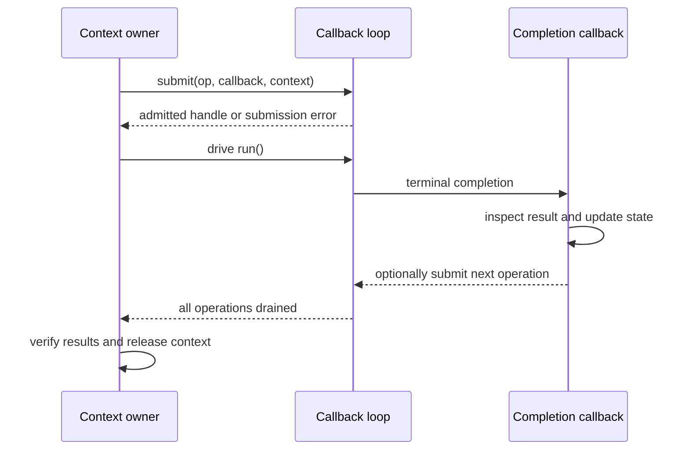
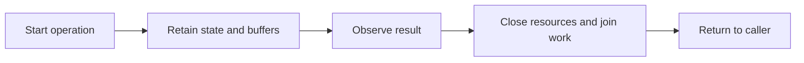

# Coming from vibe-core

The direct-style part should feel familiar: vibe-core already uses fibers so
network and file waits can read like sequential code. The migration is primarily
about task ownership, explicit results, and buffer lifetime.

This guide uses [vibe-core][vibe] at
`f0e8795495affd0d517b335e70c6f7139a6a9f5b`, whose facilities include fiber-based
tasks, I/O, timers, and synchronization. Its [task implementation][task] includes
joining; describing all vibe-core tasks as necessarily detached would be misleading.

<!-- verified-comparisons -->

> [!NOTE]
> Each source tab imports a complete executable tutorial with error handling and
> cleanup. Run it with `dub run --single <file> -b checked`. Contract examples
> linked after each group retain the behavioral assertions. `ci --verify` checks
> every displayed output and independently executes those contract counterparts.
> See [Running the examples](./running-examples.md) for prerequisites.

## Choose the continuation style, not a different I/O engine

The six three-way groups below show vibe-core, **event-horizon fibers**, and
**event-horizon callbacks**, each with its own verified output. Both EH styles
submit completion operations. Callback programs create `DefaultLoop` directly;
typed context handlers remove the raw cast, but state must still outlive every
accepted operation. No callback example hides a fiber runtime.

| Responsibility     | Tier A: callbacks                                              | Fiber style                                        |
| ------------------ | -------------------------------------------------------------- | -------------------------------------------------- |
| Continue after I/O | `void function(void*, ref Completion) nothrow @nogc`           | Resume after a verb returns an `IoResult`          |
| Keep state alive   | Explicit context until terminal completion                     | Locals in a suspended fiber, owned by its scope    |
| Start an operation | Check `submit`/`submitAfter` for admission failure             | Check the operation's returned result              |
| Observe completion | `Completion.res` is a value or negative errno                  | Typed `IoResult!T`; scope outcomes are separate    |
| Own a buffer       | Move into the op; recover/move `Completion.buf`                | Move through a sequential I/O verb                 |
| Cancel             | Request cancellation, then keep driving to terminal completion | Cancel the owning scope and join protected cleanup |
| Combine operations | Explicit pending count/state machine                           | `fork`/`join` within `withScope`                   |



A submission failure produces **no callback**. An accepted cancellation request
is **not** permission to free the context: the target's terminal callback still
runs, and a real completion may win the race. Do not call `run`/`runOnce` from a
callback. The examples keep contexts and pools alive until `inFlight == 0` and
print after dispatch, outside the `nothrow @nogc` callback boundary.

### Where a callback comparison stops being equivalent

The channel, signal, capture and supervision sections retain their fiber
programs. Tier A has raw read/wait/process-related operations, but no drop-in
callback version of scheduler-local `Channel`, scoped `SignalFd` consumption,
`execCapture`, or `supervise`. Rebuilding their buffering, cancellation, drain,
and reaping policies would be an application adapter, not a second spelling of
the same high-level API. No such equivalence is implied by the six native
operation comparisons.

## Map the lifetime boundary

For a vibe-core port, Event Horizon's fiber style preserves the familiar
sequential shape. Choosing Tier A instead is an explicit move to callback state
machines: locals that previously survived a cooperative wait must move into a
context that outlives every operation. Neither choice proves CPU parallelism.

| vibe-core pattern                 | Event Horizon fibers                     | Event Horizon callbacks                                        |
| --------------------------------- | ---------------------------------------- | -------------------------------------------------------------- |
| Fiber-aware sleep inside a loop   | `env.clock.sleep` inside a loop          | `submitAfter` rearms from its completion                       |
| Retained task handles and joining | Scoped `fork`/`join` with typed outcomes | Explicit fan-in state; no implicit child joining               |
| Sequential TCP reads/writes       | Owning stream verbs                      | `OpRecv`/`OpSend` and a framing state machine                  |
| Sequential file reading           | Owned file/buffer verbs                  | Open → repeated positioned read → EOF → close                  |
| Timeout around cooperative work   | `withDeadline` plus protected cleanup    | Deadline callback → cancel request → terminal result → cleanup |

| vibe-core idiom                      | Event Horizon idiom                  | What to review                                               |
| ------------------------------------ | ------------------------------------ | ------------------------------------------------------------ |
| Launch a task and retain its handle  | `sc.fork(handle, body)`              | Choose the lexical scope that owns the child.                |
| Join a task                          | `handle.join(s)`                     | Inspect the typed outcome before accessing its value.        |
| Fiber-aware sleep                    | `env.clock.sleep`                    | Handle cancellation as an I/O result.                        |
| Task interruption or timeout         | `withDeadline`, `Scope.cancel`       | A deadline joins children; it cannot preempt CPU-bound code. |
| Synchronization and message passing  | Scoped children and bounded channels | Event Horizon channels stay on their owning scheduler.       |
| Streams and exception-based failures | Owned buffer verbs and `IoResult!T`  | Ordinary I/O errors are values; defects still exist.         |

`LoopGroup` defaults to one loop on the calling thread. A multi-worker topology
is a separate choice, not an automatic effect of using a group.



The lifecycle is common; the mechanism is not. Callback registrations need an
explicit owner and terminal path. Fibers make sequential control flow possible,
but still need cancellation and lifetime rules. A lexical scope is useful when
it actually owns the work being started.

## Timers and cadence

Each program prints three ticks and then returns. EH uses relative sleeps or
one-shot timers, not `Ticker`: work between waits shifts the next deadline.
Neither style promises exact timing. For absolute cadence, maintain an absolute
deadline and define how missed ticks are skipped.

The callback tutorial arms a timer, drives it to completion, prints its result,
and repeats. The fiber tutorial loops over sleeps. The contract version also
exercises rearming directly from a completion callback.

::: code-group

<<< @/libs/event-horizon/tutorial/snippets/tutorial/vibe_timers.d [vibe-core]

```ansi [vibe-core output]
tick 1
tick 2
tick 3
```

<<< @/libs/event-horizon/tutorial/snippets/tutorial/eh_timers.d [event-horizon fibers]

```ansi [event-horizon fibers output]
tick 1
tick 2
tick 3
```

<<< @/libs/event-horizon/tutorial/snippets/tutorial/eh_callback_timers.d [event-horizon callbacks]

```ansi [event-horizon callbacks output]
tick 1
tick 2
tick 3
```

:::

Contract examples: [vibe-core](./snippets/vibe_timers.d) · [event-horizon fibers](./snippets/eh_timers.d) · [event-horizon callbacks](./snippets/eh_callback_timers.d).

## Concurrency and joined lifetime

Start independent work and combine its results as `1 * 10 + 2`. Both fiber
programs join both tasks before retrieving or reporting failures. This is
concurrency, not evidence of simultaneous execution on multiple CPU cores.

Keep task handles and callback contexts alive through completion. An EH `fork`
routes its typed failure to its join handle, not directly into the scope policy.
The example explicitly promotes joined failures with `root.fail`. Vibe-core's
`Future.getResult` propagates task exceptions after joining.

The callback program admits two operations before driving the loop. Their
result slots provide explicit fan-in; there is no implicit lexical child scope.
The assertion-heavy fiber fixture retains the ready/release handshake that
proves overlap independently of timer scheduling.

::: code-group

<<< @/libs/event-horizon/tutorial/snippets/tutorial/vibe_concurrency.d [vibe-core]

```ansi [vibe-core output]
joined: 12
```

<<< @/libs/event-horizon/tutorial/snippets/tutorial/eh_concurrency.d [event-horizon fibers]

```ansi [event-horizon fibers output]
joined: 12
```

<<< @/libs/event-horizon/tutorial/snippets/tutorial/eh_callback_concurrency.d [event-horizon callbacks]

```ansi [event-horizon callbacks output]
joined: 12
```

:::

Contract examples: [vibe-core](./snippets/vibe_concurrency.d) · [event-horizon fibers](./snippets/eh_concurrency.d) · [event-horizon callbacks](./snippets/eh_callback_concurrency.d).

## Cancellation, deadlines and cleanup

The examples distinguish timeout detection from successful completion and
print whether cleanup ran. Read the foreign operation's interruption mechanism
carefully: cancelling a registration, signalling a flag and interrupting a
fiber are not interchangeable. A timeout on a wait does not necessarily stop
the operation being waited for.

Event Horizon's deadline latches cooperative cancellation. The parked sleep
returns `ECANCELED`; `protect` lets cleanup cross checkpoints even with that
latch set. Keep cleanup bounded. The foreign tab documents its own status
representation rather than pretending its errors are event-horizon values.

The callback deadline requests cancellation of an already-admitted long timer, observes its terminal `-ECANCELED`, and only then submits asynchronous cleanup. `run()` drains that cleanup before the context dies. This is a manually owned deadline state machine, not `withDeadline` or a callback-level protected scope. The fixture's long delay makes the intended cancellation path testable; real code must also handle completion winning the race.

::: code-group

<<< @/libs/event-horizon/tutorial/snippets/tutorial/vibe_deadline.d [vibe-core]

```ansi [vibe-core output]
sleep returned: InterruptException
timed out: true
cleaned up: true
```

<<< @/libs/event-horizon/tutorial/snippets/tutorial/eh_deadline.d [event-horizon fibers]

```ansi [event-horizon fibers output]
sleep returned: ECANCELED
timed out: true
cleaned up: true
```

<<< @/libs/event-horizon/tutorial/snippets/tutorial/eh_callback_deadline.d [event-horizon callbacks]

```ansi [event-horizon callbacks output]
sleep returned: ECANCELED
timed out: true
cleaned up: true
```

:::

Contract examples: [vibe-core](./snippets/vibe_deadline.d) · [event-horizon fibers](./snippets/eh_deadline.d) · [event-horizon callbacks](./snippets/eh_callback_deadline.d).

## TCP and buffer ownership

The tutorial sends the five-byte message `hello` and prints the echoed frame.
TCP is a byte stream: neither one write nor one readiness/completion notification
is a message boundary. Accumulate partial receives and retain unsent suffixes,
or use an API's documented all-bytes operation. Binding loopback port zero lets
the OS reserve a port for this run without a port-selection race.

The foreign callbacks borrow buffers according to their library's contract. Copy
data that must outlive a callback, or retain the documented owner. Event Horizon
moves an owned buffer into the operation and returns ownership on completion.
That lifetime discipline is not a promise of kernel or network zero-copy. A real
protocol also needs framing, maximum message sizes and per-connection deadlines.

The callback tutorial sets up a local TCP pair synchronously, then drives all
data transfers through `OpSend` and `OpRecv`. Its five-byte framing state
handles short completions. Contexts and fixed buffers outlive the loop; teardown
prevents callbacks from rearming. The contract example additionally tests async
accept/connect and deliberately tiny pool buffers.

::: code-group

<<< @/libs/event-horizon/tutorial/snippets/tutorial/vibe_tcp_echo.d [vibe-core]

```ansi [vibe-core output]
echoed: hello
```

<<< @/libs/event-horizon/tutorial/snippets/tutorial/eh_tcp_echo.d [event-horizon fibers]

```ansi [event-horizon fibers output]
echoed: hello
```

<<< @/libs/event-horizon/tutorial/snippets/tutorial/eh_callback_tcp_echo.d [event-horizon callbacks]

```ansi [event-horizon callbacks output]
echoed: hello
```

:::

Contract examples: [vibe-core](./snippets/vibe_tcp_echo.d) · [event-horizon fibers](./snippets/eh_tcp_echo.d) · [event-horizon callbacks](./snippets/eh_callback_tcp_echo.d).

## Queues, channels and backpressure

The shared payload contract is the ordered sequence 1 through 5, with sum 15.
The flow-control contracts can differ. Both tutorials let a producer fill a
capacity-two channel while a consumer drains it. The standalone EH contract
separately proves that a third put parks and one freed slot permits exactly one
additional put, without relying on a short sleep as evidence.

Read the foreign implementation before translating `put`: an unbounded queue
does not acquire a capacity bound merely because the consumer is slow. A
callback adapter must stop producing and arrange a wakeup when space returns;
blocking an event-loop thread on an OS semaphore can stop unrelated connections.
Event Horizon's `Channel!(T, capacity)` belongs to one scheduler and is not a
drop-in cross-thread notification or broadcast mechanism.

::: code-group

<<< @/libs/event-horizon/tutorial/snippets/tutorial/vibe_channel.d [vibe-core]

```ansi [vibe-core output]
consumed: 15
```

<<< @/libs/event-horizon/tutorial/snippets/tutorial/eh_channel.d [event-horizon fibers]

```ansi [event-horizon fibers output]
consumed: 15
```

:::

Contract examples: [vibe-core](./snippets/vibe_channel.d) · [event-horizon fibers](./snippets/eh_channel.d).

## Files and operation lifetime

The tutorials create an anonymous temporary file containing `hello from a file\n`.
The vibe-core example sizes and reads a bounded span; the EH fiber helper reads
through EOF with a byte limit. Both print the contents. Keep file and buffer
ownership until all operations finish. Never classify a read failure as EOF.

The event-horizon example reads until EOF using offsets and an owned buffer.
Its Linux io_uring implementation submits file operations to the kernel. This
does not establish the same behavior for every backend: kqueue synthesizes
completions over readiness and its regular-file worker-pool refinement is
separate. Where the foreign example uses a worker adapter, it is explicitly
application code, not evidence of a native filesystem capability.

The callback tutorial reads an anonymous temporary fixture through positioned
`OpRead` operations until zero-byte EOF, using a fixed bound. Fixture creation
and final close are synchronous setup/teardown. The contract version separately
tests asynchronous open/close, missing-file errors and tiny pooled buffers.
The fiber tutorial uses bounded `env.fs.readText`, which owns open/read/close.

::: code-group

<<< @/libs/event-horizon/tutorial/snippets/tutorial/vibe_file_read.d [vibe-core]

```ansi [vibe-core output]
read 18 bytes: hello from a file
```

<<< @/libs/event-horizon/tutorial/snippets/tutorial/eh_file_read.d [event-horizon fibers]

```ansi [event-horizon fibers output]
read 18 bytes: hello from a file
```

<<< @/libs/event-horizon/tutorial/snippets/tutorial/eh_callback_file_read.d [event-horizon callbacks]

```ansi [event-horizon callbacks output]
read 18 bytes: hello from a file
```

:::

Contract examples: [vibe-core](./snippets/vibe_file_read.d) · [event-horizon fibers](./snippets/eh_file_read.d) · [event-horizon callbacks](./snippets/eh_callback_file_read.d).

## Capturing a child process

The child writes different text to stdout and stderr, then exits with code 3.
Both streams and the nonzero status are printed: a child command failing is
not necessarily failure to launch or observe it. Root reaping is part of the
operation's lifetime.

A general capture implementation must drain both pipes concurrently, even when
one is quiet. Reading all stdout before stderr can deadlock when the stderr
pipe fills. Tiny fixed fixtures do not prove a hand-written adapter safe for
unbounded output. `capture` supplies the drain/reap coordination; adapters need
their own output limits, cancellation and error handling.

::: code-group

<<< @/libs/event-horizon/tutorial/snippets/tutorial/vibe_exec.d [vibe-core]

```ansi [vibe-core output]
stdout: out

stderr: err

exit code: 3
```

<<< @/libs/event-horizon/tutorial/snippets/tutorial/eh_exec.d [event-horizon fibers]

```ansi [event-horizon fibers output]
stdout: out

stderr: err

exit code: 3
```

:::

Contract examples: [vibe-core](./snippets/vibe_exec.d) · [event-horizon fibers](./snippets/eh_exec.d).

## Streaming and termination

Streaming adds a state machine: accumulate bytes into lines, observe the root,
request termination, finish drains, and reap. A pipe read can split a line or
contain several lines, so splitting each chunk independently is insufficient.
The two source tabs expose the cleanup machinery instead of hiding it behind
a printed success message.

The foreign program's manual root termination is not process-tree containment.
Event Horizon reports supervision outcome and reap provenance, but its process
group/cgroup tiers are not an inescapable sandbox either: descendants can race
the post-spawn cgroup migration. EOF may be forced at the drain limit. See
[the supervision caveats](./running-examples.md#capture-versus-streaming-supervision).

::: code-group

<<< @/libs/event-horizon/tutorial/snippets/tutorial/vibe_spawn.d [vibe-core]

```ansi [vibe-core output]
line: one
line: two
exited: signaled by 15
end: stopped, reap: reaped
```

<<< @/libs/event-horizon/tutorial/snippets/tutorial/eh_spawn.d [event-horizon fibers]

```ansi [event-horizon fibers output]
line: one
line: two
exited: cancelled, signaled by 15
end: cancelled, reap: reaped
```

:::

Contract examples: [vibe-core](./snippets/vibe_spawn.d) · [event-horizon fibers](./snippets/eh_spawn.d).

## POSIX signals and loop notifications

The foreign tab uses `sigwait` in an ordinary worker and then delivers completion
through its runtime bridge. Unlike calling an event method from a signal handler,
this does not assume the event method is async-signal-safe. The signal is
thread-directed for an isolated, reproducible fixture.

Install the signal receiver before sending `SIGUSR1`, then print the received
signal. Linux signal masks and handler installation
are process/thread integration decisions; they are not interchangeable with an
ordinary callback queue. Keep signal-handler work async-signal-safe.

`SignalFd` receives masked POSIX signals through the event-horizon loop. A foreign
notification primitive may only wake an owner loop from another thread. In
particular, libasync's `AsyncSignal` is not a POSIX signal subscription; an OS
signal bridge must supply that integration explicitly. These programs are Linux
fixtures, not Windows signal portability examples.

::: code-group

<<< @/libs/event-horizon/tutorial/snippets/tutorial/vibe_signal.d [vibe-core]

```ansi [vibe-core output]
got signal SIGUSR1
```

<<< @/libs/event-horizon/tutorial/snippets/tutorial/eh_signal.d [event-horizon fibers]

```ansi [event-horizon fibers output]
got signal SIGUSR1
```

:::

Contract examples: [vibe-core](./snippets/vibe_signal.d) · [event-horizon fibers](./snippets/eh_signal.d).

## Retries and ordinary errors

The synthetic operation fails transiently twice, then succeeds. The tutorial
prints the successful attempt; the standalone contract checks the exact count
and result.

Retry policy needs a retryable-error decision and a finite budget. Vibe-core's
loop catches only the example's `TransientFailure`; other exceptions propagate.
EH's fiber policy retries ordinary I/O failures and preserves interruption and
defects as separate channels. Neither shape makes repeated side effects safe
unless the operation is idempotent.

The callback version handles `EAGAIN` with 5 ms then 10 ms backoff and a finite
attempt budget. Admission and timer-completion errors are reported separately,
not mistaken for retryable dependency failures.

::: code-group

<<< @/libs/event-horizon/tutorial/snippets/tutorial/vibe_retry.d [vibe-core]

```ansi [vibe-core output]
succeeded on attempt 3
```

<<< @/libs/event-horizon/tutorial/snippets/tutorial/eh_retry.d [event-horizon fibers]

```ansi [event-horizon fibers output]
succeeded on attempt 3
```

<<< @/libs/event-horizon/tutorial/snippets/tutorial/eh_callback_retry.d [event-horizon callbacks]

```ansi [event-horizon callbacks output]
succeeded on attempt 3
```

:::

Contract examples: [vibe-core](./snippets/vibe_retry.d) · [event-horizon fibers](./snippets/eh_retry.d) · [event-horizon callbacks](./snippets/eh_callback_retry.d).

## Errors and migration decisions

| Boundary                   | Migration decision                                                                                                            |
| -------------------------- | ----------------------------------------------------------------------------------------------------------------------------- |
| Ordinary operation failure | Check the foreign status/exception and the event-horizon `IoResult`; do not silently treat failure as success or EOF.         |
| Task failure               | Decide who observes the error and who joins remaining work. Scope outcomes and defects are distinct from ordinary I/O errors. |
| Buffer lifetime            | Retain borrowed data until the foreign operation finishes; recover moved buffers from event-horizon completions.              |
| Cross-thread work          | Use a documented cross-thread bridge. Scheduler-local channels do not replace it.                                             |
| Missing native primitive   | Treat a Phobos/POSIX adapter as application integration, not as a feature supplied by the networking library.                 |

## Next steps

Start with one independently owned connection or operation. Preserve its framing,
error handling and shutdown behavior before changing scheduler topology. The
[Node.js comparison](./coming-from-nodejs.md) provides another fully executable
view of the same concerns, including explicit retries. The
[execution guide](./running-examples.md) records platform and containment limits.

<!-- References -->

[vibe]: https://github.com/vibe-d/vibe-core/blob/f0e8795495affd0d517b335e70c6f7139a6a9f5b/README.md
[task]: https://github.com/vibe-d/vibe-core/blob/f0e8795495affd0d517b335e70c6f7139a6a9f5b/source/vibe/core/task.d
[spec]: ../../../specs/event-horizon/SPEC.md
