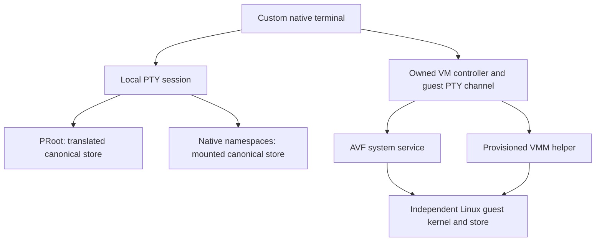

# Execution boundaries and capability gates

**Last reviewed:** September 30, 2026.

## Terminal, distro and lifecycle owner



The terminal renders VT output, accepts input and propagates geometry. A distro supplies packages, filesystem layout and session initialization. A VM owner additionally creates, starts, stops, persists and reconnects to a guest. These are separate contracts: reusing Termux-derived PRoot or PTY code does not require the Termux application, and using an Android Terminal-compatible disk image does not establish independent VM ownership. See the [Sparkles baseline][baseline] and [AVF integration][avf].

A local session needs a host PTY and child process. A VM session generally needs a guest PTY broker: the host transports bytes and explicit resize/control messages over a console or authenticated channel. A serial console alone does not offer independent tabs, working directories, signals and reconnectable sessions. [Podroid's engine][engine] implements both console streams and guest control channels; its managed implementation supplies prior art, not proof of a no-DEX implementation.

## Canonical store and ELF ABI

The **logical store** is the path embedded in derivations and outputs, normally `/nix/store`. The **physical store** may live under an app's private directory or `/data/nix`. Merely setting `NIX_STORE_DIR` or creating a symlink in app home cannot make absolute `/nix/store/...` references resolve globally. Nix's [chroot store documentation][local-store] requires namespaces for transparent relocation; choosing a different logical store sacrifices compatibility with the standard binary cache.

The **ELF interpreter** is the `PT_INTERP` path selected by the kernel before a dynamically linked executable reaches its entry point. Ordinary `aarch64-linux` Nix packages expect a glibc loader; Android applications use Bionic. Matching ARM64 instruction sets does not fix the loader path, libc ABI, dependency search paths or runtime syscall restrictions. PRoot supplies path translation, namespaces supply a real filesystem view, and a VM supplies a guest filesystem and kernel.

Run [the ELF loader reader][elf-example] on a real executable:

```bash
dub docs/research/android-dev-env/concepts/examples/elf-loader.d /proc/self/exe
```

The program parses ELF headers and reports the actual interpreter; it does not infer compatibility from filenames. A static executable legitimately has no `PT_INTERP`.

### Host page size

[Android supports 16 KiB page-size configurations starting with Android 15][pages]. Check the actual value with `getconf PAGESIZE`, native ELF load-segment alignment and APK library alignment. Native libraries need compatible builds; a no-DEX APK is still a native application. Shared-kernel PRoot/NNS execution also uses the host page size, while a VM's guest kernel has its own memory-layout requirements. Do not assume a future Pixel test uses the same page size as the Pad, which reported 4096 bytes.

## Namespaces, seccomp and SELinux

A **user namespace** can grant capabilities within a new namespace without granting capabilities over Android's parent namespace. A **mount namespace** gives a process its own mount tree. Kernel configuration, Android's inherited **seccomp** filter and **SELinux** rules are independent gates. A successful ADB shell probe is not evidence that a zygote-born application child can run the same syscall. [NNS's kernel integration][kernel] explicitly changes the exec path and app policy to open these gates.

[The namespace probe][namespace-example] calls `unshare` in a disposable child and confirms the parent mount namespace is unchanged. Missing capabilities print `SKIP:` on a normal Linux CI host. [The Android app probe][app-example] provides a Bionic-linked `-betterC` variant that can run in the custom terminal's actual session. Neither program mounts a filesystem or changes host policy.

The numeric result alone should not be overinterpreted: `EINVAL` can reflect unsupported namespace features or invalid combinations; `EPERM` can reflect capabilities or filtering. Read kernel configuration and policy where available before naming a unique cause. [Observed device results][devices] retain the raw domain, UID and seccomp state.

## AVF, hypervisor and protected firmware

**AVF** is Android's framework/service/VMM stack; **pKVM**, **Gunyah** and **GenieZone** are different hypervisor backends. Framework availability, management permission, custom-image permission and guest compatibility are separate checks. MediaTek's [GenieZone crosvm adapter][geniezone] opens `/dev/gzvm`; it is not evidence that every MediaTek device exposes AVF to apps.

**pvmfw** runs before a protected guest and validates its boot inputs. It is not the hypervisor. **Microdroid** is a small Android guest for native payloads, not a synonym for an arbitrary Linux guest. A protected Linux guest may be possible, but an unsigned NixOS disk image cannot be presumed acceptable to a production verification chain. See [Gunyah][gunyah] and [AVF][avf].

## Persistence, networking and services

Persistence has three lifetimes: package/store files, session processes and the backend owner. App uninstall removes private files; Android can kill a process even while the display sleeps. A partial wake lock does not turn an activity into a foreground service. A VM disk can survive even when its owner and interactive shell disappear. Define reconnect, cancellation, snapshot/backup and startup behavior separately in [the implementation milestones][recommendations].

**DNS** is especially backend-specific. A static `resolv.conf`, Android's UID-aware resolver, a Bionic-to-glibc bridge and guest networking can behave differently under VPN or private DNS. Shared-kernel backends also inherit Android resource controls. Full NixOS service semantics require a guest kernel; portable runit services on Android do not provide equivalent systemd isolation.

## Sources

- [Nix local store model][local-store].
- [NNS kernel requirements][kernel] and [Podroid session transport][engine].
- [GenieZone adapter][geniezone]; [device probes and results][devices].

<!-- References -->

[baseline]: ../sparkles-baseline.md
[avf]: ../avf.md
[gunyah]: ../gunyah.md
[recommendations]: ../recommendations.md
[devices]: ../device-validation/index.md
[elf-example]: ./examples/elf-loader.d
[namespace-example]: ./examples/namespace-probe.d
[app-example]: ../device-validation/examples/app-probe.d
[local-store]: https://github.com/NixOS/nix/blob/1ed54a0fd62da96d4f5e9c806555861e46f65341/src/libstore/local-store.md
[kernel]: https://github.com/reo101/NNS/blob/28d2229a664cbe29e55a051d648a789b6511f735/kernel/README.md
[engine]: https://github.com/ExTV/Podroid/blob/ce0121896b2895637ab1f656cbb0d75fa2874489/app/src/main/java/com/excp/podroid/engine/avf/AvfEngine.kt
[geniezone]: https://android.googlesource.com/platform/external/crosvm/+/853aaa9bdb28774fd82e7cfa4c910c95b0acaa5d/hypervisor/src/geniezone/mod.rs
[pages]: https://developer.android.com/guide/practices/page-sizes
