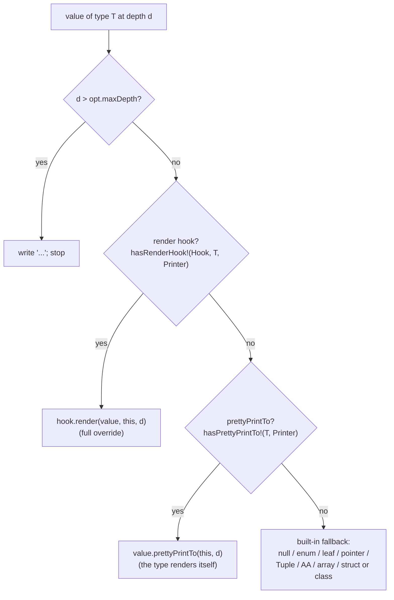

# `sparkles.base.prettyprint` — value pretty-printing & extension specification

_Audience: developers and coding agents building against `sparkles:base`. This
document is normative and self-contained — it states what `prettyPrint` provides
and how to extend it, not why. For the delivery plan and milestone orchestration,
see [PLAN.md](./PLAN.md); the extension model follows the repo's
[Design by Introspection guidelines](../../../guidelines/design-by-introspection-01-guidelines.md);
for the library overview see [`sparkles:base`](../../../libs/base/index.md). The
implementation is [`libs/base/src/sparkles/base/prettyprint.d`](../../../../libs/base/src/sparkles/base/prettyprint.d)._

## 1. Overview

`prettyPrint` renders an arbitrary D value to any output range as colorized,
depth- and width-bounded text — a structured `toString` for debugging,
logging, and CLI output. Out of the box it dispatches on the value's D
**static type** (leaves, enums, pointers, tuples, arrays, associative arrays,
structs, classes) and bounds output by depth, item count, and a soft line
width.

Type-static dispatch is not enough for value types whose _meaning_ differs
from their _representation_: a `std.sumtype.SumType` is a struct whose private
storage should never be shown; a Nix `Value` is a handle into an external
evaluator; a `Money` is a `long` that should read `$5.00`; a secret should
read `***`. For these, `prettyPrint` exposes a **Design-by-Introspection
extension model** (§6): a value type renders itself (a `prettyPrintTo` method),
or a caller-supplied **hook** — carried on the renderer object — takes over
rendering of chosen types, including overriding built-ins, carrying mutable
session state, and recursing back through the same hook.

Core rules:

- **Backward compatibility is a contract.** With no hook (`NullHook`) and no
  `prettyPrintTo` primitive in play, output is **byte-identical** to the
  type-static printer (the fallback). Every optional primitive is a
  compile-time-guarded `static if` that is dead code when absent (§6.4).
- **Optionality and zero-cost when unused.** Customization is opt-in: each
  optional primitive is detected with a named capability trait (`hasRenderHook`,
  `hasPrettyPrintTo`, …) following the repo's `__traits(compiles, …)` idiom; an
  absent primitive is never an error, it just falls back.
- **The shell owns layout; hooks own representation.** The `PrettyPrinter` (the
  shell) provides the config, recursion, depth/width/item bounding, colors, OSC 8
  links, and any traversal scratch; a hook decides what a value of its chosen type
  _says_.
- **Attributes infer.** `prettyPrint` and every customization point are
  templates with inferred attributes. A pure/`@nogc`/`@safe` payload+hook stays
  `@safe pure nothrow @nogc`; an impure hook (e.g. Nix) infers impure **only**
  for that instantiation (§9).

A consumer who just wants to print a value touches one function:

```d
import sparkles.base.prettyprint : prettyPrint;

struct Point { int x, y; }
assert(prettyPrint(Point(1, 2), PrettyPrintOptions(useColors: false))
       == "Point(x: 1, y: 2)");
```

## 2. Module and public API surface

| Identifier      | Value                                       |
| --------------- | ------------------------------------------- |
| Dub sub-package | `sparkles:base`                             |
| Module          | `sparkles.base.prettyprint`                 |
| Source          | `libs/base/src/sparkles/base/prettyprint.d` |

| Public symbol                                                       | Role                                                                |
| ------------------------------------------------------------------- | ------------------------------------------------------------------- |
| `writePretty(ref writer, value, [hook,] opt)`                       | Front-door writer function (writer-first, `write*` family); returns the writer |
| `prettyPrint(value, opt) → string`                                  | Convenience overload returning a freshly-allocated string           |
| `PrettyPrinter(Writer, Hook = NullHook)`                            | The renderer **object** (the shell, §6): `.print` / `.printNested`  |
| `NullHook`                                                          | The default no-op hook — yields the built-in fallback               |
| `PrettyPrintOptions`                                                | Formatting config — a plain value, no hook (§3)                     |
| `SumTypeStyle`                                                      | `{ activeType, declaredType, valueOnly }` — sum-type rendering (§5) |
| `CombineRenderHooks(Hooks...)`                                      | Compose several render hooks, first-wins (§6.6)                     |
| `hasRenderHook`, `hasPrettyPrintTo`, `hasRenderField`, `hasOnEnter` | Capability traits for the optional primitives (§6.9)                |

The renderer is a **stateful object**, `PrettyPrinter`, that owns the output
range, the formatting config, and the hook (a **mutable field** — so a stateful
hook mutates its session directly, with no `const` games; §6.5). The free
`writePretty` (writer-first) and `prettyPrint` (string) functions are thin front
doors that construct a `PrettyPrinter` and call `.print`:

```d
struct PrettyPrinter(Writer, Hook = NullHook)
{
    PrettyPrintOptions opt;   // formatting config (§3)
    Hook               hook;  // the hook — a MUTABLE field; holds any session/traversal state

    void print(T)(in T value);                 // render `value` at depth 0
    void printNested(T)(in T value, ushort d); // re-entry: hooks/`prettyPrintTo` recurse here
    // PrettyPrinter is itself an output range (`put`) writing to the wrapped Writer.
}

// Front-door free functions — the write*-family convention: the writer comes
// first. The hookless forms use NullHook (the built-in fallback).
ref Writer writePretty(T, Writer)(
    return ref Writer w, in T value, in PrettyPrintOptions opt = PrettyPrintOptions.init);

string prettyPrint(T)(in T value, in PrettyPrintOptions opt = PrettyPrintOptions.init);

// With an explicit render hook (its mutable session lives in the printer it builds):
ref Writer writePretty(T, Writer, Hook)(
    return ref Writer w, in T value, auto ref Hook hook,
    in PrettyPrintOptions opt = PrettyPrintOptions.init);
```

`Writer` is any `std.range.primitives.put`-compatible output range
(`Appender!string`, `SmallBuffer!(char, N)`, a file sink, …). The string overload
allocates an `Appender!string`. Recursion uses `PrettyPrinter.printNested` (a
method on the mutable object), not a free function — there is no `const` to fight.

## 3. `PrettyPrintOptions`

`PrettyPrintOptions` is **formatting config only** — a plain value with no hook,
genuinely read-only during a render (it is passed `in`):

```d
struct PrettyPrintOptions
{
    ushort       indentStep   = 2;     // spaces per indent level
    ushort       maxDepth     = 8;     // recursion limit; deeper → "..."
    uint         maxItems     = 32;    // per array/range/attr-set; rest → "... N more"
    uint         softMaxWidth = 80;    // try single-line if it fits (0 = always multi-line)
    bool         useColors    = true;  // ANSI SGR styling
    bool         useOscLinks  = false; // OSC 8 hyperlinks on type names (§7)
    SumTypeStyle sumTypeStyle = SumTypeStyle.activeType; // §5
}
```

The render hook is **not** here — it lives on the `PrettyPrinter` (§2, §6) as a
mutable field, because a stateful session (a Nix `EvalState`, a cycle visited-set,
a label table) needs to mutate during the render while the config does not. This
separation is deliberate: it is exactly what keeps the config `in`/const-clean and
removes any need to launder `const` (contrast the earlier single-struct design,
where a stateful hook embedded in const options could not mutate). A single `Hook`
type may still provide several orthogonal capabilities at once — a render hook
(§6.1), a source-URI writer (§7), a field-override hook (§6.7), and/or event hooks
(§6.8) — each detected independently; a stateless hook (e.g. `NullHook`, a
redaction hook) is a zero-byte field.

## 4. Built-in rendering (the default type dispatch)

With no applicable hook or `prettyPrintTo`, `prettyPrint` walks the value by
its D static type. The first guard is depth:

- **Depth limit:** at `depth > maxDepth`, render `"..."` (red when `useColors`)
  and stop. The root is depth 0; each level of nesting increments depth.

Then the type is dispatched, in this order, to a representation:

| Kind                                  | Representation (example, `useColors: false`)                          |
| ------------------------------------- | --------------------------------------------------------------------- |
| `null` (class/pointer/`typeof(null)`) | `null`                                                                |
| `enum`                                | `TypeName.memberName` (e.g. `Color.green`)                            |
| `bool`                                | `true` / `false`                                                      |
| character                             | quoted + escaped (`'a'`, `'\n'`)                                      |
| string                                | quoted + escaped (`"hello"`, `"a\tb"`)                                |
| numeric                               | decimal (`42`, `-7`, `3.14`, `nan`, `inf`)                            |
| pointer                               | `&` then the dereferenced value (`&42`)                               |
| `std.typecons.Tuple`                  | `(a, b)` or `(name: a, …)` when fields are named                      |
| associative array                     | `[k: v, …]` (inline) or multi-line; empty → `[]`-suffixed placeholder |
| static / dynamic array, length-range  | `[a, b, c]` (inline) or multi-line; empty → `[]`                      |
| `struct` / `class`                    | `TypeName(field: v, …)`; empty → `TypeName()`                         |

Cross-cutting rules:

- **Item limit:** arrays/ranges/associative arrays render at most `maxItems`
  elements, then a gray `... N more` (with `N` the remaining count when the
  length is known).
- **Inline vs multi-line:** collections and aggregates first attempt a
  single-line render; if it fits within `softMaxWidth` (and `≤ maxItems`) it is
  emitted inline, otherwise each element/field goes on its own
  `indentStep`-indented line. `softMaxWidth: 0` forces multi-line.
- **Colors:** when `useColors`, leaves are styled by kind (numbers blue;
  bool/`null` yellow; strings/chars/enum-members green; NaN/Inf red), type
  names magenta, field names bright-cyan, truncation markers gray. The leaf
  color policy is centralized in the private `PrettyLeafHook.styleOf`.
- **Type-name hyperlinks:** when `useOscLinks`, every rendered type name is
  wrapped in an OSC 8 hyperlink to its source location (§7).

## 5. Sum types, variants, and unions

`prettyPrint` renders the standard Phobos tagged-union types at the level of
their _active alternative_, not their internal storage. These are built-in
branches (no hook required), inserted before the generic struct/class branch
(both `SumType` and `Algebraic` are structs).

- **`std.sumtype.SumType` and bounded `std.variant.Algebraic`** render the
  active alternative, formatted by `opt.sumTypeStyle`:

  | `SumTypeStyle`         | `SumType!(int,string)` holding `42` | a struct alternative         |
  | ---------------------- | ----------------------------------- | ---------------------------- |
  | `activeType` (default) | `int(42)`                           | `SemVer(1.2.3)`              |
  | `declaredType`         | `SumType!(int, string)(42)`         | `SumType!(…)(SemVer(1.2.3))` |
  | `valueOnly`            | `42`                                | `1.2.3`                      |

  The payload is rendered by recursing through the printer, so depth, width,
  colors, and any active hook apply to it. An uninitialized `Algebraic`
  (`!hasValue`) renders `<empty>`.

- **Unbounded `std.variant.Variant`** is type-erased: best-effort rendering
  probes a small set of common scalar types and otherwise prints the dynamic
  type name. This is a documented limitation, not a guarantee.

- **Raw `union`** renders the type name, a `/* union */` marker, and the member
  **names and declared types** from compile-time introspection only — e.g.
  `U /* union */ { i: int, f: float }`. This branch is `@safe pure nothrow @nogc`.

> [!IMPORTANT]
> **A raw `union` member is never read.** A union has no discriminant, so the
> printer cannot know which member is active; reading a non-active member that
> holds an indirection (pointer, slice, class reference) yields a garbage value the
> printer would then follow — a crash, and not `@safe`. The union branch therefore
> consults only compile-time field names and declared types, never a member's
> value — which is exactly what lets it stay `@safe pure nothrow @nogc`.

Detection uses import-free traits so `std.variant` is not pulled into module
scope for consumers that never use it.

## 6. The extension model

The shell is the **`PrettyPrinter` object** (§2): a mutable struct owning the
output range, the config, and the hook. Customization is exposed as **optional
primitives** — some on the printer's `hook` (a policy), some on the **value's own
type**. Each is detected by a capability trait (§6.9) and consulted **before** the
built-in fallback (so a hook can override even built-ins), in the DbI
full-override → fallback order: **render hook → `prettyPrintTo` primitive →
built-in fallback** (§6.4). Because the printer is a mutable object whose rendering
methods are non-`const`, a stateful hook mutates its session directly — no `const`
laundering (§6.5).

### 6.1 The render hook (`canRender` / `render`)

A `Hook` type may provide a **full-override** hook (DbI §5.4):

```d
enum bool canRender(T) = /* compile-time: does this hook render type T? */;
void render(T, Printer)(in T value, ref Printer p, ushort depth);  // non-const: may mutate this hook's session
```

When `Hook.canRender!T` is `true`, the printer calls `hook.render(value, this,
depth)` in place of the built-in dispatch. Inside `render`, the hook:

- Writes through the printer (`PrettyPrinter` is itself an output range:
  `put(p, …)`).
- Reads config via `p.opt`, and recurses into sub-values via
  `p.printNested(child, depth + 1)` (§6.3) — which re-dispatches through the same
  hook, so a runtime-tagged tree (Nix `Value`, `JSONValue`) renders fully.
- Mutates its own session through `this` (the hook is the printer's mutable
  `hook` field, §6.5).
- May opt into **any** type, including built-ins (`canRender!string` → redact).
- Owns its own layout; the built-in inline/multi-line collapser is not applied to
  hook-rendered values (§9).

### 6.2 The `prettyPrintTo` primitive

A value type the author owns may render itself with an optional primitive on the
type, taking the printer:

```d
struct Money {
    long cents;
    void prettyPrintTo(Printer)(ref Printer p, ushort depth) const
    { import std.format : formattedWrite; formattedWrite(p, "$%d.%02d", cents/100, cents%100); }
}
// prettyPrint(Money(500)) == "$5.00"
```

Detected when the exact call `value.prettyPrintTo(p, depth)` compiles. The method
writes through the printer (an output range) and may recurse via
`p.printNested(child, depth + 1)`. It needs no hook (works under `NullHook`).

### 6.3 Recursion — `PrettyPrinter.printNested`

```d
void printNested(T)(in T value, ushort depth);   // method on the mutable PrettyPrinter
```

The re-entry point. Hooks and `prettyPrintTo` methods recurse into children with
`p.printNested(child, cast(ushort)(depth + 1))`. Because it is a method on the
mutable printer, the same `hook`, `opt`, and writer are reused automatically and
there is no `const` to fight; recursion stays generic over heterogeneous child
types (a template method, not a `scope delegate`) and preserves per-instantiation
attribute inference. Callers increment `depth` themselves.

### 6.4 Dispatch precedence and the compatibility contract

`PrettyPrinter.printImpl` dispatches:

```
depth guard
  → render hook       (hasRenderHook!(Hook, T, Printer))    // full override; can override built-ins
  → prettyPrintTo     (hasPrettyPrintTo!(T, Printer))       // the type renders itself
  → built-in fallback (null/enum/leaf/pointer/Tuple/AA/array/struct|class)
  → static assert(false, "unsupported type")
```

As a decision flow — first match wins:



_Illustrative; the precedence list above and the prose below are normative._

When the printer's `Hook` is `NullHook` (no `canRender`) and the value's type has
no `prettyPrintTo`, both capability traits are `false` and control falls through to
the unchanged built-in fallback. The new branches are dead `static if` code → **the
output is byte-identical to the pre-extension printer.** This contract is enforced
by a regression test that renders a representative value under `NullHook` and
asserts the exact legacy output (the mandatory `void`-hook baseline test, DbI
§9.4).

### 6.5 Stateful hooks (no `const` laundering)

The printer is a **mutable object**; its rendering methods are **non-`const`**, so
the `hook` field is mutable throughout the render. A stateful hook therefore stores
its session as an **ordinary field** and mutates it directly — no `const`, no
address-laundering, no `@trusted`:

```d
struct NixRenderHook {
    EvalState es;                                          // plain mutable field — the session
    enum bool canRender(T) = is(immutable T == immutable Value);
    void render(T, P)(in T v, ref P p, ushort depth) {    // non-const → es is mutable
        final switch (es.valueType(v)) { /* … p.printNested(child, depth + 1) … */ }
    }
}
```

The config (`opt`) stays `in`/const — only the session is mutable, which is the
whole point of keeping them separate (§3). Traversal-scoped scratch that is **not**
type-specific — a cycle visited-set, an indentation counter — is naturally a field
of the `PrettyPrinter` itself (a built-in capability) rather than a hook; the event
hooks (§6.8) build on that.

> [!NOTE]
> **Why not embed the hook in the options?** An earlier design carried the hook
> inside `PrettyPrintOptions` and passed the options `in` (const). D's `const` is
> transitive, so a stateful hook's session was `const` too and could not mutate
> (force a Nix thunk, update a visited-set) — the only escape was to launder
> `const` away by storing the session's address as a `size_t` and reconstructing a
> mutable pointer through a `@trusted` accessor. That was a smell: it conflated
> read-only **config** with a mutable **session**. The `PrettyPrinter` object
> separates them — config stays `in`/const, the session is a mutable field — so the
> laundering disappears.

### 6.6 Composition — `CombineRenderHooks`

```d
auto hook = CombineRenderHooks!(NixRenderHook, RedactStringsHook)(NixRenderHook(es), RedactStringsHook());
writePretty(w, value, hook, opt);   // or PrettyPrinter!(Writer, typeof(hook))
```

`CombineRenderHooks!(Hooks...)` stores each sub-hook (mutably, as printer state);
`canRender!T` is the OR over the sub-hooks; `render` dispatches to the **first**
sub-hook whose `canRender!T` is `true` (documented first-wins precedence); and it
forwards a `writeSourceUri` capability from the first sub-hook that provides one.

### 6.7 The field-override hook (advanced) — `canRenderField` / `renderField`

For per-field overrides (redact one field, format another as hex/units), a hook
may provide a field-granular full-override primitive consulted by the aggregate
walker:

```d
enum bool canRenderField(T, string member) = /* compile-time */;
void renderField(T, string member, FT, Printer)(in FT value, ref Printer p, ushort depth);
```

When present for field `member` of aggregate `T`, the walker calls
`hook.renderField!(T, member)(field, p, …)` instead of recursing normally.
Guarded → zero-cost when absent. Shipped wired (usable) but with no built-in
consumer; **advanced/unstable**.

### 6.8 Event hooks (advanced) — `onEnter` / `onLeave`

For decorate-and-fall-through over many types — cycle-aware graph rendering,
indentation tracing — a hook may provide **event hooks** (DbI §5.4: observe at a
critical point, then fall back):

```d
bool onEnter(T, Printer)(in T value, ref Printer p, ushort depth);  // return true ⇒ "handled, stop"
void onLeave(T)(in T value);
```

Consulted in the aggregate and pointer branches _before_ recursing: `onEnter`
returning `true` (e.g. a back-reference `<cycle #1>`) short-circuits the
built-in; otherwise the built-in proceeds and `onLeave` runs on exit. Because the
hook is a mutable printer field, the cycle visited-set lives in the hook (or, for
a built-in guard, directly on the printer). Guarded → zero-cost when absent.
**Advanced/unstable.**

### 6.9 Capability traits

The optional primitives are detected by public named capability traits mirroring
`hasWriteSourceUri`, usable by consumers in `static assert`s. The `Printer` type
argument is the `PrettyPrinter!(Writer, Hook)` the call runs against:

| Trait                              | True when…                                                  |
| ---------------------------------- | ----------------------------------------------------------- |
| `hasRenderHook!(Hook, T, Printer)` | `Hook.canRender!T` and a matching `render` compile          |
| `hasPrettyPrintTo!(T, Printer)`    | `value.prettyPrintTo(p, depth)` compiles                    |
| `hasRenderField!(Hook, T, member)` | `Hook.canRenderField!(T, member)` and `renderField` compile |
| `hasOnEnter!(Hook, T, Printer)`    | `Hook.onEnter(value, p, depth)` compiles                    |

> [!NOTE]
> `hasRenderHook` is **staged**: it checks `canRender!T` _before_ probing `render`,
> so `render`'s body is not semantically analyzed for types the hook rejects. This
> matters under `-allinst` (which instantiates every template body) and keeps an
> impure `render` from infecting the attribute inference of unrelated
> instantiations.

### 6.10 Capability summary

Every customization point, its home, its detection trait, its DbI precedence tier,
and the milestone (PLAN) that lands it:

| Optional primitive             | Provided on         | Detection trait     | Precedence (DbI §5.4) | Lands in |
| ------------------------------ | ------------------- | ------------------- | --------------------- | -------- |
| `canRender` / `render`         | the hook            | `hasRenderHook`     | full override (1st)   | M1       |
| `prettyPrintTo`                | the value's type    | `hasPrettyPrintTo`  | full override (2nd)   | M1       |
| `canRenderField`/`renderField` | the hook            | `hasRenderField`    | full override (field) | M2       |
| `onEnter` / `onLeave`          | the hook            | `hasOnEnter`        | event hook            | M2       |
| `writeSourceUri`               | the hook (`static`) | `hasWriteSourceUri` | n/a (URI scheme, §7)  | shipped  |

Absence of any primitive falls back to the built-in renderer; `NullHook` provides
none — the byte-identical baseline (§6.4).

## 7. OSC 8 hyperlinks and source URIs

When `useOscLinks`, type names are wrapped in OSC 8 terminal hyperlinks to
their definition site, obtained from `__traits(getLocation, T)`. The URI scheme
is an optional **static** capability on the printer's `Hook`
(`sparkles.base.source_uri`):

```
static void writeSourceUri(string path, size_t line, size_t col, Writer)(ref Writer w);
```

- The fallback `FileUriHook` emits `file://path#Lline`. `SchemeHook!"code"`,
  `SchemeHook!"idea"`, etc. emit editor schemes (`vscode://…`,
  `jetbrains://…`); `EditorDetectHook` picks one from `$VISUAL`/`$EDITOR` at
  runtime. The scheme table lives in `source_uri.d`. A URI-scheme-only hook
  (e.g. `writePretty(w, v, SchemeHook!"code"(), opt)`) provides `writeSourceUri`
  and nothing else.
- The same `Hook` type may carry both `writeSourceUri` (a `static` method,
  CTFE — `path`/`line`/`col` are template arguments) and the render/field/event
  capabilities (instance methods). They are orthogonal.
- `writeSourceUri` is compile-time only. A consumer whose locations are
  **runtime** values (e.g. a Nix attribute's source position, §8.3) builds the
  link with a small runtime URI helper rather than this CTFE hook.

## 8. Consumers (normative examples)

The extension model is validated against these consumers. 8.1–8.2 ship as
in-tree tests; 8.3 ships in `sparkles:nix`; 8.4 is illustrative.

### 8.1 Owned value types (the `prettyPrintTo` primitive)

`Money` → `$5.00`, `Color` → `#ff0000` via `prettyPrintTo` (§6.2). No hook.

### 8.2 Redaction (a render hook overriding a built-in)

```d
struct RedactStringsHook {
    enum bool canRender(T) = is(immutable T == immutable string);
    void render(T, P)(in T, ref P p, ushort) const { import std.range.primitives: put; put(p, "***"); }
}
```

Proves the render hook precedes the built-in leaf branch. (A stateless hook like
this carries no session — `render` may even be `const`.)

### 8.3 Nix values — `sparkles:nix` `NixRenderHook`

`libs/nix` provides a `NixRenderHook` (stateful, carries the `EvalState` by
§6.5) with `canRender!T = is(immutable T == immutable Value)`. Its `render`
walks a Nix value in `nix repl` surface syntax and is **normative** in these
respects:

- **Lazy / eagerness-bounded.** A node is forced only to WHNF to learn its kind.
  `maxDepth` and `maxItems` are evaluation-eagerness bounds: at `depth >
maxDepth` an unforced thunk renders `…` (never forced); a list/attr set forces
  at most `maxItems` children (via single-element access) and summarizes the
  rest as `... N more` (the tail is never forced). A small `maxDepth`/`maxItems`
  is a cheap "peek" at a huge tree.
- **Error-tolerant.** A per-node evaluation failure renders `«error: msg»`
  (red) inline and rendering **continues with siblings** — one failing
  attribute does not abort the whole value.
- **Surface syntax.** Strings quoted with Nix escaping (incl. `${` → `\${`),
  paths unquoted, lists `[ a b c ]` (space-separated), attribute sets
  `{ name = value; … }` (semicolon-separated, non-identifier names quoted),
  `«lambda»` / `«external»` for functions and external values.
- **OSC 8.** When `useOscLinks`, `ValueType.path` values (and exact
  `/nix/store/…` strings) link to `file://` URIs. When built against a Nix
  whose C API exposes positions (a `version(NixSourceLocations)` build),
  attribute names and lambdas additionally link to their **definition site**
  via a runtime `file://path#Lline` URI (§7). On stock Nix this is absent.

Convenience entries `writePrettyNixValue(w, es, v, opt)` (writer-first, like
`writePretty`) and `toPrettyString(es, v, opt)` build a printer with a
`NixRenderHook(es)` and render. This consumer is specified in full in
`sparkles:nix`'s own docs.

### 8.4 `std.json.JSONValue` (illustrative)

A stateless render hook with `canRender!T = is(immutable T == immutable
JSONValue)` whose `render` switches on `JSONType` and recurses via
`p.printNested` — shows the mechanism handles a runtime-tagged tree with no
external context.

## 9. Safety attributes and conventions

- **Inference, not annotation.** `PrettyPrinter` and its methods (`print`,
  `printNested`, `printImpl`), the free `writePretty`/`prettyPrint` functions, and
  the capability traits are templates with inferred attributes. Following the repo
  rule, no `@safe`/`@trusted` is forced on them. A pure/`@nogc`/`@safe`
  payload+hook keeps the instantiation `@safe pure nothrow @nogc`; an impure hook
  (Nix) infers impure for _that_ printer instantiation only.
- **Probes don't leak attributes.** The capability traits are
  `__traits(compiles, …)` computations; merely adding them cannot drag an
  impure/`@system` path into the common case.
- **The inline-layout guard.** The built-in single-line collapser measures with a
  hookless (`NullHook`) sub-printer and would mis-handle hook-rendered children;
  aggregates/collections therefore skip the inline attempt when any field/element
  type is hook-rendered (a hook owns its own layout). For `NullHook` this guard is
  inert and the inline path is unchanged.
- **No `const` laundering.** Because the printer is a mutable object with
  non-`const` methods, stateful hooks need no `@trusted` address tricks (contrast
  the rejected single-const-struct design). Any residual `@trusted` is confined to
  a genuinely unsafe primitive (never a whole function or template).

## 10. Non-goals (initial release)

- **Multi-render dispatch beyond first-wins.** `CombineRenderHooks` picks the
  first matching sub-hook; there is no priority negotiation or merging.
- **A UDA policy engine.** The field-override hook is a mechanism; a declarative
  "redact every `@sensitive` field" layer on top is out of scope.
- **Built-in JSON/Nix consumers in `sparkles:base`.** `sparkles:base` ships the
  _mechanism_ and in-tree validation hooks; `JSONValue`/Nix renderers live with
  their data types (Nix in `sparkles:nix`), not in `prettyprint.d`.
- **Whole-graph deduplication** beyond what an `onEnter` visited-set hook
  implements.
- **Runtime editor-scheme source links.** Runtime source positions link via
  `file://` only; reusing the editor-scheme table (`vscode://`, …) for runtime
  positions is a later refinement.

## 11. References

- **Design by Introspection** — the repo's
  [intro](../../../guidelines/design-by-introspection-00-intro.md) and
  [standard](../../../guidelines/design-by-introspection-01-guidelines.md)
  (shell-with-hooks, capability traits, precedence order, the `void`-hook baseline).
- **Prior art for hook protocols** — Phobos
  [`std.checkedint`](https://dlang.org/phobos/std_checkedint.html) (layered hook
  fallback) and [`expected`](https://tchaloupka.github.io/expected/expected.html)
  (documented hook table, predefined hooks).
- **Implementation** — `libs/base/src/sparkles/base/prettyprint.d`; the OSC 8 URI
  hooks live in `sparkles.base.source_uri`. The delivery plan is [PLAN.md](./PLAN.md).
- **Sibling spec** — [`sparkles.base.text`](../text/index.md), whose
  executable-snippet standard this document follows (see PLAN's executable-spec
  discipline). The Nix `Value` consumer of §8.3 is specified in `sparkles:nix`'s
  own docs.
