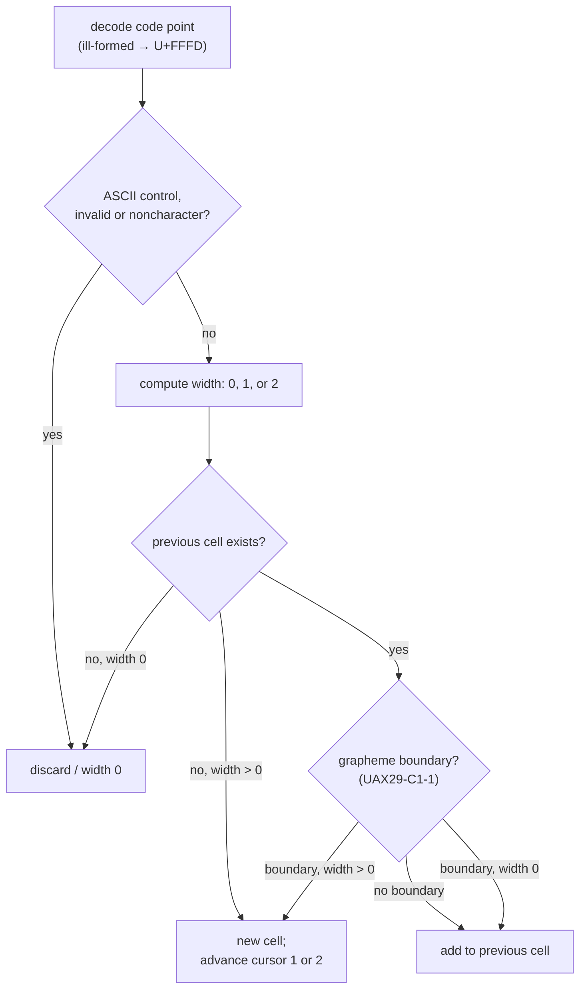
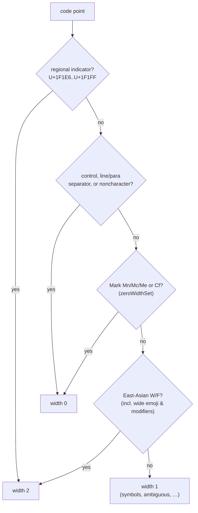

# `sparkles.base.text` — cell-splitting & width specification

_Audience: developers and coding agents building against `sparkles:base`. This
document is normative and self-contained — it states how the library decodes,
segments, measures, and wraps styled UTF-8 in terminal cells. It is **based on
[kitty's Text Sizing Protocol](https://sw.kovidgoyal.net/kitty/text-sizing-protocol/)**,
whose normative "algorithm for splitting text into cells" is the clearest written
reference for the modern-terminal width consensus; relevant passages are quoted with
credit below. The conformance ledger — every case the implementation must satisfy,
including currently-failing ones — lives in [test cases](./test-cases.md). For the
library overview see [`sparkles:base`](../../../libs/base/index.md)._

## 1. Scope & credits

This spec governs three modules of `sparkles.base.text`:

| Module             | Role                                                                                                |
| ------------------ | --------------------------------------------------------------------------------------------------- |
| `width.d`          | width of a single code point (`codepointWidth`) and of a grapheme cluster (`graphemeClusterWidth`)  |
| `grapheme.d`       | segmentation of styled UTF-8 into escapes + clusters (`byGraphemeCluster`) and total `visibleWidth` |
| `wrap.d`           | greedy line wrapping in cells (`writeWrappedText` / `wrapText`) — a sparkles extension              |
| `unicode_tables.d` | generated East-Asian-Width and emoji-VS-base tables (`isEastAsianWide`, `isEmojiVsBase`)            |

The width model follows kitty. Quoted passages in this document are taken from
kitty's documentation and source, **© Kovid Goyal, licensed GPL-3.0**:

- The prose spec — `docs/text-sizing-protocol.rst`, section _"The algorithm for
  splitting text into cells"_
  ([online](https://sw.kovidgoyal.net/kitty/text-sizing-protocol/#the-algorithm-for-splitting-text-into-cells)).
- The width-class implementation — `gen/wcwidth.py` (the generator that emits
  kitty's character-property tables).

> [!NOTE]
> kitty's algorithm document states it is based on **Unicode 16**. sparkles pins its
> East-Asian-Width / emoji **width** tables to **Unicode 17.0** (see
> `libs/base/tools/gen_unicode_tables.d`), but **grapheme segmentation and the
> general categories** (the zero-width Mark set) ride the toolchain's Phobos
> `std.uni`, which currently tracks **Unicode 15.0** (LDC 1.41). The two axes can
> therefore disagree: a code point that UCD 17.0 assigns a Mark category but
> `std.uni` does not yet know measures as width 1 instead of 0. Width assignments
> are stable across these versions for the curated cases in this spec, but **not in
> general** — the [conformance harness](./conformance-harness.md) pins each axis
> separately and tracks the (currently 42) such version-skew code points.

## 2. Measurement model vs. kitty's placement model

kitty's algorithm is written for a terminal that **places** decoded scalars into a
cursor-addressed grid of cells. `sparkles.base.text` is a **measurement and layout**
library: it does not own a grid. The correspondence is exact:

- one kitty **cell** ⇔ one sparkles **grapheme cluster** (width 1 or 2);
- kitty's "advance the cursor by the code point's width" ⇔ `visibleWidth` summing
  each cluster's width;
- kitty's "add the code point to the previous cell" ⇔ the cluster absorbing a
  zero-width or combining member without changing its width.

So `visibleWidth(s)` equals the number of cells kitty would advance the cursor by
when printing `s` (escapes excluded — see [§9](#_9-styled-text-a-sparkles-extension)).
Walking the clusters and advancing a column counter reproduces `visibleWidth`:

```d
#!/usr/bin/env dub
/+ dub.sdl:
    name "spec_text_model"
    dependency "sparkles:base" version="*"
+/
import std.stdio : writefln;
import sparkles.base.text.grapheme : byGraphemeCluster, visibleWidth;

void main()
{
    const s = "a❤️世\U0001F1FA\U0001F1F8"; // ascii, emoji+VS16, CJK, flag
    size_t col;
    foreach (u; s.byGraphemeCluster)
    {
        if (u.isEscape)
            continue;
        writefln("cells [%s..%s)  %s", col, col + u.width, u.slice.idup);
        col += u.width;
    }
    writefln("cursor advanced %s cells; visibleWidth = %s", col, visibleWidth(s));
}
```

```ansi
cells [0..1)  a
cells [1..3)  ❤️
cells [3..5)  世
cells [5..7)  🇺🇸
cursor advanced 7 cells; visibleWidth = 7
```

### Visual: a crisp cell grid

The same idea as a figure — each cluster boxed over the cells it occupies (wide
clusters shaded, spanning two), with its code points beneath. It is generated from
the real `byGraphemeCluster` segmentation by `libs/base/examples/text-cell-svg.d`
and regenerated by a pre-commit hook, so it stays in lock-step with the algorithm:


### Try it: interactive cell explorer

Type any string below and watch it split into cells. This runs the **real
`sparkles.base.text`** — compiled to WebAssembly (`wasm32`, full Phobos) by
`nix build .#text-wasm` and calling the actual `byGraphemeCluster` / `visibleWidth`
in your browser, not a reimplementation.

<ClientOnly>
  <TextCellViz />
</ClientOnly>

## 3. Decoding (safe UTF-8)

> A terminal using this algorithm must decode the bytes they receive into Unicode
> scalar values (i.e., code points except surrogates) using UTF-8. When it
> encounters any UTF-8 ill-formed subsequences, it must replace each maximal subpart
> of the ill-formed subsequence with a `U+FFFD REPLACEMENT CHARACTER` (�).
>
> — kitty Text Sizing Protocol

`grapheme.d` decodes with `std.utf.decode!(Yes.useReplacementDchar)`, which yields
`U+FFFD` for ill-formed input rather than throwing — keeping the scanner
`@nogc nothrow`. `U+FFFD` is East-Asian _ambiguous_, so it measures as width 1.
(The exact byte-grouping of a maximal ill-formed subpart is a Phobos decoding
detail and is not pinned by this spec.)

```d
#!/usr/bin/env dub
/+ dub.sdl:
    name "spec_text_decoding"
    dependency "sparkles:base" version="*"
+/
import std.stdio : writefln, writeln;
import std.string : representation;
import sparkles.base.text.grapheme : byGraphemeCluster, visibleWidth;

void main()
{
    // 'a', 'b', then one ill-formed byte 0xFF -> decoded as U+FFFD (width 1).
    const char[] bytes = ['a', 'b', '\xFF'];
    foreach (u; bytes.byGraphemeCluster)
        writefln("bytes=%(%02x %)  width=%s", u.slice.representation, u.width);
    writeln("visibleWidth = ", visibleWidth(bytes));
}
```

```ansi
bytes=61  width=1
bytes=62  width=1
bytes=ff  width=1
visibleWidth = 3
```

## 4. The per-code-point pipeline

kitty specifies, for each decoded code point:

> 1. First check if the code point is an ASCII control code, and handle it
>    appropriately. ASCII control codes are the code points less than `U+0032` and
>    the code point `U+0127 DEL`. The code point `U+0000 NUL` must be discarded.
> 2. Next, check if the code point is _invalid_, and if it is, discard it … Invalid
>    code points are code points with Unicode category `Cc or Cs` and 66 additional
>    code points: `[0xfdd0, 0xfdef]`, `[0xfffe, 0x10ffff-1, 0x10000]` and
>    `[0xffff, 0x10ffff, 0x10000]`.
> 3. Next, check if there is a previous cell …
> 4. Next, calculate the width in cells of the received code point, which can be 0,
>    1, or 2 …
> 5. If there is no previous cell and the code point's width is zero, the code point
>    is discarded …
> 6. If there is a previous cell, the Grapheme segmentation algorithm UAX29-C1-1 is
>    used to determine if there is a grapheme boundary …
> 7. If there is no boundary, the current code point is added to the previous cell …
> 8. If there is a boundary, but the width of the current code point is zero, it is
>    added to the previous cell …
> 9. The code point is added to the current cell and the cursor is moved forward
>    (right) by either 1 or 2 cells …
>
> — kitty Text Sizing Protocol

> [!NOTE]
> The thresholds `U+0032` and `U+0127 DEL` in step 1 are apparent typos in kitty's
> prose for `U+0020` (space) and `U+007F` (DEL). sparkles classifies controls via
> `std.uni.isControl`, which correctly covers the C0 (`U+0000`–`U+001F`), `U+007F`
> DEL, and C1 ranges, all measured as width 0.

As a diagram (one decoded code point flowing through the nine steps):



_The flowchart is illustrative; the quoted steps above and the runnable snippet below
are normative._

sparkles realizes this pipeline as: segment with `byGraphemeCluster` (steps 3, 6–9),
where each cluster's width comes from `graphemeClusterWidth` ([§6](#_6-width-of-a-grapheme-cluster)),
which takes the leading scalar's width and folds zero-width members (steps 7–8).
Invalid/non-character handling (step 2) is implemented in `codepointWidth` via
`isNoncharacter`, which measures `U+FDD0`..`U+FDEF` and any `U+xxFFFE`/`U+xxFFFF` as
width 0.

Decomposing a cluster into its scalars shows steps 4–9 at work: each scalar has an
isolated width (step 4), zero-width members attach to the cell (steps 7–8), and the
cell advances by the **leading** scalar's width — a flag's two width-2 indicators
still make one 2-cell cell, never four:

```d
#!/usr/bin/env dub
/+ dub.sdl:
    name "spec_text_pipeline"
    dependency "sparkles:base" version="*"
+/
import std.stdio : writefln;
import std.array : appender;
import std.format : format;
import std.uni : graphemeStride;
import sparkles.base.text.width : codepointWidth, graphemeClusterWidth;

void main()
{
    static struct C { string label; dstring s; }
    static immutable C[] cs = [
        C("A + combining acute", "Á"d),
        C("flag (RI + RI)",      "\U0001F1FA\U0001F1F8"d),
        C("Devanagari की",       "की"d),
    ];
    foreach (c; cs)
        for (size_t i = 0; i < c.s.length;)
        {
            const n = graphemeStride(c.s, i);
            auto scalars = appender!string;
            foreach (k, cp; c.s[i .. i + n])
                scalars ~= format("%sU+%04X(w%s)", k ? " " : "", cp, codepointWidth(cp));
            writefln("%-22s %s -> cell width %s", c.label, scalars[],
                graphemeClusterWidth(c.s[i .. i + n]));
            i += n;
        }
}
```

```ansi
A + combining acute    U+00C1(w1) -> cell width 1
flag (RI + RI)         U+1F1FA(w2) U+1F1F8(w2) -> cell width 2
Devanagari की           U+0915(w1) U+0940(w0) -> cell width 1
```

## 5. Width of a single code point

kitty assigns width by these classes, in **decreasing priority**:

> 1. _Regional indicators_: 26 code points starting at `0x1F1E6`. These all have
>    width 2.
> 2. _Doublewidth_: … All code points marked `W` or `F` [in `EastAsianWidth.txt`]
>    have width two. All code points in the following ranges have width two _unless_
>    they are marked as `A`: `[0x3400, 0x4DBF], [0x4E00, 0x9FFF], [0xF900, 0xFAFF], [0x20000, 0x2FFFD], [0x30000, 0x3FFFD]`.
> 3. _Wide emoji_: … All `Basic_Emoji` have width two unless they are followed by
>    `FE0F` in the file. The leading codepoints in all `RGI_Emoji_Modifier_Sequence`
>    and `RGI_Emoji_Tag_Sequence` have width two. All code points in
>    `RGI_Emoji_Flag_Sequence` have width two.
> 4. _Marks_: These are all zero width code points. They are code points with Unicode
>    categories whose first letter is `M` or `S`. Additionally, code points with
>    Unicode category `Cf`. Finally, they include all modifier code points from
>    `RGI_Emoji_Modifier_Sequence` …
> 5. All remaining code points have a width of one cell.
>
> — kitty Text Sizing Protocol

> [!IMPORTANT]
> **Prose vs. implementation for rule 4.** kitty's _implementation_ does **not**
> treat category `S` as zero width. `gen/wcwidth.py` puts only `M*`, `Cf`,
> `Other_Default_Ignorable_Code_Point`, and emoji modifiers into `marks` (width 0);
> code points with a category starting in `S` go to a separate symbols set and keep
> the default width 1:
>
> ```python
> if category.startswith('M'):
>     marks.add(codepoint)         # M* -> width 0
> elif category.startswith('S'):
>     all_symbols.add(codepoint)   # S* -> NOT marks (width 1)
> elif category == 'Cf':
>     marks.add(codepoint)         # Cf -> width 0
> ```
>
> So `+` (`U+002B`, category `Sm`) is width **1**, not 0. **sparkles follows the
> implementation**: `codepointWidth` returns 1 for symbols.
>
> The same priority order resolves **emoji skin-tone modifiers** (`U+1F3FB`..`U+1F3FF`):
> the prose lists them under _Marks_, but they have `East_Asian_Width = W`, and
> _Doublewidth_ (rule 2) outranks _Marks_ (rule 4) — so a modifier in **isolation**
> is width **2**. It only contributes 0 _inside_ a cluster, where the leading emoji
> already sets the width.

As a decision tree — the first matching class wins (`codepointWidth`'s order):



_Illustrative; the runnable snippet below is normative. Note the two prose-vs-impl
points it encodes: symbols (`S*`) fall through to width 1, and an emoji modifier is
caught by East-Asian `W` (width 2) before the Marks branch._

sparkles' `codepointWidth(dchar)` implements rules 1, 2, 4, 5 directly: a regional
indicator (`U+1F1E6`..`U+1F1FF`) → 2 (they are EAW-neutral, so this is an explicit
check); noncharacters and controls/line-separators → 0; all Marks `Mn | Mc | Me`
plus `Cf` and a few conjoining ranges (`zeroWidthSet`) → 0; East-Asian `W`/`F` (via
`isEastAsianWide`, which also covers wide emoji and modifiers) → 2; everything else
→ 1. Rule 3's variation-selector adjustment is applied at the **cluster** level
([§6](#_6-width-of-a-grapheme-cluster)).

> [!IMPORTANT]
> **Partial rule 3 — RGI modifier/tag sequences.** sparkles honors the _Wide
> emoji_ rule only through the EAW table (and VS16/VS15 at the cluster level). It
> does **not** separately force "the leading code point of an
> `RGI_Emoji_Modifier_Sequence` / `RGI_Emoji_Tag_Sequence` to width 2." So when the
> base is already EAW-wide (👍 `U+1F44D`) a skin-tone sequence is 2 either way, but
> when the base is EAW-_neutral_ (✌ `U+270C`, EAW `N`) the sequence `270C 1F3FB`
> stays width **1**, where kitty's rule 3 gives 2. This is a real divergence from
> kitty — but **ghostty agrees with sparkles** here, so it is a contested,
> terminal-dependent case rather than a clear bug. The
> [conformance harness](./conformance-harness.md) (Layers 3 & 4) enumerates these.

```d
#!/usr/bin/env dub
/+ dub.sdl:
    name "spec_text_codepoint_width"
    dependency "sparkles:base" version="*"
+/
import std.stdio : writefln;
import sparkles.base.text.width : codepointWidth;

void main()
{
    static struct C { string label; dchar cp; }
    static immutable C[] cps = [
        C("U+0041 LATIN A",        'A'),
        C("U+002B PLUS (Sm)",      '+'),
        C("U+4E16 CJK (EAW W)",    '世'),
        C("U+FF21 FULLWIDTH (F)",  'Ａ'),
        C("U+0301 COMB. ACUTE",    '́'),
        C("U+200B ZWSP (Cf)",      '​'),
        C("U+0009 TAB (control)",  '\t'),
    ];
    foreach (c; cps)
        writefln("%-24s width=%s", c.label, codepointWidth(c.cp));
}
```

```ansi
U+0041 LATIN A           width=1
U+002B PLUS (Sm)         width=1
U+4E16 CJK (EAW W)       width=2
U+FF21 FULLWIDTH (F)     width=2
U+0301 COMB. ACUTE       width=0
U+200B ZWSP (Cf)         width=0
U+0009 TAB (control)     width=0
```

## 6. Width of a grapheme cluster

A cluster occupies one cell whose width is set by its **leading** scalar; combining
members add nothing, and only the variation selectors ([§7](#_7-variation-selectors))
adjust it. `graphemeClusterWidth(in dchar[])` implements exactly that. So a flag
(leading regional indicator → 2), a ZWJ family (leading wide emoji → 2), and an
emoji + skin-tone modifier (leading wide emoji → 2) each resolve to one 2-cell
cluster, while a base + spacing mark (`Mc`) stays one 1-cell cluster.

Note the parenthetical "leading **wide** emoji": a skin-tone modifier never adds
width itself, so a sequence whose base is EAW-_neutral_ (✌ `U+270C`) stays width 1
— sparkles does not implement kitty's separate "modifier-sequence base → 2" rule
(see the §5 note above and the [conformance harness](./conformance-harness.md)).

```d
#!/usr/bin/env dub
/+ dub.sdl:
    name "spec_text_cluster_width"
    dependency "sparkles:base" version="*"
+/
import std.stdio : writefln;
import sparkles.base.text.width : graphemeClusterWidth;

void main()
{
    static struct C { string label; dstring s; }
    static immutable C[] cs = [
        C("A + combining acute",  "Á"d),
        C("CJK U+4E16",           "世"d),
        C("flag (RI + RI)",       "\U0001F1FA\U0001F1F8"d),
        C("thumbs-up + tone",     "\U0001F44D\U0001F3FE"d),
        C("woman ZWJ girl",       "\U0001F469‍\U0001F467"d),
        C("heart + VS16",         "❤️"d),
        C("heart (bare)",         "❤"d),
        C("heart + VS15",         "❤︎"d),
    ];
    foreach (c; cs)
        writefln("%-22s width=%s", c.label, graphemeClusterWidth(c.s));
}
```

```ansi
A + combining acute    width=1
CJK U+4E16             width=2
flag (RI + RI)         width=2
thumbs-up + tone       width=2
woman ZWJ girl         width=2
heart + VS16           width=2
heart (bare)           width=1
heart + VS15           width=1
```

### Visual: the cell grid

Laying a mixed string out as a grid makes the model concrete — each grapheme
cluster is one column occupying its `[start, end)` cells, wide clusters span two,
and a multi-scalar cluster (combining mark, flag, Indic syllable, emoji + VS) is
still a single cell. The grid is drawn with `drawTable`, which sizes every column by
`visibleWidth`, so its own alignment is a live check of the algorithm:

```d
#!/usr/bin/env dub
/+ dub.sdl:
    name "spec_text_cell_grid"
    dependency "sparkles:core-cli" version="*"
+/
import std.stdio : write;
import std.conv : to;
import std.format : format;
import std.array : appender;
import std.utf : byDchar;
import sparkles.base.text.grapheme : byGraphemeCluster;
import sparkles.core_cli.ui.table : drawTable;

void main()
{
    // ascii, combining, CJK, flag, Indic, emoji + VS16
    const s = "aÁ世\U0001F1FA\U0001F1F8की❤️";
    string[] glyphs = ["cluster"], cells = ["cells"], widths = ["width"], scalars = ["scalars"];
    size_t col;
    foreach (u; s.byGraphemeCluster)
    {
        if (u.isEscape)
            continue;
        glyphs ~= u.slice.idup;
        cells ~= format("[%s,%s)", col, col + u.width);
        widths ~= u.width.to!string;
        auto cps = appender!string;
        size_t k;
        foreach (cp; u.slice.byDchar)
        {
            cps ~= format("%sU+%04X", k ? " " : "", cp);
            ++k;
        }
        scalars ~= cps[];
        col += u.width;
    }
    write(drawTable([glyphs, cells, widths, scalars]));
}
```

```ansi
╭─────────┬────────┬───────────────┬────────┬─────────────────┬───────────────┬───────────────╮
│ cluster │ a      │ Á             │ 世     │ 🇺🇸              │ की             │ ❤️            │
│ cells   │ [0,1)  │ [1,2)         │ [2,4)  │ [4,6)           │ [6,7)         │ [7,9)         │
│ width   │ 1      │ 1             │ 2      │ 2               │ 1             │ 2             │
│ scalars │ U+0061 │ U+0041 U+0301 │ U+4E16 │ U+1F1FA U+1F1F8 │ U+0915 U+0940 │ U+2764 U+FE0F │
╰─────────┴────────┴───────────────┴────────┴─────────────────┴───────────────┴───────────────╯
```

## 7. Variation selectors

> `U+FE0E` - Variation Selector 15 — When the previous cell has width two and the
> last code point in the previous cell is one of the `Basic_Emoji` code points from
> the _Wide emoji_ rule above that is _not_ followed by `FE0F` then the width of the
> previous cell is decreased to one.
>
> `U+FE0F` - Variation Selector 16 — When the previous cell has width one and the
> last code point in the previous cell is one of the `Basic_Emoji` code points from
> the _Wide emoji_ rule above that is followed by `FE0F` then the width of the
> previous cell is increased to two.
>
> — kitty Text Sizing Protocol

In `width.d`, VS16 promotion is **gated** on the base being an emoji-VS base
(`isEmojiVsBase`, generated from `emoji-variation-sequences.txt`), exactly as
specified. VS15 demotion is gated the same way. So a non-emoji base ignores both
selectors — `A + VS16` stays 1, and a wide `CJK + VS15` stays 2 (gating VS15 is what
keeps an unrelated wide character from being wrongly narrowed):

```d
#!/usr/bin/env dub
/+ dub.sdl:
    name "spec_text_variation_selectors"
    dependency "sparkles:base" version="*"
+/
import std.stdio : writefln;
import sparkles.base.text.width : graphemeClusterWidth;

void main()
{
    static struct C { string label; dstring s; }
    static immutable C[] cs = [
        C("heart (bare)",                "❤"d),
        C("heart + VS16",                "❤️"d),
        C("heart + VS15",                "❤︎"d),
        C("A + VS16 (not emoji base)",   "A️"d),
        C("CJK + VS15 (not emoji base)", "世︎"d),
    ];
    foreach (c; cs)
        writefln("%-30s width=%s", c.label, graphemeClusterWidth(c.s));
}
```

```ansi
heart (bare)                   width=1
heart + VS16                   width=2
heart + VS15                   width=1
A + VS16 (not emoji base)      width=1
CJK + VS15 (not emoji base)    width=2
```

## 8. Grapheme segmentation (UAX29-C1-1)

> The basis for the algorithm is the Grapheme segmentation algorithm from the
> Unicode standard. … the Grapheme segmentation algorithm UAX29-C1-1 is used to
> determine if there is a grapheme boundary …
>
> — kitty Text Sizing Protocol
>
> kitty comes with a utility to test terminal compliance with this algorithm … This
> uses tests published by the Unicode consortium, `GraphemeBreakTest.txt`.

sparkles segments via `std.uni.graphemeStride` (the toolchain's Unicode-17 grapheme
tables) inside `byGraphemeCluster`. This implements the parts of UAX #29 that matter
for terminal width: **regional-indicator pairing** (a flag is one cluster) and
**emoji ZWJ sequences** (a multi-person emoji is one cluster).

The snippet below adapts the format of the Unicode `GraphemeBreakTest.txt` cases
that drive kitty's `kitten __width_test__`: a `÷` marks a cluster boundary, a `×`
marks "no boundary", and each hex token is a code point. It reads both halves of
each line as declarative pipelines — the string the line denotes and the cluster
lengths it prescribes — then segments with `std.uni.byGrapheme` (the same Unicode-17
grapheme tables `byGraphemeCluster` uses) and checks the lengths against the spec, so
the same boundary rules kitty validates against are checked here:

```d
#!/usr/bin/env dub
/+ dub.sdl:
    name "spec_text_grapheme_breaks"
    dependency "sparkles:base" version="*"
+/
import std.algorithm : splitter, filter, map, count, equal;
import std.array : array;
import std.conv : to;
import std.stdio : writefln;
import std.uni : byGrapheme;

// A GraphemeBreakTest.txt line is hex code points separated by `÷` (boundary) or
// `×` (no boundary), e.g. "÷ 0061 × 0301 ÷". Both halves of the line read as a
// declarative pipeline.

/// The decoded string the line denotes: every hex token, in order, as a dchar.
dstring specText(string spec) pure
    => spec.splitter(' ')
           .filter!(t => t.length && t != "÷" && t != "×")
           .map!(t => t.to!uint(16).to!dchar)
           .array;

/// The cluster lengths the line prescribes: code points between `÷` boundaries.
auto specClusters(string spec) pure
    => spec.splitter("÷")
           .map!(cluster => cluster.splitter(' ').count!(t => t.length && t != "×"))
           .filter!(n => n > 0);

void main()
{
    static immutable string[2][] cases = [
        ["a + acute", "÷ 0061 × 0301 ÷"],
        ["CRLF", "÷ 000D × 000A ÷"],
        ["CR | a", "÷ 000D ÷ 0061 ÷"],
        ["flag pair | RI", "÷ 1F1FA × 1F1F8 ÷ 1F1F8 ÷"],
        ["ZWJ family", "÷ 1F469 × 200D × 1F467 ÷"],
        ["Hangul L V T", "÷ 1100 × 1161 × 11A8 ÷"],
        ["Devanagari KA+AA", "÷ 0915 × 093E ÷"],
    ];
    foreach (c; cases)
    {
        // Each Grapheme's length is its code-point count — the spec's cluster length.
        auto got = c[1].specText.byGrapheme.map!(g => g.length).array;
        writefln("%-5s %-18s %s  clusters=%s",
            c[1].specClusters.equal(got) ? "PASS" : "FAIL", c[0], c[1], got);
    }
}
```

```ansi
PASS  a + acute          ÷ 0061 × 0301 ÷  clusters=[2]
PASS  CRLF               ÷ 000D × 000A ÷  clusters=[2]
PASS  CR | a             ÷ 000D ÷ 0061 ÷  clusters=[1, 1]
PASS  flag pair | RI     ÷ 1F1FA × 1F1F8 ÷ 1F1F8 ÷  clusters=[2, 1]
PASS  ZWJ family         ÷ 1F469 × 200D × 1F467 ÷  clusters=[3]
PASS  Hangul L V T       ÷ 1100 × 1161 × 11A8 ÷  clusters=[3]
PASS  Devanagari KA+AA   ÷ 0915 × 093E ÷  clusters=[2]
```

## 9. Styled text (a sparkles extension)

kitty's algorithm operates on already-decoded text; ANSI escape sequences are out of
its scope. `grapheme.d` extends the model so callers can measure **styled** strings
directly: `byGraphemeCluster` yields each ANSI escape (SGR, OSC 8 hyperlink) as its
own unit with `isEscape = true` and width 0, and `visibleWidth` ignores them. Thus a
flag is still one 2-cell cluster, and color codes never inflate a measurement.

```d
#!/usr/bin/env dub
/+ dub.sdl:
    name "spec_text_segmentation"
    dependency "sparkles:base" version="*"
+/
import std.stdio : writefln, writeln;
import sparkles.base.text.grapheme : byGraphemeCluster, visibleWidth;

void main()
{
    const s = "a\x1b[31m世界\x1b[0m\U0001F1FA\U0001F1F8";
    foreach (u; s.byGraphemeCluster)
        writefln("%-7s width=%s  %s", u.isEscape ? "escape" : "cluster", u.width,
            u.isEscape ? "<esc>" : u.slice.idup);
    writeln("visibleWidth = ", visibleWidth(s));
}
```

```ansi
cluster width=1  a
escape  width=0  <esc>
cluster width=2  世
cluster width=2  界
escape  width=0  <esc>
cluster width=2  🇺🇸
visibleWidth = 7
```

## 10. Line wrapping (a sparkles extension)

kitty's protocol governs cell **width**, not line breaking. `wrap.d` adds greedy
wrapping measured in cells: it never lets a 2-cell glyph straddle the wrap column,
breaks at a documented **reduced subset of UAX #14** (spaces, ZWSP, between
ideographs, after a soft hyphen; never at NBSP / word-joiner) via `classOf`, honours
mandatory breaks, and — with `StyleContinuity` — suspends active SGR/OSC-8 state at a
wrap newline and re-emits it on the continuation line so styling never bleeds onto a
border.

```d
#!/usr/bin/env dub
/+ dub.sdl:
    name "spec_text_wrapping"
    dependency "sparkles:base" version="*"
+/
import std.stdio : writeln;
import std.array : replace;
import sparkles.base.text.wrap : wrapText, WrapOptions, WhitespaceMode, StyleContinuity;

void main()
{
    // CJK breaks between ideographs (each is 2 cells; width 4 fits two).
    writeln("CJK @ width 4:");
    writeln(wrapText("世界世", WrapOptions(width: 4)));

    // Soft hyphen: the '-' appears only at a realized break.
    writeln("soft hyphen @ width 3:");
    writeln(wrapText("ab­cd", WrapOptions(width: 3, whitespace: WhitespaceMode.collapse)));

    // SGR suspended at the break and re-emitted on the next line (ESC shown as \e).
    writeln("styled @ width 3 (ESC as \\e):");
    const styled = wrapText("\x1b[31mfoo bar\x1b[0m",
        WrapOptions(width: 3, continuity: StyleContinuity.sgrReset, whitespace: WhitespaceMode.collapse));
    writeln(styled.replace("\x1b", "\\e"));
}
```

```ansi
CJK @ width 4:
世界
世
soft hyphen @ width 3:
ab-
cd
styled @ width 3 (ESC as \e):
\e[31mfoo\e[0m
\e[31mbar\e[0m
```

## 11. Conformance

The full, executable conformance ledger — every normative case the implementation
must satisfy, with pass status — is maintained in [test cases](./test-cases.md), and
the same assertions are mirrored as `unittest`s in `width.d` / `grapheme.d`. All
cases conform to kitty:

| Rule                        | Status | Note                                           |
| --------------------------- | ------ | ---------------------------------------------- |
| EAW `W`/`F` → 2             | ✓      | also covers emoji bases & skin-tone modifiers  |
| all Marks `M*` + `Cf` → 0   | ✓      | incl. spacing marks (`Mc`) — Brahmic syllables |
| symbols (`S*`) → 1          | ✓      | matches kitty's implementation, not its prose  |
| regional indicator → 2      | ✓      | lone half and flag pair                        |
| flags, ZWJ emoji, VS16/VS15 | ✓      | segmentation + cluster width                   |
| lone emoji modifier → 2     | ✓      | EAW `W` outranks _Marks_ in isolation          |
| noncharacters discarded → 0 | ✓      | `U+FDD0`..`U+FDEF`, `U+xxFFFE`, `U+xxFFFF`     |

Beyond this curated ledger, the [conformance harness](./conformance-harness.md)
differentially tests the implementation **exhaustively** — every code point and
the official `GraphemeBreakTest.txt` / `emoji-test.txt` corpora — across eleven
layers: a clean-room raw-UCD oracle, three reference terminals (kitty, ghostty
via `libghostty-vt`, notcurses), three width libraries (utf8proc, Rust
`unicode-width`, Python `wcwidth` embedded in-process), and two live UAX #29
segmenters (utf8proc, ICU). It documents where these independent implementations
genuinely _disagree_ (emoji-modifier sequences, Hangul jamo, Brahmic spacing
marks, regional indicators, VS16) and which interpretation sparkles follows — the
contested classes are implementation-dependent, not bugs.

## 12. References

- kitty Text Sizing Protocol — <https://sw.kovidgoyal.net/kitty/text-sizing-protocol/>
  (and `docs/text-sizing-protocol.rst`, `gen/wcwidth.py` in the kitty source) — © Kovid Goyal, GPL-3.0.
- [UAX #11 East Asian Width](https://www.unicode.org/reports/tr11/)
- [UAX #14 Line Breaking](https://www.unicode.org/reports/tr14/)
- [UAX #29 Grapheme Cluster Boundaries](https://www.unicode.org/reports/tr29/#Grapheme_Cluster_Boundaries)
- [UTS #51 Emoji](https://www.unicode.org/reports/tr51/)
- [`EastAsianWidth.txt`](https://www.unicode.org/Public/UCD/latest/ucd/EastAsianWidth.txt),
  [`emoji-variation-sequences.txt`](https://www.unicode.org/Public/UCD/latest/ucd/emoji/emoji-variation-sequences.txt)
- sparkles modules: `width.d`, `grapheme.d`, `wrap.d`, `unicode_tables.d` (under
  `libs/base/src/sparkles/base/text/`); table generator
  `libs/base/tools/gen_unicode_tables.d`.
