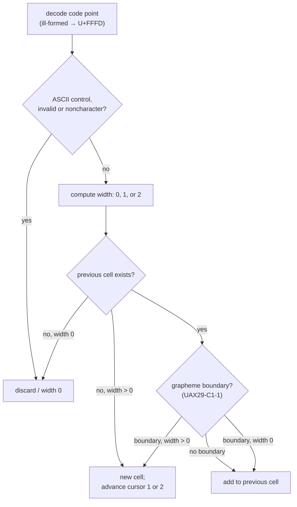
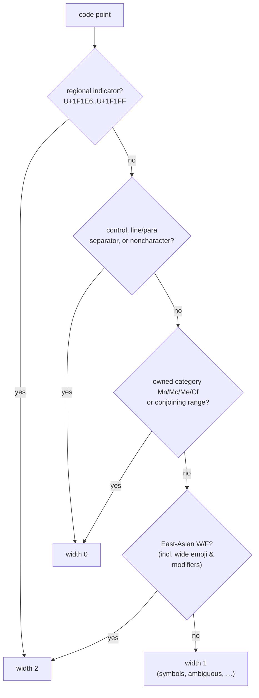

# `sparkles.base.text` — cell-splitting & width specification

## Abstract

This page records the delivered terminal cell policy and its curated conformance
baseline. The [owned UTF/Unicode specification](./SPEC.md) defines the production
foundation and expanded target contracts, and [wrapping and measurement](./wrapping.md)
defines the shared line-selection and source-preserving plan contracts. Their
delivery status and remaining cutover gates are tracked in [the delivery plan](./PLAN.md);
a target requirement alone is not evidence that its implementation has shipped.

`sparkles:base` measures text the way a grapheme-clustering terminal lays it out:
how many grid cells each user-perceived character occupies, where one character
ends and the next begins, and how a line of styled text wraps without splitting a
wide character or bleeding colour onto the next line. This page specifies the
delivered `terminalKitty` cell policy, the width policy kitty's text-sizing protocol defines, and
its conformance baseline against the Unicode test corpora and independent
terminal and library implementations. A [separate specification](./SPEC.md)
covers the owned production foundation and its expanded target contracts, built
on Unicode data and algorithms that sparkles implements itself.

## Introduction

A terminal user interface draws text into a grid. Every column, border, cursor
position and selection depends on knowing how many
[grid cells](../../../glossary.md#grid-cell) a string advances the cursor by. That
number is not the string's length in bytes or code points. A flag is two code
points in two cells, an accented letter can be two code points in one cell, and
a family emoji is five code points that a clustering terminal draws in two.

No single authority settles the width of every character. The Unicode East Asian
Width property leaves many characters ambiguous, emoji presentation depends on
variation selectors, and terminals and width libraries disagree on whole classes
of input. A measurement library that does not name the policy it follows
inherits those disagreements as misaligned borders and drifting cursors.

This library follows one named policy: kitty's
[Text Sizing Protocol](https://sw.kovidgoyal.net/kitty/text-sizing-protocol/)
algorithm for splitting text into cells, as kitty's implementation applies it.
Each [grapheme cluster](../../../glossary.md#grapheme-cluster) occupies one or
two adjacent grid cells. How many is set by the cluster's leading scalar (its
first Unicode code point) and adjusted only by emoji variation selectors. That
policy is the `terminalKitty` [width profile](../../../glossary.md#width-profile).
ANSI escape sequences (colour and hyperlink codes, measured as zero width) and
line wrapping are sparkles extensions layered on the same measurement.

This page is the accepted contract of the delivered terminal cell policy. The
[owned UTF, Unicode, and cell text specification](./SPEC.md) defines the
production foundation and expanded target contracts. It keeps `terminalKitty` as a
named, revisioned width profile and adds the per-scalar `terminalUnclustered`
profile. The production foundation derives every property from one Unicode
release whose data and algorithms sparkles implements itself
([owned semantics](./SPEC.md#_1-scope-vocabulary-and-ownership)), instead of
from the toolchain's tables. Its
[cell text contract](./SPEC.md#_6-cell-text-and-coordinates) cites this page for
the delivered width classes. Delivery and review of the expanded width-profile,
glyph-channel, and scaled-footprint requirements remain separate gates in
[the delivery plan](./PLAN.md); this page does not mark those requirements
implemented or reviewed. The shared line-selection contracts live in
[wrapping and measurement](./wrapping.md). Fonts, shaping and proportional layout
are out of scope here.

Sections 2–8 define the measurement model, decoding, per-code-point and
per-cluster width, variation selectors and segmentation; §9 and §10 the styled
text and wrapping extensions; §11 the conformance summary. The curated cases live
in [test cases](./test-cases.md), exhaustive differential testing in
[the conformance harness](./conformance-harness.md), and usage in
[`sparkles:base`](../../../libs/base/index.md).

## Contract at a glance

1. A string's visible width equals the number of grid cells kitty advances the
   cursor by when printing it, with escapes excluded.
2. A grapheme cluster's width is its leading scalar's width, never the sum of its
   members; VS16 and VS15 adjust it only on an emoji-variation base.
3. Marks (`M*`) and format characters (`Cf`) are width zero; symbols (`S*`) are
   width one, following kitty's implementation rather than its prose.
4. Ill-formed UTF-8 decodes to `U+FFFD` without throwing or allocating.
5. Wrapping never lets a wide cluster straddle the wrap column.
6. Every runnable example on this page is CI-verified against its recorded output.

## 1. Scope & credits

The terminal policy uses the following owned modules of `sparkles.base.text`:

- `utf.d`, `utf8.d`, `utf16.d`: bounded scalar decoding, conversion, and explicit
  malformed-input policies.
- `unicode_tables.d`: manifest-identified categories, boundary properties, East
  Asian width, and emoji variation bases.
- `width.d`: the named terminal-cell profile (`codepointWidth`,
  `graphemeClusterWidth`, `unclusteredWidth`).
- `grapheme.d`: default extended-grapheme state and streaming spans; styled UTF-8
  measurement (`byGraphemeCluster`, `visibleWidth`).
- `wrap.d`, `wrap_plan.d`, `wrap_cells_project.d`: cell wrapping, source-preserving
  plans, and validated emission.

The width model is inspired by kitty. Quoted passages in this document are taken from
kitty's documentation and source, **© Kovid Goyal, licensed GPL-3.0**:

- The prose spec — `docs/text-sizing-protocol.rst`, section _"The algorithm for
  splitting text into cells"_
  ([online](https://sw.kovidgoyal.net/kitty/text-sizing-protocol/#the-algorithm-for-splitting-text-into-cells)).
- The width-class implementation — `gen/wcwidth.py` (the generator that emits
  kitty's character-property tables).

> [!NOTE]
> kitty's quoted algorithm document states that it is based on **Unicode 16**.
> sparkles' production decoding, segmentation, categories, and width properties
> use owned code and one authenticated **Unicode 18.0.0** manifest:
> `libs/base/tools/unicode/manifest.json`. The manifest-driven generator
> `libs/base/tools/gen_unicode_tables.d` reads authenticated local inputs from
> `libs/base/tools/unicode/18.0.0`; ordinary generation does not download data.
> Phobos and installed foreign Unicode versions do not select production
> semantics. The [conformance harness](./conformance-harness.md) distinguishes
> normative Unicode 18 checks from foreign terminal-policy comparisons.

## 2. Measurement model vs. kitty's placement model

kitty's algorithm is written for a terminal that **places** decoded scalars into a
cursor-addressed grid of cells. `sparkles.base.text` is a **measurement and layout**
library: it does not own a grid or interpret cursor-motion effects.
`CellPolicy.terminalKitty`, revision 1, is its named local cell profile:

- one measured grapheme cluster occupies 0, 1, or 2 terminal columns;
- `visibleWidth` sums those cluster widths, excluding escape units;
- combining members do not add advance to the leading scalar's cell width;
  eligible presentation selectors can adjust that width.

This models the curated kitty-inspired cases, not every terminal's actual cursor
advance (see [§6](#_6-width-of-a-grapheme-cluster) and
[§9](#_9-styled-text-a-sparkles-extension)).
Walking the clusters and advancing a column counter reproduces `visibleWidth`:

```d
#!/usr/bin/env dub
/+ dub.sdl:
    name "spec_text_model"
    dependency "sparkles:base" version="*"
+/
import std.stdio : writefln;
import sparkles.base.text.grapheme : byGraphemeCluster, visibleWidth;

void main()
{
    const s = "a❤️世\U0001F1FA\U0001F1F8"; // ascii, emoji+VS16, CJK, flag
    size_t col;
    foreach (u; s.byGraphemeCluster)
    {
        if (u.isEscape)
            continue;
        writefln("cells [%s..%s)  %s", col, col + u.width, u.slice.idup);
        col += u.width;
    }
    writefln("cursor advanced %s cells; visibleWidth = %s", col, visibleWidth(s));
}
```

```ansi
cells [0..1)  a
cells [1..3)  ❤️
cells [3..5)  世
cells [5..7)  🇺🇸
cursor advanced 7 cells; visibleWidth = 7
```

### Visual: a crisp cell grid

The same idea as a figure — each cluster boxed over the cells it occupies (wide
clusters shaded, spanning two), with its code points beneath. It is generated from
the real `byGraphemeCluster` segmentation by `libs/base/examples/text-cell-svg.d`
and regenerated by a pre-commit hook, so it stays in lock-step with the algorithm:


### Try it: interactive cell explorer

Type any string below and watch it split into cells. This runs the **real
`sparkles.base.text`** — compiled to WebAssembly (`wasm32`, full Phobos) by
`nix build .#text-wasm` and calling the actual `byGraphemeCluster` / `visibleWidth`
in your browser, not a reimplementation.

<ClientOnly>
  <TextCellViz />
</ClientOnly>

## 3. Decoding (safe UTF-8)

> A terminal using this algorithm must decode the bytes they receive into Unicode
> scalar values (i.e., code points except surrogates) using UTF-8. When it
> encounters any UTF-8 ill-formed subsequences, it must replace each maximal subpart
> of the ill-formed subsequence with a `U+FFFD REPLACEMENT CHARACTER` (�).
>
> — kitty Text Sizing Protocol

`grapheme.d` uses owned `decodeToken` with `UtfMode.replacement`. It emits one
`U+FFFD` per Unicode maximal subpart, retains that token's consumed source span,
and never absorbs a following independently valid token. For example, `E1 80 41`
becomes one replacement for bytes `[0,2)` followed by `A`; final `ED A0 80`
becomes three replacements. This grouping is pinned by the
[owned UTF contract](./SPEC.md#_2-encoding-operations-and-progress),
not by Phobos.

`U+FFFD` is East-Asian _ambiguous_ and has width 1 in the named cell profile.
The scanner remains `@safe pure nothrow @nogc`; `ClusterMeasure.hasMalformed`
marks replacement-decoded clusters. Its `slice` still borrows the original bytes,
so callers must not mistake malformed source bytes for rendered valid UTF-8.

```d
#!/usr/bin/env dub
/+ dub.sdl:
    name "spec_text_decoding"
    dependency "sparkles:base" version="*"
+/
import std.stdio : writefln, writeln;
import std.string : representation;
import sparkles.base.text.grapheme : byGraphemeCluster, visibleWidth;

void main()
{
    // 'a', 'b', then one ill-formed byte 0xFF -> decoded as U+FFFD (width 1).
    const char[] bytes = ['a', 'b', '\xFF'];
    foreach (u; bytes.byGraphemeCluster)
        writefln("bytes=%(%02x %)  width=%s", u.slice.representation, u.width);
    writeln("visibleWidth = ", visibleWidth(bytes));
}
```

```ansi
bytes=61  width=1
bytes=62  width=1
bytes=ff  width=1
visibleWidth = 3
```

## 4. The per-code-point pipeline

kitty specifies, for each decoded code point:

> 1. First check if the code point is an ASCII control code, and handle it
>    appropriately. ASCII control codes are the code points less than `U+0032` and
>    the code point `U+0127 DEL`. The code point `U+0000 NUL` must be discarded.
> 2. Next, check if the code point is _invalid_, and if it is, discard it … Invalid
>    code points are code points with Unicode category `Cc or Cs` and 66 additional
>    code points: `[0xfdd0, 0xfdef]`, `[0xfffe, 0x10ffff-1, 0x10000]` and
>    `[0xffff, 0x10ffff, 0x10000]`.
> 3. Next, check if there is a previous cell …
> 4. Next, calculate the width in cells of the received code point, which can be 0,
>    1, or 2 …
> 5. If there is no previous cell and the code point's width is zero, the code point
>    is discarded …
> 6. If there is a previous cell, the Grapheme segmentation algorithm UAX29-C1-1 is
>    used to determine if there is a grapheme boundary …
> 7. If there is no boundary, the current code point is added to the previous cell …
> 8. If there is a boundary, but the width of the current code point is zero, it is
>    added to the previous cell …
> 9. The code point is added to the current cell and the cursor is moved forward
>    (right) by either 1 or 2 cells …
>
> — kitty Text Sizing Protocol

> [!NOTE]
> The thresholds `U+0032` and `U+0127 DEL` in step 1 are apparent typos in kitty's
> prose for `U+0020` (space) and `U+007F` (DEL). sparkles uses owned
> `generalCategory` data (`GeneralCategory.Cc`), plus its ASCII fast path, to
> measure the C0 (`U+0000`–`U+001F`), DEL, and C1 controls as width 0.

As a diagram (one decoded code point flowing through the nine steps):


```mermaid
flowchart TD
  A["decode code point<br/>(ill-formed → U+FFFD)"] --> B{"ASCII control,<br/>invalid or noncharacter?"}
  B -- yes --> D["discard / width 0"]
  B -- no --> W["compute width: 0, 1, or 2"]
  W --> P{"previous cell exists?"}
  P -- "no, width 0" --> D
  P -- "no, width > 0" --> N["new cell;<br/>advance cursor 1 or 2"]
  P -- yes --> G{"grapheme boundary?<br/>(UAX29-C1-1)"}
  G -- "no boundary" --> ADD["add to previous cell"]
  G -- "boundary, width 0" --> ADD
  G -- "boundary, width > 0" --> N
```

_The diagram illustrates the quoted kitty placement algorithm, not a VT engine
implemented by sparkles._

sparkles segments an escape-free run with owned `GraphemeBreakState`, then derives
each cluster's width with `graphemeClusterWidth`
([§6](#_6-width-of-a-grapheme-cluster)). `codepointWidth` assigns noncharacters,
controls, and the profile's zero-width classes width 0; it does not remove their
source bytes. In particular, `isNoncharacter` recognizes `U+FDD0`..`U+FDEF` and
every `U+xxFFFE`/`U+xxFFFF`. A standalone zero-width cluster remains addressable
even though it advances no cells.

Decomposing a cluster into its scalars shows steps 4–9 at work: each scalar has an
isolated width (step 4), zero-width members attach to the cell (steps 7–8), and the
cell advances by the **leading** scalar's width — a flag's two width-2 indicators
still make one 2-cell cell, never four:

```d
#!/usr/bin/env dub
/+ dub.sdl:
    name "spec_text_pipeline"
    dependency "sparkles:base" version="*"
+/
import std.stdio : writefln;
import std.array : appender;
import std.format : format;
import sparkles.base.text.grapheme : GraphemeBreakState;
import sparkles.base.text.width : codepointWidth, graphemeClusterWidth;

void main()
{
    static struct C { string label; dstring s; }
    static immutable C[] cs = [
        C("A + combining acute", "Á"d),
        C("flag (RI + RI)",      "\U0001F1FA\U0001F1F8"d),
        C("Devanagari की",       "की"d),
    ];
    void report(string label, const(dchar)[] cluster)
    {
        auto scalars = appender!string;
        foreach (k, cp; cluster)
            scalars ~= format("%sU+%04X(w%s)", k ? " " : "", cp, codepointWidth(cp));
        writefln("%-22s %s -> cell width %s", label, scalars[],
            graphemeClusterWidth(cluster));
    }
    foreach (c; cs)
    {
        GraphemeBreakState state;
        size_t start;
        foreach (i, cp; c.s)
            if (state.push(cp) && i != 0)
            {
                report(c.label, c.s[start .. i]);
                start = i;
            }
        if (start < c.s.length)
            report(c.label, c.s[start .. $]);
    }
}
```

```ansi
A + combining acute    U+00C1(w1) -> cell width 1
flag (RI + RI)         U+1F1FA(w2) U+1F1F8(w2) -> cell width 2
Devanagari की           U+0915(w1) U+0940(w0) -> cell width 1
```

## 5. Width of a single code point

kitty assigns width by these classes, in **decreasing priority**:

> 1. _Regional indicators_: 26 code points starting at `0x1F1E6`. These all have
>    width 2.
> 2. _Doublewidth_: … All code points marked `W` or `F` [in `EastAsianWidth.txt`]
>    have width two. All code points in the following ranges have width two _unless_
>    they are marked as `A`: `[0x3400, 0x4DBF], [0x4E00, 0x9FFF], [0xF900, 0xFAFF], [0x20000, 0x2FFFD], [0x30000, 0x3FFFD]`.
> 3. _Wide emoji_: … All `Basic_Emoji` have width two unless they are followed by
>    `FE0F` in the file. The leading codepoints in all `RGI_Emoji_Modifier_Sequence`
>    and `RGI_Emoji_Tag_Sequence` have width two. All code points in
>    `RGI_Emoji_Flag_Sequence` have width two.
> 4. _Marks_: These are all zero width code points. They are code points with Unicode
>    categories whose first letter is `M` or `S`. Additionally, code points with
>    Unicode category `Cf`. Finally, they include all modifier code points from
>    `RGI_Emoji_Modifier_Sequence` …
> 5. All remaining code points have a width of one cell.
>
> — kitty Text Sizing Protocol

> [!IMPORTANT]
> **Prose vs. implementation for rule 4.** kitty's _implementation_ does **not**
> treat category `S` as zero width. `gen/wcwidth.py` puts only `M*`, `Cf`,
> `Other_Default_Ignorable_Code_Point`, and emoji modifiers into `marks` (width 0);
> code points with a category starting in `S` go to a separate symbols set and keep
> the default width 1:
>
> ```python
> if category.startswith('M'):
>     marks.add(codepoint)         # M* -> width 0
> elif category.startswith('S'):
>     all_symbols.add(codepoint)   # S* -> NOT marks (width 1)
> elif category == 'Cf':
>     marks.add(codepoint)         # Cf -> width 0
> ```
>
> So `+` (`U+002B`, category `Sm`) is width **1**, not 0. **sparkles follows the
> implementation**: `codepointWidth` returns 1 for symbols.
>
> The same priority order resolves **emoji skin-tone modifiers** (`U+1F3FB`..`U+1F3FF`):
> the prose lists them under _Marks_, but they have `East_Asian_Width = W`, and
> _Doublewidth_ (rule 2) outranks _Marks_ (rule 4) — so a modifier in **isolation**
> is width **2**. It only contributes 0 _inside_ a cluster, where the leading emoji
> already sets the width.

As a decision tree — the first matching class wins (`codepointWidth`'s order):


```mermaid
flowchart TD
  S["code point"] --> RI{"regional indicator?<br/>U+1F1E6..U+1F1FF"}
  RI -- yes --> TWO["width 2"]
  RI -- no --> CN{"control, line/para<br/>separator, or noncharacter?"}
  CN -- yes --> ZERO["width 0"]
  CN -- no --> MK{"owned category Mn/Mc/Me/Cf<br/>or conjoining range?"}
  MK -- yes --> ZERO
  MK -- no --> EAW{"East-Asian W/F?<br/>(incl. wide emoji & modifiers)"}
  EAW -- yes --> TWO
  EAW -- no --> ONE["width 1<br/>(symbols, ambiguous, …)"]
```

_Illustrative; the runnable snippet below exercises the named profile. Symbols
(`S*`) fall through to width 1. An isolated emoji modifier is not a zero-width
category and is East-Asian `W`, so its standalone width is 2._

sparkles' `codepointWidth(dchar)` requires a Unicode scalar. It checks ASCII,
regional indicators (`U+1F1E6`..`U+1F1FF`, width 2), noncharacters and explicit
conjoining ranges, then owned general categories (`Cc`, `Zl`, `Zp`, `Mn`, `Mc`,
`Me`, `Cf`, width 0), then East-Asian `W`/`F` (`isEastAsianWide`, width 2).
Everything else has width 1, including ambiguous characters and symbols not
already classified wide. This is the named profile's priority, not a literal
copy of every kitty generator class. Variation selectors are applied at the
**cluster** level ([§6](#_6-width-of-a-grapheme-cluster)).

> [!IMPORTANT]
> **Partial rule 3 — RGI modifier/tag sequences.** sparkles honors the _Wide
> emoji_ rule only through the EAW table (and VS16/VS15 at the cluster level). It
> does **not** separately force "the leading code point of an
> `RGI_Emoji_Modifier_Sequence` / `RGI_Emoji_Tag_Sequence` to width 2." So when the
> base is already EAW-wide (👍 `U+1F44D`) a skin-tone sequence is 2 either way, but
> when the base is EAW-_neutral_ (✌ `U+270C`, EAW `N`) the sequence `270C 1F3FB`
> stays width **1**, where kitty's rule 3 gives 2. This is a real divergence from
> kitty — but **ghostty agrees with sparkles** here, so it is a contested,
> terminal-dependent case rather than a clear bug. The
> [conformance harness](./conformance-harness.md) (Layers 3 & 4) enumerates these.

```d
#!/usr/bin/env dub
/+ dub.sdl:
    name "spec_text_codepoint_width"
    dependency "sparkles:base" version="*"
+/
import std.stdio : writefln;
import sparkles.base.text.width : codepointWidth;

void main()
{
    static struct C { string label; dchar cp; }
    static immutable C[] cps = [
        C("U+0041 LATIN A",        'A'),
        C("U+002B PLUS (Sm)",      '+'),
        C("U+4E16 CJK (EAW W)",    '世'),
        C("U+FF21 FULLWIDTH (F)",  'Ａ'),
        C("U+0301 COMB. ACUTE",    '́'),
        C("U+200B ZWSP (Cf)",      '​'),
        C("U+0009 TAB (control)",  '\t'),
    ];
    foreach (c; cps)
        writefln("%-24s width=%s", c.label, codepointWidth(c.cp));
}
```

```ansi
U+0041 LATIN A           width=1
U+002B PLUS (Sm)         width=1
U+4E16 CJK (EAW W)       width=2
U+FF21 FULLWIDTH (F)     width=2
U+0301 COMB. ACUTE       width=0
U+200B ZWSP (Cf)         width=0
U+0009 TAB (control)     width=0
```

## 6. Width of a grapheme cluster

A cluster's width is set by its **leading** scalar; combining members add nothing.
For an eligible emoji variation base, the last VS15/VS16 selector in the cluster
sets width 1/2 respectively ([§7](#_7-variation-selectors)).
`graphemeClusterWidth(in dchar[])` applies that policy to an already-segmented
scalar slice; it does not validate that the slice is exactly one cluster. A flag
(leading regional indicator → 2), a ZWJ family (leading wide emoji → 2), and an
emoji + skin-tone modifier (leading wide emoji → 2) each resolve to one 2-cell
cluster, while a base + spacing mark (`Mc`) stays one 1-cell cluster. Empty or
standalone zero-width clusters have width 0.

A cluster is wide only when its leading scalar is **wide**. A skin-tone
modifier never adds width itself, so a sequence whose base is EAW-_neutral_
(✌ `U+270C`) stays width 1. sparkles does not implement kitty's separate
"modifier-sequence base → 2" rule (see the §5 note above and the
[conformance harness](./conformance-harness.md)).

That width assumes the terminal **clusters** — lays the cluster out as one
character. One that does not advances each scalar by its own width, a regional
indicator narrow, and `unclusteredWidth(in dchar[])` gives that advance:
measured by cursor report, XTerm puts a ZWJ family in 6 cells and a heart with
VS16 in 1, while a flag (two narrow halves) and a letter with a combining accent
keep their cell. `byGraphemeCluster` reports both widths per cluster, so a
painter can tell which clusters a non-clustering terminal would move.

The owned foundation's target contract names this per-scalar advance as the
`terminalUnclustered` [width profile](../../../glossary.md#width-profile), a
sibling of `terminalKitty` rather than a compatibility helper. It requires the
design system's `grapheme-folded` substitution
([glyphs, GLY6](../../design-system/glyphs.md#typography-and-sizing)) to be
expressed through that profile: a terminal with neither mode 2027 nor measured
clustering must be driven under `terminalUnclustered`, and the toolkit must draw
each moved cluster as its leading scalar so cursor and drawing agree. This
expanded profile and drawing contract is not delivery or review evidence; the
implemented per-cluster widths above do not establish its acceptance.

```d
#!/usr/bin/env dub
/+ dub.sdl:
    name "spec_text_cluster_width"
    dependency "sparkles:base" version="*"
+/
import std.stdio : writefln;
import sparkles.base.text.width : graphemeClusterWidth;

void main()
{
    static struct C { string label; dstring s; }
    static immutable C[] cs = [
        C("A + combining acute",  "Á"d),
        C("CJK U+4E16",           "世"d),
        C("flag (RI + RI)",       "\U0001F1FA\U0001F1F8"d),
        C("thumbs-up + tone",     "\U0001F44D\U0001F3FE"d),
        C("woman ZWJ girl",       "\U0001F469‍\U0001F467"d),
        C("heart + VS16",         "❤️"d),
        C("heart (bare)",         "❤"d),
        C("heart + VS15",         "❤︎"d),
    ];
    foreach (c; cs)
        writefln("%-22s width=%s", c.label, graphemeClusterWidth(c.s));
}
```

```ansi
A + combining acute    width=1
CJK U+4E16             width=2
flag (RI + RI)         width=2
thumbs-up + tone       width=2
woman ZWJ girl         width=2
heart + VS16           width=2
heart (bare)           width=1
heart + VS15           width=1
```

### Visual: the cell grid

Laying a mixed string out as a grid makes the model concrete — each grapheme
cluster is one column occupying its `[start, end)` cells, wide clusters span two,
and a multi-scalar cluster (combining mark, flag, Indic syllable, emoji + VS) is
still a single cell. The grid is drawn with `drawTable`, which sizes every column by
`visibleWidth`, so its own alignment is a live check of the algorithm:

```d
#!/usr/bin/env dub
/+ dub.sdl:
    name "spec_text_cell_grid"
    dependency "sparkles:core-cli" version="*"
+/
import std.stdio : write;
import std.conv : to;
import std.format : format;
import std.array : appender;
import sparkles.base.text.utf : decodeToken, UtfStatus;
import sparkles.base.text.grapheme : byGraphemeCluster;
import sparkles.ui.components.table : drawTable;

void main()
{
    // ascii, combining, CJK, flag, Indic, emoji + VS16
    const s = "aÁ世\U0001F1FA\U0001F1F8की❤️";
    string[] glyphs = ["cluster"], cells = ["cells"], widths = ["width"], scalars = ["scalars"];
    size_t col;
    foreach (u; s.byGraphemeCluster)
    {
        if (u.isEscape)
            continue;
        glyphs ~= u.slice.idup;
        cells ~= format("[%s,%s)", col, col + u.width);
        widths ~= u.width.to!string;
        auto cps = appender!string;
        size_t k;
        for (size_t i; i < u.slice.length;)
        {
            const decoded = decodeToken(u.slice[i .. $]);
            assert(decoded.result.status == UtfStatus.ok);
            cps ~= format("%sU+%04X", k ? " " : "", decoded.token.scalar);
            i += decoded.result.consumed;
            ++k;
        }
        scalars ~= cps[];
        col += u.width;
    }
    write(drawTable([glyphs, cells, widths, scalars]));
}
```

```ansi
╭─────────┬────────┬───────────────┬────────┬─────────────────┬───────────────┬───────────────╮
│ cluster │ a      │ Á             │ 世     │ 🇺🇸              │ की             │ ❤️            │
│ cells   │ [0,1)  │ [1,2)         │ [2,4)  │ [4,6)           │ [6,7)         │ [7,9)         │
│ width   │ 1      │ 1             │ 2      │ 2               │ 1             │ 2             │
│ scalars │ U+0061 │ U+0041 U+0301 │ U+4E16 │ U+1F1FA U+1F1F8 │ U+0915 U+0940 │ U+2764 U+FE0F │
╰─────────┴────────┴───────────────┴────────┴─────────────────┴───────────────┴───────────────╯
```

## 7. Variation selectors

> `U+FE0E` - Variation Selector 15 — When the previous cell has width two and the
> last code point in the previous cell is one of the `Basic_Emoji` code points from
> the _Wide emoji_ rule above that is _not_ followed by `FE0F` then the width of the
> previous cell is decreased to one.
>
> `U+FE0F` - Variation Selector 16 — When the previous cell has width one and the
> last code point in the previous cell is one of the `Basic_Emoji` code points from
> the _Wide emoji_ rule above that is followed by `FE0F` then the width of the
> previous cell is increased to two.
>
> — kitty Text Sizing Protocol

In `width.d`, presentation changes are **gated** on the leading scalar being an
emoji variation base (`isEmojiVsBase`, from the owned
`emoji-variation-sequences.txt` data). The last eligible VS16 sets width 2 and
VS15 sets width 1. A non-emoji base ignores both selectors: `A + VS16` stays 1,
and a wide `CJK + VS15` stays 2. This is the named profile's cluster policy;
the kitty quotation records its source, not an independently executed algorithm.

```d
#!/usr/bin/env dub
/+ dub.sdl:
    name "spec_text_variation_selectors"
    dependency "sparkles:base" version="*"
+/
import std.stdio : writefln;
import sparkles.base.text.width : graphemeClusterWidth;

void main()
{
    static struct C { string label; dstring s; }
    static immutable C[] cs = [
        C("heart (bare)",                "❤"d),
        C("heart + VS16",                "❤️"d),
        C("heart + VS15",                "❤︎"d),
        C("A + VS16 (not emoji base)",   "A️"d),
        C("CJK + VS15 (not emoji base)", "世︎"d),
    ];
    foreach (c; cs)
        writefln("%-30s width=%s", c.label, graphemeClusterWidth(c.s));
}
```

```ansi
heart (bare)                   width=1
heart + VS16                   width=2
heart + VS15                   width=1
A + VS16 (not emoji base)      width=1
CJK + VS15 (not emoji base)    width=2
```

## 8. Grapheme segmentation (UAX29-C1-1)

> The basis for the algorithm is the Grapheme segmentation algorithm from the
> Unicode standard. … the Grapheme segmentation algorithm UAX29-C1-1 is used to
> determine if there is a grapheme boundary …
>
> — kitty Text Sizing Protocol
>
> kitty comes with a utility to test terminal compliance with this algorithm … This
> uses tests published by the Unicode consortium, `GraphemeBreakTest.txt`.

sparkles segments with owned `GraphemeBreakState` and Unicode 18.0.0 properties.
It implements default extended-grapheme boundaries, including CRLF, Hangul,
Prepend, Extend/SpacingMark, regional-indicator parity, emoji ZWJ sequences, and
Indic conjunct rule GB9c. The state retains finite context, not a decoded cluster
window: clusters have no scalar-count limit. `GraphemeStream` exposes completed
UTF-8 source spans across chunks, and a chunk end is not a boundary.

The snippet below adapts the Unicode `GraphemeBreakTest.txt` format that also
drives kitty's `kitten __width_test__`: `÷` marks a boundary, `×` marks no
boundary, and hex tokens denote scalars. It parses the expected lengths and feeds
those scalars to the production owned boundary state; it does not substitute a
Phobos segmenter. These examples illustrate selected rules; the full official
corpus belongs to the [conformance harness](./conformance-harness.md).

```d
#!/usr/bin/env dub
/+ dub.sdl:
    name "spec_text_grapheme_breaks"
    dependency "sparkles:base" version="*"
+/
import std.algorithm : splitter, filter, map, count, equal;
import std.array : array;
import std.conv : to;
import std.stdio : writefln;
import sparkles.base.text.grapheme : GraphemeBreakState;

// A GraphemeBreakTest.txt line is hex code points separated by `÷` (boundary) or
// `×` (no boundary), e.g. "÷ 0061 × 0301 ÷". Both halves of the line read as a
// declarative pipeline.

/// The decoded string the line denotes: every hex token, in order, as a dchar.
dstring specText(string spec) pure
    => spec.splitter(' ')
           .filter!(t => t.length && t != "÷" && t != "×")
           .map!(t => t.to!uint(16).to!dchar)
           .array;

/// The cluster lengths the line prescribes: code points between `÷` boundaries.
auto specClusters(string spec) pure
    => spec.splitter("÷")
           .map!(cluster => cluster.splitter(' ').count!(t => t.length && t != "×"))
           .filter!(n => n > 0);

/// Cluster lengths from the production owned Unicode 18 boundary state.
size_t[] segmentClusters(dstring text) pure
{
    GraphemeBreakState state;
    size_t[] lengths;
    foreach (cp; text)
        if (state.push(cp))
            lengths ~= 1;
        else
            ++lengths[$ - 1];
    return lengths;
}

void main()
{
    static immutable string[2][] cases = [
        ["a + acute", "÷ 0061 × 0301 ÷"],
        ["CRLF", "÷ 000D × 000A ÷"],
        ["CR | a", "÷ 000D ÷ 0061 ÷"],
        ["flag pair | RI", "÷ 1F1FA × 1F1F8 ÷ 1F1F8 ÷"],
        ["ZWJ family", "÷ 1F469 × 200D × 1F467 ÷"],
        ["Hangul L V T", "÷ 1100 × 1161 × 11A8 ÷"],
        ["Devanagari KA+AA", "÷ 0915 × 093E ÷"],
    ];
    foreach (c; cases)
    {
        // Count scalars per cluster, independently of UTF encoding length.
        auto got = c[1].specText.segmentClusters;
        writefln("%-5s %-18s %s  clusters=%s",
            c[1].specClusters.equal(got) ? "PASS" : "FAIL", c[0], c[1], got);
    }
}
```

```ansi
PASS  a + acute          ÷ 0061 × 0301 ÷  clusters=[2]
PASS  CRLF               ÷ 000D × 000A ÷  clusters=[2]
PASS  CR | a             ÷ 000D ÷ 0061 ÷  clusters=[1, 1]
PASS  flag pair | RI     ÷ 1F1FA × 1F1F8 ÷ 1F1F8 ÷  clusters=[2, 1]
PASS  ZWJ family         ÷ 1F469 × 200D × 1F467 ÷  clusters=[3]
PASS  Hangul L V T       ÷ 1100 × 1161 × 11A8 ÷  clusters=[3]
PASS  Devanagari KA+AA   ÷ 0915 × 093E ÷  clusters=[2]
```

## 9. Styled text (a sparkles extension)

kitty's placement algorithm operates on decoded text; ANSI escape sequences are
outside its scope. The styled `byGraphemeCluster` adapter yields recognized escape
sequences (including SGR and OSC 8 hyperlinks) as separate borrowed units with
`isEscape = true` and width 0. It segments each escape-free text run separately,
so inserting an escape within a Unicode cluster can split the adapter's units.
`visibleWidth` ignores escape units; it does not execute VT controls or cursor
motion. Raw Unicode boundary checks use `GraphemeBreakState` / `GraphemeStream`.

```d
#!/usr/bin/env dub
/+ dub.sdl:
    name "spec_text_segmentation"
    dependency "sparkles:base" version="*"
+/
import std.stdio : writefln, writeln;
import sparkles.base.text.grapheme : byGraphemeCluster, visibleWidth;

void main()
{
    const s = "a\x1b[31m世界\x1b[0m\U0001F1FA\U0001F1F8";
    foreach (u; s.byGraphemeCluster)
        writefln("%-7s width=%s  %s", u.isEscape ? "escape" : "cluster", u.width,
            u.isEscape ? "<esc>" : u.slice.idup);
    writeln("visibleWidth = ", visibleWidth(s));
}
```

```ansi
cluster width=1  a
escape  width=0  <esc>
cluster width=2  世
cluster width=2  界
escape  width=0  <esc>
cluster width=2  🇺🇸
visibleWidth = 7
```

## 10. Line wrapping (a sparkles extension)

kitty's protocol governs cell **width**, not line selection. `wrap.d` builds
source-preserving cell plans using owned Unicode 18 line opportunities filtered
through grapheme boundaries. `WrapOptions.solver` selects greedy or balanced
selection; the default is greedy. Width is explicitly `CellWidth.bounded(n)` or
`CellWidth.unbounded`, and bounded zero is a genuine zero-cell capacity.

Whitespace, opportunity, overflow, malformed-input, tab, and style policies are
independent options. By default, overlong units may use grapheme-emergency breaks;
an indivisible cluster can still be overfull, so a bounded width is not a promise
to split a wide glyph or reject every overflow. `StyleContinuity.suspendResume`
suspends active SGR/OSC-8 state at a selected newline and resumes it on the
continuation line; `copyThrough` leaves formatting bytes alone.
`wrapText` and `writeWrappedText` are allocating convenience adapters over the
plan and validated emitter. The bounded caller-storage API and its failure,
budget, provenance, and style contracts are documented in
[wrapping and measurement](./wrapping.md).

```d
#!/usr/bin/env dub
/+ dub.sdl:
    name "spec_text_wrapping"
    dependency "sparkles:base" version="*"
+/
import std.stdio : writeln;
import std.array : replace;
import sparkles.base.text.wrap : wrapText, WrapOptions, CellWidth, WhitespaceMode, StyleContinuity;

void main()
{
    // CJK breaks between ideographs (each is 2 cells; width 4 fits two).
    writeln("CJK @ width 4:");
    writeln(wrapText("世界世", WrapOptions(width: CellWidth.bounded(4))));

    // Soft hyphen: the '-' appears only at a realized break.
    writeln("soft hyphen @ width 3:");
    writeln(wrapText("ab­cd", WrapOptions(width: CellWidth.bounded(3), whitespace: WhitespaceMode.collapse)));

    // SGR suspended at the break and re-emitted on the next line (ESC shown as \e).
    writeln("styled @ width 3 (ESC as \\e):");
    const styled = wrapText("\x1b[31mfoo bar\x1b[0m",
        WrapOptions(width: CellWidth.bounded(3), continuity: StyleContinuity.suspendResume, whitespace: WhitespaceMode.collapse));
    writeln(styled.replace("\x1b", "\\e"));
}
```

```ansi
CJK @ width 4:
世界
世
soft hyphen @ width 3:
ab-
cd
styled @ width 3 (ESC as \e):
\e[31mfoo\e[0m
\e[31mbar\e[0m
```

## 11. Conformance

The curated terminal-policy ledger is maintained in [test cases](./test-cases.md),
with corresponding assertions in `width.d` / `grapheme.d`. It exercises the
kitty-inspired local profile; it is not a claim that every external terminal,
Unicode release, or contested width class agrees:

| Rule                        | Status | Note                                           |
| --------------------------- | ------ | ---------------------------------------------- |
| EAW `W`/`F` → 2             | ✓      | also covers emoji bases & skin-tone modifiers  |
| all Marks `M*` + `Cf` → 0   | ✓      | incl. spacing marks (`Mc`) — Brahmic syllables |
| symbols (`S*`) → 1          | ✓      | matches kitty's implementation, not its prose  |
| regional indicator → 2      | ✓      | lone half and flag pair                        |
| flags, ZWJ emoji, VS16/VS15 | ✓      | segmentation + cluster width                   |
| lone emoji modifier → 2     | ✓      | EAW `W`; not a zero-width general category     |
| noncharacters → width 0     | ✓      | original source spans remain retained          |

Beyond the curated ledger, the [conformance harness](./conformance-harness.md)
has seventeen layers covering cell widths, default grapheme/word/sentence
boundaries, line opportunities, bidi, normalization, and casing. Official Unicode
18 corpora and independently parsed authenticated UCD data are the normative
oracles. Foreign terminals (kitty, ghostty via `libghostty-vt`, notcurses), width
libraries (utf8proc, Rust `unicode-width`, Python `wcwidth` embedded in-process),
and segmenters (utf8proc, ICU) provide separate interoperability evidence at their
own versions.

Foreign disagreements can document terminal-policy differences, such as
emoji-modifier sequences, Hangul jamo, Brahmic spacing marks, regional indicators,
or VS16. These contested width classes are implementation-dependent, not
necessarily bugs; they cannot waive an owned Unicode boundary, bidi,
normalization, or casing failure. Execution results and delivery evidence belong
to the harness and [delivery plan](./PLAN.md), not to this overview.

## 12. References

- kitty Text Sizing Protocol — <https://sw.kovidgoyal.net/kitty/text-sizing-protocol/>
  (and `docs/text-sizing-protocol.rst`, `gen/wcwidth.py` in the kitty source) — © Kovid Goyal, GPL-3.0.
- [UAX #11 East Asian Width](https://www.unicode.org/reports/tr11/)
  ([revision 46](https://www.unicode.org/reports/tr11/tr11-46.html))
- [UAX #14 Line Breaking](https://www.unicode.org/reports/tr14/)
  ([revision 57](https://www.unicode.org/reports/tr14/tr14-57.html))
- [UAX #29 Grapheme Cluster Boundaries](https://www.unicode.org/reports/tr29/#Grapheme_Cluster_Boundaries)
  ([revision 49](https://www.unicode.org/reports/tr29/tr29-49.html#Grapheme_Cluster_Boundaries))
- [UTS #51 Emoji](https://www.unicode.org/reports/tr51/)
  ([revision 31](https://www.unicode.org/reports/tr51/tr51-31.html))
- Authenticated production inputs: `libs/base/tools/unicode/manifest.json` and
  `libs/base/tools/unicode/18.0.0/`, including `EastAsianWidth.txt`,
  `emoji/emoji-variation-sequences.txt`, categories, and boundary properties.
- sparkles modules under `libs/base/src/sparkles/base/text/`: `utf.d`, `utf8.d`,
  `utf16.d`, `unicode_tables.d`, `width.d`, `grapheme.d`, `wrap.d`, `wrap_plan.d`,
  and `wrap_cells_project.d`; manifest-driven generator
  `libs/base/tools/gen_unicode_tables.d`.
