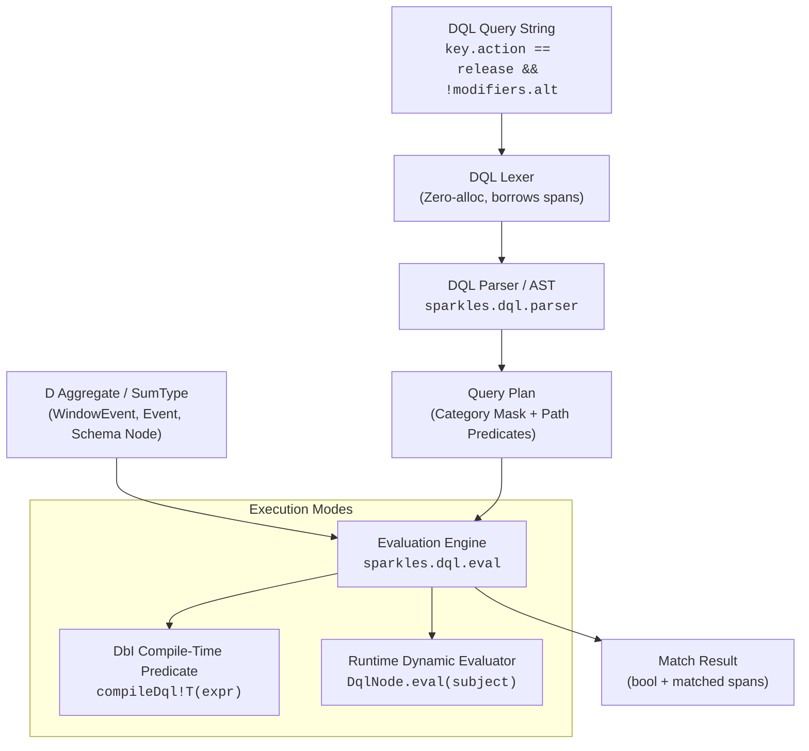

# `sparkles:dql` — D Query Language — Specification

_Audience: developers and coding agents building against or integrating with `sparkles:dql`.
This document is the normative specification for the D Query Language library: its grammar,
operator semantics, zero-allocation execution model, fuzzy integration, and schema introspection._

---

## 1. Overview and Design Principles

`sparkles:dql` provides a unified, allocation-conscious query engine for navigating, inspecting,
and filtering typed D aggregates (`struct`, `class`, `SumType`, `Tuple`, arrays, and associative arrays)
using idiomatic D expression syntax.



### Core Principles

1. **Paths are addresses; element keys are identity.** Every queryable field in an aggregate has a deterministic, readable path address (e.g. `pointer.logicalPosition.x`, `modifiers.ctrl`, `payload.key.action`). Active `SumType` variants are addressed transparently without boilerplate.
2. **D-native expression syntax.** DQL adopts standard D language syntax rather than ad-hoc colons or DSL operators: equality uses `==`, inequality uses `!=`, comparisons use `<`, `<=`, `>`, `>=`, null checks use `path == null` / `path != null`, and combinators use `&&`, `||`, and `!`.
3. **Zero-allocation evaluation.** The lexer and parser borrow `const(char)[]` slices directly from input queries. Evaluator paths operate with `@safe pure nothrow @nogc` execution where possible.
4. **Fuzzy and glob integration.** Bounded pattern matching is provided via `sparkles:fuzzy` (`globMatch`, `fuzzyMatch`) alongside PCRE regular expressions (`regexMatch`).
5. **Introspection & help protocol.** Any CLI or UI surface exposing DQL provides structured path introspection when queried with `?` or `help` (e.g. `--event-filter=?`), outputting available paths, types, descriptions, and a reference tutorial.

---

## 2. Grammar & Operators

### 2.1 Path Addressing Grammar

Paths follow member access and array indexing conventions:

```
Path       := Segment ( "." Segment | "[" Digits "]" | "[\"" EscapedString "\"]" | "[#" Key "]" )*
Segment    := Identifier
Digits     := [0-9]+
Key        := [0-9]+
```

- **Member Access**: `pointer.phase`, `key.logical.character`, `metrics.logicalSize.width`
- **SumType Unrolling**: Addressing `key.action` automatically matches `WindowEventPayload.get!KeyboardEvent.action`.
- **Positional & Keyed Indexes**: `stops[0]`, `items[#7]`.

### 2.2 Operators and Functions

| Operator / Function | Syntax                     | Description                                                  | Example                                         |
| :------------------ | :------------------------- | :----------------------------------------------------------- | :---------------------------------------------- |
| **Equality**        | `path == value`            | Exact value or enum comparison                               | `pointer.phase == pressed`                      |
| **Inequality**      | `path != value`            | Inequality check                                             | `pointer.phase != moved`                        |
| **Relational**      | `<`, `<=`, `>`, `>=`       | Numeric or timestamp comparisons                             | `pointer.logicalPosition.x > 400`               |
| **Nullability**     | `path == null`, `!= null`  | Checks pointers, strings, slices, `Nullable!T`, `Optional!T` | `text.text != null`                             |
| **Regex Match**     | `regexMatch(path, \`re\`)` | Regular expression match via Phobos `std.regex`              | `regexMatch(text.text, \`^[0-9]+$\`)`           |
| **Glob Match**      | `globMatch(path, \`pat\`)` | Bounded glob pattern matching via `sparkles:fuzzy`           | `globMatch(file.name, \`\*.d\`)`                |
| **Fuzzy Match**     | `fuzzyMatch(path, \`q\`)`  | Typo-tolerant fuzzy string ranking via `sparkles:fuzzy`      | `fuzzyMatch(title, \`wsi echo\`)`               |
| **Conjunction**     | `&&`                       | Logical AND                                                  | `key.action == press && modifiers.ctrl == true` |
| **Disjunction**     | `\|\|` or `,`              | Logical OR                                                   | `key \|\| text \|\| composition`                |
| **Negation**        | `!` or `-`                 | Logical NOT                                                  | `!motion` or `!pointer.phase == moved`          |
| **Grouping**        | `( ... )`                  | Precedence override                                          | `(key && ctrl) \|\| (pointer && left)`          |

### 2.3 Nullability Classification

Following the [`sparkles:wired` specification](../wired/SPEC.md#L150-L168), `path == null` and `path != null` transparently inspect:

- Pointers and class references (`ptr is null`)
- Slices, dynamic arrays, and strings (`slice.length == 0` / `slice is null`)
- Associative arrays (`aa is null`)
- `Nullable!T` (`nullable.isNull`)
- `Optional!T` (`optional.empty` / `isNone`)
- `Ternary` (`ternary == Ternary.unknown`)

---

## 3. Execution & Fast-Path Optimization

DQL provides two execution strategies:

### 3.1 Fast-Path Category Bitset (`bool[N]`)

When filtering domain events with a known closed category enum (e.g. `EventCategory` in `sparkles:wsi`), pure category queries (e.g. `!motion && !scroll` or `key, text`) compile down to fixed-size boolean arrays:

```d
enum size_t categoryCardinality = [EnumMembers!EventCategory].length;
bool[categoryCardinality] included;
bool[categoryCardinality] excluded;
```

Evaluation executes in `O(1)` with `@safe pure nothrow @nogc` performance before inspecting deep aggregate payload fields.

### 3.2 Dynamic AST Evaluation

For expressions with property constraints or functions (`pointer.phase == pressed`, `logicalPosition.x > 400`), DQL parses the query into a lightweight tree of `DqlNode`s evaluated against the aggregate.

---

## 4. Schema Introspection & Help Protocol

Tools exposing DQL options must intercept `?` and `help` tokens to output available paths and an interactive reference guide.

```d
import sparkles.dql.help : DqlPathDoc, printDqlHelp;

immutable DqlPathDoc[] wsiPaths = [
    DqlPathDoc("pointer.phase", "PointerPhase", "Button click phase", "pointer.phase == pressed"),
    DqlPathDoc("pointer.logicalPosition.x", "double", "Cursor X coordinate", "pointer.logicalPosition.x > 400"),
    DqlPathDoc("key.action", "KeyAction", "Key stroke action", "key.action == release"),
    DqlPathDoc("modifiers.ctrl", "bool", "Control key state", "modifiers.ctrl == true"),
];

if (eventFilter == "?" || eventFilter == "help")
{
    printDqlHelp(wsiPaths, categories, "wsi_input_echo");
    return ok();
}
```

---

## 5. Monorepo Integration Matrix

| Sub-package                     | Role of `sparkles:dql`                                                                                           |
| :------------------------------ | :--------------------------------------------------------------------------------------------------------------- |
| **`sparkles:wsi`**              | Event stream filtering in `wsi-input-echo.d` via `-F, --event-filter`.                                           |
| **`sparkles:ui`**               | Property tree path addresses (`at!`, `resolve`) and `@ShowIf("kind == FillKind.gradient")` predicate evaluation. |
| **`sparkles:wired`**            | Schema path navigation, validation error locations, and `@WireIf` conditional serialization.                     |
| **`sparkles:dsv` / `apps/hue`** | Column constraint evaluation (`DSF1`/`DSF2`) and fuzzy remainder combining (`DSF3`).                             |
