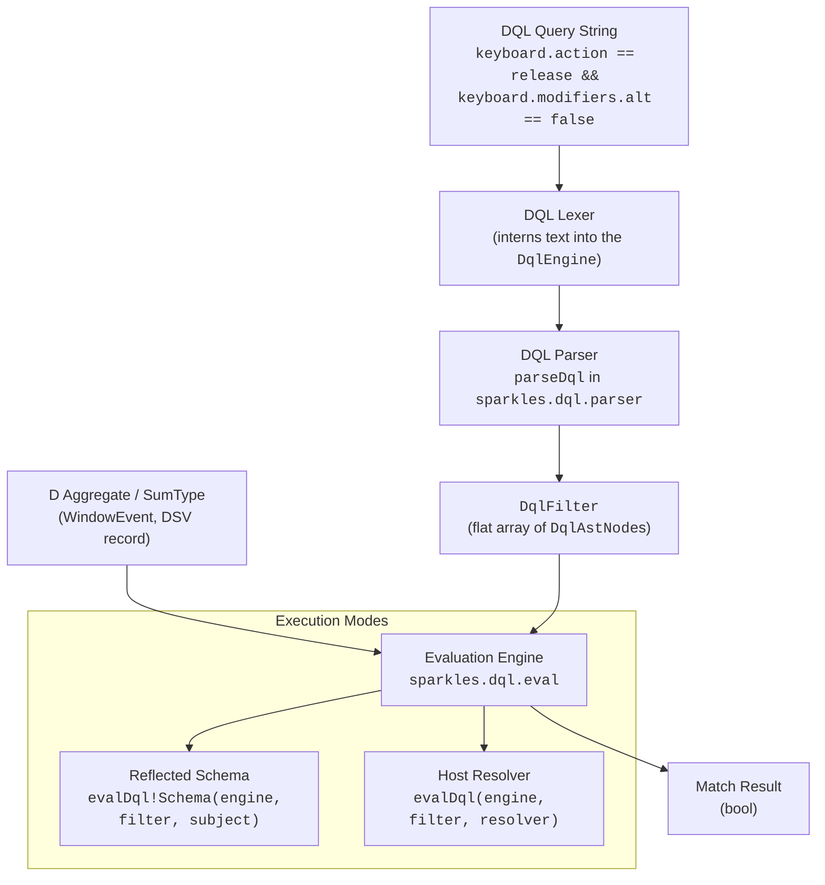

# `sparkles:dql` — D Query Language — Specification

## Abstract

`sparkles:dql` lets a user filter and inspect typed D values with a short
query written in D's own expression syntax, such as "key events released
without the Alt modifier". A query names fields by readable dotted paths,
compares them with literals, and matches text with regular expressions,
globs, or fuzzy search. The library derives the set of valid paths from the
queried type itself, so it can reject a mistyped path when the query is
parsed and print the paths a type offers as help. Parsing keeps a query's
strings and compiled matchers in one reusable engine, and evaluation reads
each value in place without copying it.

## Introduction

Tools in Sparkles routinely face a stream of structured values that a person
wants to narrow down: window-system events in an input echo, rows of a
delimited data file, widget properties that should appear only under some
condition. Each of these needs a small filter language, typed by the user on
a command line or in a settings field, and evaluated against ordinary D
structs, tagged unions such as `SumType`, and arrays.

Ad hoc filter flags do not scale. Each tool invents its own operator
spelling, accepts typos silently and so matches nothing, cannot tell a user
which fields exist, and duplicates code that walks its value types. A query
over typed values also has to settle questions that string matching never
meets: how to address a field that lives inside one alternative of a tagged
union, what a comparison means when that alternative is not the active one,
and when a path that runs through a null pointer counts as missing.

This library answers them with one query language whose paths come from the
type. At compile time it walks the queried type through the shared
[reflection kernel](../../libs/reflection/index.md) and builds a
[DQL schema](../../glossary.md#dql-schema): the table of every
[DQL path](../../glossary.md#dql-path) the type offers, with its type and
documentation. A query is parsed at run time and, when the queried type is
known, checked against that table. The fields of a tagged union's
alternatives join the path of the field that holds the union, so a key
event's action is simply `keyboard.action`.
The same naming rules drive both the schema and the run-time walk that
reads a value, so a path the parser accepts always resolves. Expressions
use D's operators, so a D programmer can read a query without learning a
new syntax.

Evaluation separates a typo from a missing value. When a value cannot answer
a valid path, because another alternative is active or a pointer along the
path is null, the path is absent. Under the type's schema, an absent path
compares equal to `null` and fails every other comparison or match, `!=`
included; a host resolver classifies absence itself (§3.2). Evaluation
answers every query with a plain yes or no and never raises an error.

DQL only selects: it does not project, sort, aggregate, or modify the values
it inspects, and it supports a subset of D's syntax with no arithmetic. It
filters values already in memory and does not index, store, or fetch them.
Queried types need no dependency on DQL; they may carry the attributes of
`sparkles:metadata` to rename or document a path. Where a query is typed,
where help is printed, and how matches are displayed belong to the host
tool. Typo-tolerant ranking itself is the job of
[`sparkles:fuzzy`](../fuzzy/SPEC.md); DQL uses it only to decide whether a
text field matches.

§1 states the design principles and §2 the path grammar, operators, and
null semantics. §3 describes the two ways a parsed query is evaluated, and
§4 the help protocol: how a tool exposing DQL answers a `?` query with the
paths it accepts. §5 lists the packages that consume DQL and what each uses
it for, among them the [property tree](../ui/property-tree.md), the
`sparkles:ui` view that presents one D value as a filterable tree of rows.

---

## 1. Overview and Design Principles


```mermaid
graph TD
    QueryText["DQL Query String<br/><code>keyboard.action == release && keyboard.modifiers.alt == false</code>"] --> Lexer["DQL Lexer<br/>(interns text into the <code>DqlEngine</code>)"]
    Lexer --> Parser["DQL Parser<br/><code>parseDql</code> in <code>sparkles.dql.parser</code>"]
    Parser --> Plan["<code>DqlFilter</code><br/>(flat array of <code>DqlAstNode</code>s)"]

    Subject["D Aggregate / SumType<br/>(WindowEvent, DSV record)"] --> Matcher["Evaluation Engine<br/><code>sparkles.dql.eval</code>"]
    Plan --> Matcher

    subgraph Execution Modes
        Matcher --> CT["Reflected Schema<br/><code>evalDql!Schema(engine, filter, subject)</code>"]
        Matcher --> RT["Host Resolver<br/><code>evalDql(engine, filter, resolver)</code>"]
    end

    Matcher --> Result["Match Result<br/>(bool)"]
```

### Core Principles

1. **Paths are addresses.** Every queryable field in an aggregate has a
   deterministic, readable path address (e.g. `pointer.logicalPosition.x`,
   `keyboard.modifiers.ctrl`, `keyboard.action`). The fields of a `SumType`
   alternative are addressed under the alternative's name without
   boilerplate; the path holds a value only while that alternative is active.
2. **D-native expression syntax.** DQL adopts standard D language syntax rather than ad-hoc colons or DSL operators: equality uses `==`, inequality uses `!=`, comparisons use `<`, `<=`, `>`, `>=`, null checks use `path == null` / `path != null`, and combinators use `&&`, `||`, and `!`.
3. **Zero-allocation evaluation.** The lexer copies a query's identifiers and
   literals into the `DqlEngine`'s string pool, and AST nodes refer to them
   by `TextSpan`, so a filter does not borrow the query text. The engine also
   owns the compiled matchers and the glob and fuzzy workspaces, allocated on
   first use and reused across evaluations; glob and fuzzy evaluation is
   `nothrow @nogc`.
4. **Fuzzy and glob integration.** Bounded pattern matching is provided via
   `sparkles:fuzzy` (`globMatch`, `fuzzyMatch`) alongside regular expressions
   compiled by Phobos `std.regex` (`regexMatch`).
5. **Introspection & help protocol.** Any CLI or UI surface exposing DQL provides structured path introspection when queried with `?` or `help` (e.g. `--event-filter=?`), outputting available paths, types, descriptions, and a reference tutorial.

---

## 2. Grammar & Operators

### 2.1 Path Addressing Grammar

Paths follow member access and static-array indexing conventions:

```
Path       := Segment ( "." Segment | "[" Digits "]" )*
Segment    := Identifier
Digits     := [0-9]+
```

- **Member Access**: `pointer.phase`, `keyboard.logical.character`,
  `ready.metrics.logicalSize.width`. A segment is the field's identifier, or
  the name an `@Name` attribute gives it; `@Aliases` adds further spellings.
- **SumType Unrolling**: an alternative's fields are addressed under the
  alternative's name, its type name with the schema's suffix (`Event` by
  default) stripped and recased to camelCase. In a `WindowEvent`,
  `keyboard.action` reads `KeyboardEvent.action` from the
  `WindowEventPayload` field when that alternative is active; the name of
  the field holding the `SumType` does not appear in the path.
- **Positional Indexes**: `stops[0]` addresses an element of a static array;
  the schema lists one path per index. Dynamic arrays and associative arrays
  have no element paths. The property tree extends this grammar with quoted
  and keyed segments (`["…"]`, `[#7]`) that DQL's parser does not accept.

### 2.2 Operators and Functions

| Operator / Function | Syntax                     | Description                                             | Example                                                                     |
| :------------------ | :------------------------- | :------------------------------------------------------ | :-------------------------------------------------------------------------- |
| **Equality**        | `path == value`            | Exact value or enum comparison                          | `pointer.phase == pressed`                                                  |
| **Inequality**      | `path != value`            | Inequality check                                        | `pointer.phase != moved`                                                    |
| **Relational**      | `<`, `<=`, `>`, `>=`       | Numeric, character, or text ordering                    | `pointer.logicalPosition.x > 400`                                           |
| **Nullability**     | `path == null`, `!= null`  | Whether the path is absent (§2.3)                       | `pointer.phase != null`                                                     |
| **Regex Match**     | `regexMatch(path, \`re\`)` | Regular expression match via Phobos `std.regex`         | `regexMatch(textCommitted.text, \`^[0-9]+$\`)`                              |
| **Glob Match**      | `globMatch(path, \`pat\`)` | Bounded glob pattern matching via `sparkles:fuzzy`      | `globMatch(file.name, \`\*.d\`)`                                            |
| **Fuzzy Match**     | `fuzzyMatch(path, \`q\`)`  | Typo-tolerant fuzzy string ranking via `sparkles:fuzzy` | `fuzzyMatch(title, \`wsi echo\`)`                                           |
| **Conjunction**     | `&&`                       | Logical AND                                             | `keyboard.action == press && keyboard.modifiers.ctrl == true`               |
| **Disjunction**     | `\|\|` or `,`              | Logical OR                                              | `keyboard \|\| textCommitted \|\| composition`                              |
| **Negation**        | `!` or `-`                 | Logical NOT                                             | `!pointer` or `!pointer.phase == moved`                                     |
| **Grouping**        | `( ... )`                  | Precedence override                                     | `(keyboard && keyboard.modifiers.ctrl == true) \|\| pointer.button == left` |

### 2.3 Nullability Classification

`path == null` holds when the path is absent, and `path != null` when it
holds a value. Against a reflected schema (§3.2) a path is absent when:

- it reaches into a `SumType` alternative that is not the active one;
- a pointer along it is null, or a pointer chain exceeds 64 hops.

Every other path in the schema holds a value: an empty string is a value,
not null. DQL does not share the null-aware types of the
[`sparkles:wired` specification](../wired/SPEC.md#_4-2-supported-types):
`Nullable!T` and `Optional!T` are ordinary aggregates whose public getters
form paths (`n.isNull == true`), and dynamic arrays and associative arrays
are not in the schema, so the parser rejects a null check on them.

A host resolver (§3.2) classifies null itself. When it implements
`resolveIsNull(path, isNull)`, its answer decides both checks; otherwise a
path that resolves to any value is non-null, and a path it cannot resolve
fails both `== null` and `!= null`.

---

## 3. Execution & Fast-Path Optimization

DQL provides two execution strategies:

### 3.1 Category Tests

A bare identifier, such as `pointer` in `!pointer && !scroll` or
`keyboard, textCommitted`, is a category: the name of a `SumType`
alternative. Against a reflected schema, `resolveDqlCategory` answers it
with `true` when that alternative, or one it contains through a nested
`SumType`, is active in the subject. A host resolver answers it through its
`resolveCategory(name)`. Category tests are ordinary nodes of the parsed
filter, evaluated in order with the other nodes; `&&` and `||`
short-circuit, so a category written first spares the deeper field reads
of a non-matching value.

### 3.2 Dynamic AST Evaluation

`parseDql(engine, expr)` parses a query into a `DqlFilter`: a flat array of
`DqlAstNode`s with a root index, whose strings and compiled matchers live in
the `DqlEngine`. `parseDql!Schema(engine, expr)` also rejects any path or
category absent from the `DqlSchema`. An empty query yields an empty filter,
which admits every value. The filter is evaluated in one of two ways:

- **Reflected schema.** `evalDql!Schema(engine, filter, subject)` walks the
  subject with `resolveDqlPath`, which follows the naming conventions the
  schema was generated with and hands each addressed leaf to a sink in
  place, without copying it. A path resolves to a value, to absent, or to
  unknown.
- **Host resolver.** `evalDql(engine, filter, resolver)` asks a
  host-supplied resolver for each path's value through `resolveValue`, or
  the typed `resolveString`, `resolveNumber`, `resolveInt`, `resolveUInt`
  and `resolveBool` methods, and for categories through `resolveCategory`.
  A path the resolver cannot answer fails every comparison and match.

Both answer each query with a plain `bool`.

---

## 4. Schema Introspection & Help Protocol

Tools exposing DQL options must intercept `?` and `help` tokens to output
available paths and an interactive reference guide. `printDqlHelp` writes
the guide to standard output and `writeDqlHelp` to any output range. Each
comes in two forms: one generated from a `DqlSchema`, and one taking
hand-written `DqlPathDoc` entries with a list of category names.

```d
import sparkles.dql : DqlSchema, printDqlHelp;
import sparkles.wsi.events : WindowEvent;

alias EventSchema = DqlSchema!WindowEvent;

if (eventFilter == "?" || eventFilter == "help")
{
    printDqlHelp!EventSchema("wsi-input-echo", !noColor);
    return ok();
}
```

---

## 5. Monorepo Integration Matrix

| Sub-package                     | Role of `sparkles:dql`                                                                                                                                                                                                |
| :------------------------------ | :-------------------------------------------------------------------------------------------------------------------------------------------------------------------------------------------------------------------- |
| **`sparkles:wsi`**              | Event stream filtering in `wsi-input-echo.d` via `-F, --event-filter`.                                                                                                                                                |
| **`sparkles:ui`**               | Property tree path addresses (`at!`, `resolve`) follow DQL's path conventions; a fixture test checks that both name the same leaves. `@ShowIf("kind == FillKind.gradient")` is a typed D expression, not a DQL query. |
| **`sparkles:wired`**            | None at run time: wired does not depend on DQL. Conditional omission on encode is `@WireOptional` with a `WireSkip` policy (wired §5.4).                                                                              |
| **`sparkles:dsv` / `apps/hue`** | `DsvRecordResolver` (`sparkles.dsv.dql`) answers DQL paths over a DSV record, addressing columns by case-insensitive name or `#N` index. hue's filter bar (`DSF1`–`DSF3`) uses its own `name:value` syntax.           |
