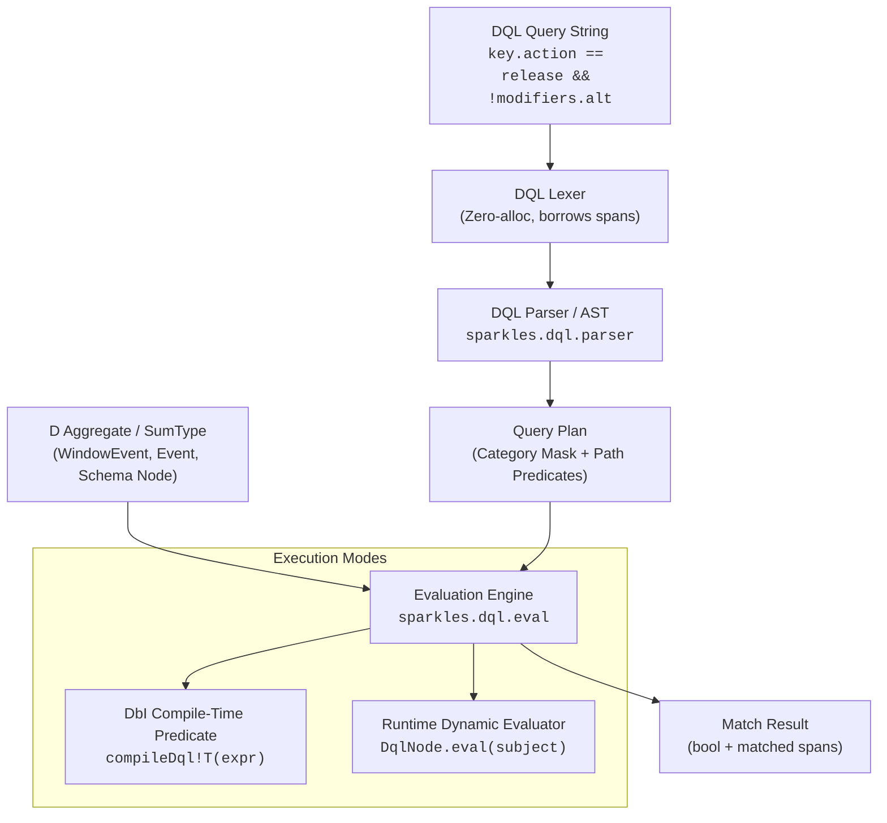

# `sparkles:dql` — D Query Language — Specification

## Abstract

`sparkles:dql` lets a user filter and inspect typed D values with a short
query written in D's own expression syntax, such as "key events released
without the Alt modifier". A query names fields by readable dotted paths,
compares them with literals, and matches text with regular expressions,
globs, or fuzzy search. The library derives the set of valid paths from the
queried type itself, so it can reject a mistyped path when the query is
parsed and print the paths a type offers as help. Parsing keeps a query's
strings and compiled matchers in one reusable engine, and evaluation reads
each value in place without copying it.

## Introduction

Tools in Sparkles routinely face a stream of structured values that a person
wants to narrow down: window-system events in an input echo, rows of a
delimited data file, widget properties that should appear only under some
condition. Each of these needs a small filter language, typed by the user on
a command line or in a settings field, and evaluated against ordinary D
structs, tagged unions such as `SumType`, and arrays.

Ad hoc filter flags do not scale. Each tool invents its own operator
spelling, accepts typos silently and so matches nothing, cannot tell a user
which fields exist, and duplicates code that walks its value types. A query
over typed values also has to settle questions that string matching never
meets: how to address a field that lives inside one alternative of a tagged
union, what a comparison means when that alternative is not the active one,
and when a pointer, empty string, or empty optional counts as null.

This library answers them with one query language whose paths come from the
type. At compile time it walks the queried type through the shared
[reflection kernel](../../libs/reflection/index.md) and builds a
[DQL schema](../../glossary.md#dql-schema): the table of every
[DQL path](../../glossary.md#dql-path) the type offers, with its type and
documentation. A query is parsed at run time and, when the queried type is
known, checked against that table. The fields of a tagged union's
alternatives join the path of the field that holds the union, so a key
event's action is simply `key.action`.
The same naming rules drive both the schema and the run-time walk that
reads a value, so a path the parser accepts always resolves. Expressions
use D's operators, so a D programmer can read a query without learning a
new syntax.

Evaluation separates a typo from a missing value. When a value cannot answer
a valid path, because another alternative is active or a pointer along the
path is null, the path is absent. An absent path compares equal to `null`
and fails every other comparison or match, `!=` included, so evaluation
answers every query with a plain yes or no and never raises an error.

DQL only selects: it does not project, sort, aggregate, or modify the values
it inspects, and it supports a subset of D's syntax with no arithmetic. It
filters values already in memory and does not index, store, or fetch them.
Queried types need no dependency on DQL; they may carry the attributes of
`sparkles:metadata` to rename or document a path. Where a query is typed,
where help is printed, and how matches are displayed belong to the host
tool. Typo-tolerant ranking itself is the job of
[`sparkles:fuzzy`](../fuzzy/SPEC.md); DQL uses it only to decide whether a
text field matches.

§1 states the design principles and §2 the path grammar, operators, and
null semantics. §3 describes the two ways a parsed query is evaluated, and
§4 the help protocol: how a tool exposing DQL answers a `?` query with the
paths it accepts. §5 lists the packages that consume DQL and what each uses
it for, among them the [property tree](../ui/property-tree.md), the
`sparkles:ui` view that presents one D value as a filterable tree of rows.

---

## 1. Overview and Design Principles


```mermaid
graph TD
    QueryText["DQL Query String<br/><code>key.action == release && !modifiers.alt</code>"] --> Lexer["DQL Lexer<br/>(Zero-alloc, borrows spans)"]
    Lexer --> Parser["DQL Parser / AST<br/><code>sparkles.dql.parser</code>"]
    Parser --> Plan["Query Plan<br/>(Category Mask + Path Predicates)"]

    Subject["D Aggregate / SumType<br/>(WindowEvent, Event, Schema Node)"] --> Matcher["Evaluation Engine<br/><code>sparkles.dql.eval</code>"]
    Plan --> Matcher

    subgraph Execution Modes
        Matcher --> CT["DbI Compile-Time Predicate<br/><code>compileDql!T(expr)</code>"]
        Matcher --> RT["Runtime Dynamic Evaluator<br/><code>DqlNode.eval(subject)</code>"]
    end

    Matcher --> Result["Match Result<br/>(bool + matched spans)"]
```

### Core Principles

1. **Paths are addresses; element keys are identity.** Every queryable field in an aggregate has a deterministic, readable path address (e.g. `pointer.logicalPosition.x`, `modifiers.ctrl`, `payload.key.action`). Active `SumType` variants are addressed transparently without boilerplate.
2. **D-native expression syntax.** DQL adopts standard D language syntax rather than ad-hoc colons or DSL operators: equality uses `==`, inequality uses `!=`, comparisons use `<`, `<=`, `>`, `>=`, null checks use `path == null` / `path != null`, and combinators use `&&`, `||`, and `!`.
3. **Zero-allocation evaluation.** The lexer and parser borrow `const(char)[]` slices directly from input queries. Evaluator paths operate with `@safe pure nothrow @nogc` execution where possible.
4. **Fuzzy and glob integration.** Bounded pattern matching is provided via `sparkles:fuzzy` (`globMatch`, `fuzzyMatch`) alongside PCRE regular expressions (`regexMatch`).
5. **Introspection & help protocol.** Any CLI or UI surface exposing DQL provides structured path introspection when queried with `?` or `help` (e.g. `--event-filter=?`), outputting available paths, types, descriptions, and a reference tutorial.

---

## 2. Grammar & Operators

### 2.1 Path Addressing Grammar

Paths follow member access and array indexing conventions:

```
Path       := Segment ( "." Segment | "[" Digits "]" | "[\"" EscapedString "\"]" | "[#" Key "]" )*
Segment    := Identifier
Digits     := [0-9]+
Key        := [0-9]+
```

- **Member Access**: `pointer.phase`, `key.logical.character`, `metrics.logicalSize.width`
- **SumType Unrolling**: Addressing `key.action` automatically matches `WindowEventPayload.get!KeyboardEvent.action`.
- **Positional & Keyed Indexes**: `stops[0]`, `items[#7]`.

### 2.2 Operators and Functions

| Operator / Function | Syntax                     | Description                                                  | Example                                         |
| :------------------ | :------------------------- | :----------------------------------------------------------- | :---------------------------------------------- |
| **Equality**        | `path == value`            | Exact value or enum comparison                               | `pointer.phase == pressed`                      |
| **Inequality**      | `path != value`            | Inequality check                                             | `pointer.phase != moved`                        |
| **Relational**      | `<`, `<=`, `>`, `>=`       | Numeric or timestamp comparisons                             | `pointer.logicalPosition.x > 400`               |
| **Nullability**     | `path == null`, `!= null`  | Checks pointers, strings, slices, `Nullable!T`, `Optional!T` | `text.text != null`                             |
| **Regex Match**     | `regexMatch(path, \`re\`)` | Regular expression match via Phobos `std.regex`              | `regexMatch(text.text, \`^[0-9]+$\`)`           |
| **Glob Match**      | `globMatch(path, \`pat\`)` | Bounded glob pattern matching via `sparkles:fuzzy`           | `globMatch(file.name, \`\*.d\`)`                |
| **Fuzzy Match**     | `fuzzyMatch(path, \`q\`)`  | Typo-tolerant fuzzy string ranking via `sparkles:fuzzy`      | `fuzzyMatch(title, \`wsi echo\`)`               |
| **Conjunction**     | `&&`                       | Logical AND                                                  | `key.action == press && modifiers.ctrl == true` |
| **Disjunction**     | `\|\|` or `,`              | Logical OR                                                   | `key \|\| text \|\| composition`                |
| **Negation**        | `!` or `-`                 | Logical NOT                                                  | `!motion` or `!pointer.phase == moved`          |
| **Grouping**        | `( ... )`                  | Precedence override                                          | `(key && ctrl) \|\| (pointer && left)`          |

### 2.3 Nullability Classification

Following the [`sparkles:wired` specification](../wired/SPEC.md#L150-L168), `path == null` and `path != null` transparently inspect:

- Pointers and class references (`ptr is null`)
- Slices, dynamic arrays, and strings (`slice.length == 0` / `slice is null`)
- Associative arrays (`aa is null`)
- `Nullable!T` (`nullable.isNull`)
- `Optional!T` (`optional.empty` / `isNone`)
- `Ternary` (`ternary == Ternary.unknown`)

---

## 3. Execution & Fast-Path Optimization

DQL provides two execution strategies:

### 3.1 Fast-Path Category Bitset (`bool[N]`)

When filtering domain events with a known closed category enum (e.g. `EventCategory` in `sparkles:wsi`), pure category queries (e.g. `!motion && !scroll` or `key, text`) compile down to fixed-size boolean arrays:

```d
enum size_t categoryCardinality = [EnumMembers!EventCategory].length;
bool[categoryCardinality] included;
bool[categoryCardinality] excluded;
```

Evaluation executes in `O(1)` with `@safe pure nothrow @nogc` performance before inspecting deep aggregate payload fields.

### 3.2 Dynamic AST Evaluation

For expressions with property constraints or functions (`pointer.phase == pressed`, `logicalPosition.x > 400`), DQL parses the query into a lightweight tree of `DqlNode`s evaluated against the aggregate.

---

## 4. Schema Introspection & Help Protocol

Tools exposing DQL options must intercept `?` and `help` tokens to output available paths and an interactive reference guide.

```d
import sparkles.dql.help : DqlPathDoc, printDqlHelp;

immutable DqlPathDoc[] wsiPaths = [
    DqlPathDoc("pointer.phase", "PointerPhase", "Button click phase", "pointer.phase == pressed"),
    DqlPathDoc("pointer.logicalPosition.x", "double", "Cursor X coordinate", "pointer.logicalPosition.x > 400"),
    DqlPathDoc("key.action", "KeyAction", "Key stroke action", "key.action == release"),
    DqlPathDoc("modifiers.ctrl", "bool", "Control key state", "modifiers.ctrl == true"),
];

if (eventFilter == "?" || eventFilter == "help")
{
    printDqlHelp(wsiPaths, categories, "wsi_input_echo");
    return ok();
}
```

---

## 5. Monorepo Integration Matrix

| Sub-package                     | Role of `sparkles:dql`                                                                                           |
| :------------------------------ | :--------------------------------------------------------------------------------------------------------------- |
| **`sparkles:wsi`**              | Event stream filtering in `wsi-input-echo.d` via `-F, --event-filter`.                                           |
| **`sparkles:ui`**               | Property tree path addresses (`at!`, `resolve`) and `@ShowIf("kind == FillKind.gradient")` predicate evaluation. |
| **`sparkles:wired`**            | Schema path navigation, validation error locations, and `@WireIf` conditional serialization.                     |
| **`sparkles:dsv` / `apps/hue`** | Column constraint evaluation (`DSF1`/`DSF2`) and fuzzy remainder combining (`DSF3`).                             |
